**目录**

[TOC]

### A

#### A01、初识PS

#### A02、安装

#### A03、认识界面
1. 点该键可以重置全部工作区分布
    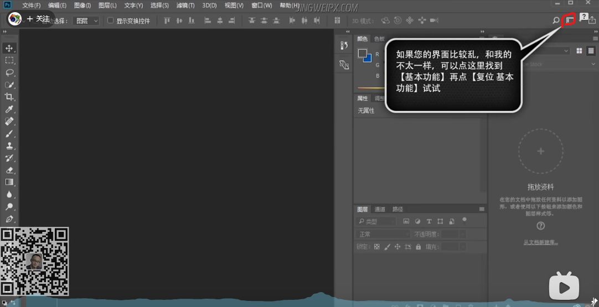
2. 面板分布
    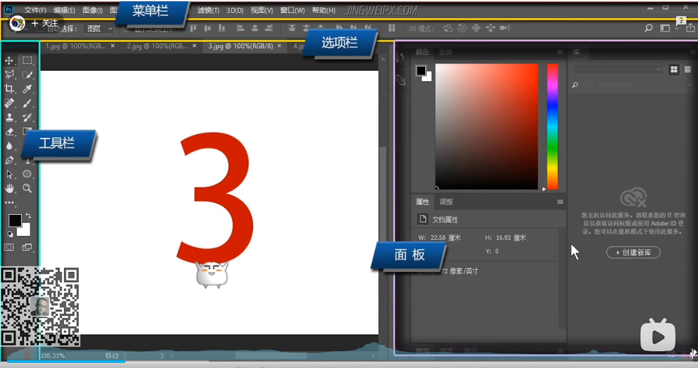
3. 底部可以显示工作信息，并且可以改变显示内容
   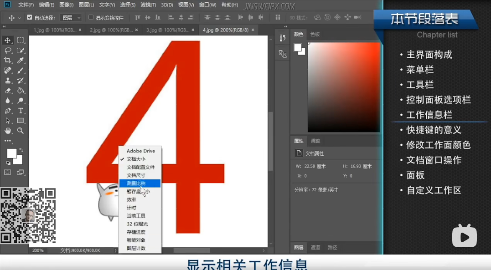
4. 快捷键：
   - `ctrl`+鼠标滚轮：左右平移
   - `shift`+鼠标滚轮：垂直平移
   - `alt`+鼠标滚轮：扩大缩小
5. 工作面的颜色也可以改变。
   如图，蓝色为工作面
   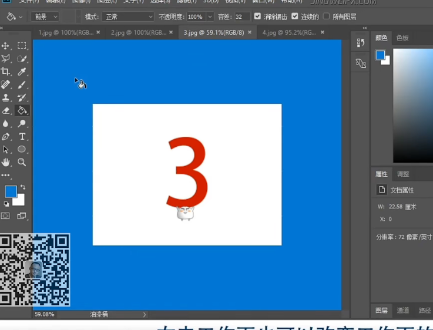
6. 右侧为工作区，每一小部分都可以移动，双击打开或关闭该栏目。
   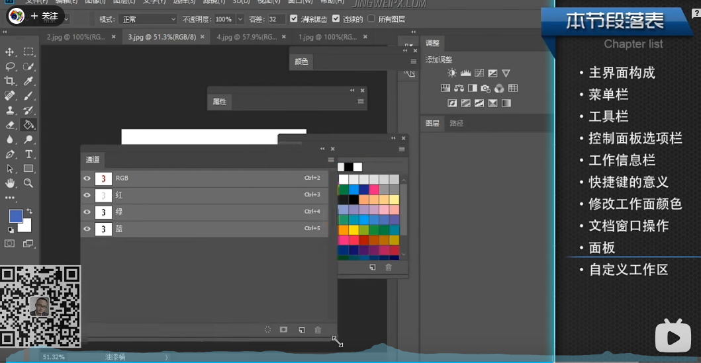

---

#### A04、新建文件
1. 快捷键：
   `ctrl`+`N`：新建文件
2. 有许多预设选项可以选择：
   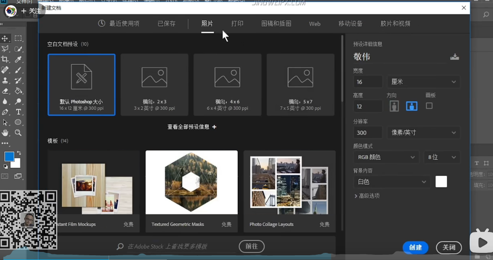
   预设中各种设置解释：
   - 分辨率：单位为像素/英寸（一般），缩写即为Ppi，pixel per inch
        常用分辨率设置：
        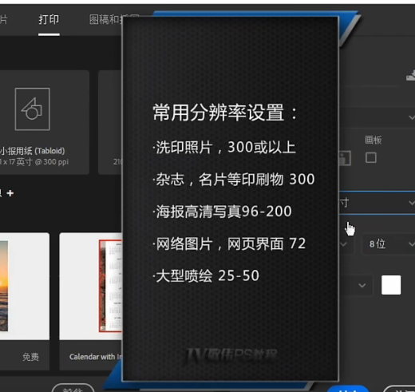
   - 颜色模式：
        RGB就是红绿蓝三原色，根据物体的发光定义颜色。
        CMYK为印刷颜色模式，为青色、品红、黄、黑组成。（因为颜料喷涂到纸面上时，其显示的颜色为颜色相减原理）
   - 背景内容：
    里面填的颜色为图像区域的背景颜色
    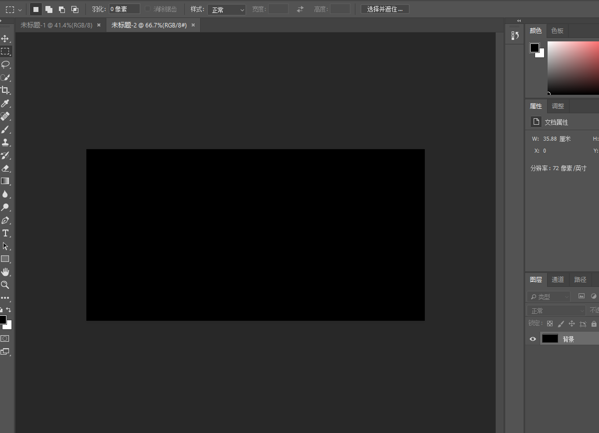
3. 前景色与背景色
   
   1. 图中橙色为前景色，青色为背景色.
   2. 快捷键 `D` 与小按钮都可以恢复默认前景色与背景色.
   3. 设置完背景色后，新建文件时，选取背景色，则新建的文件的背景色将为该色。
4. 存储预设
   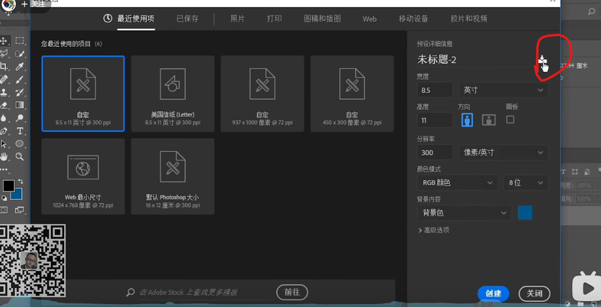
   如图可以存储设置

---

#### A05、修改图像大小
1. 上节讲解了新建文件，此时需要设置各项数据。而在新建文件之后，同样可以再次更改其设置。如图操作
   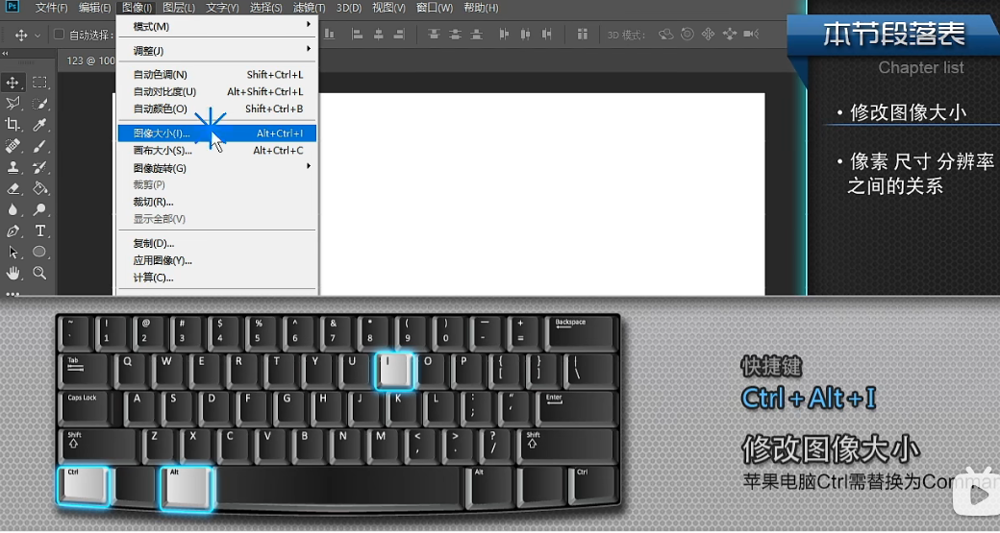
   快捷键：`ctrl`+`alt`+`I`
2. 重新采样
   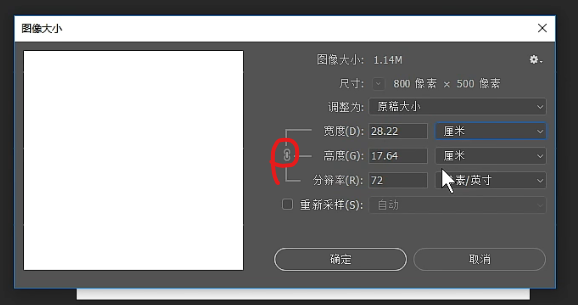
   1. 如图，当点选重新采样时，则图像像素可以改变.
   2. 若不选重新采样，则图像像素数固定，只能修改图像大小。图中红圈圈住表示宽度、高度、分辨率比例固定，则修改一个值，其他的也会改变。

---

#### A06、保存文件
1. PS中打开图片还可以打开图片序列（但注意序列需要有序列命名）
   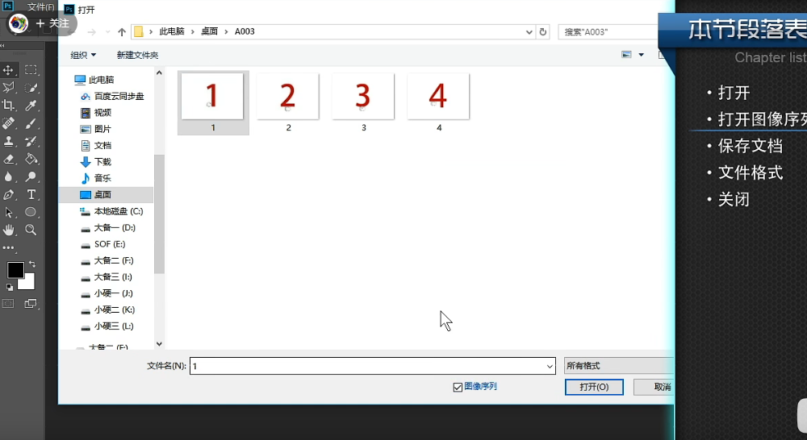
   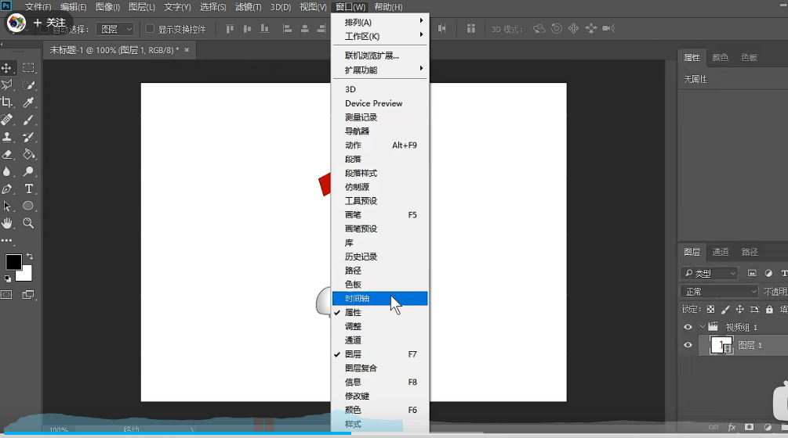
   如图选择打开时间轴，可以发现与pr界面类似，即ps也可以对视频动画进行编辑。
   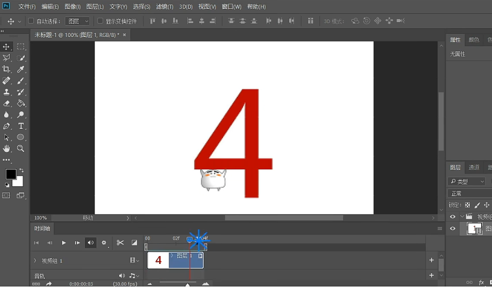
2. png文件支持透明背景

---

#### A07、软件设置
1. 设置暂存盘，ps工作时会产生很大的临时数据，因此需要暂存盘。
   `ctrl`+`k`打开首选项，在其中设置暂存盘。
2. 修改记录历史步骤
   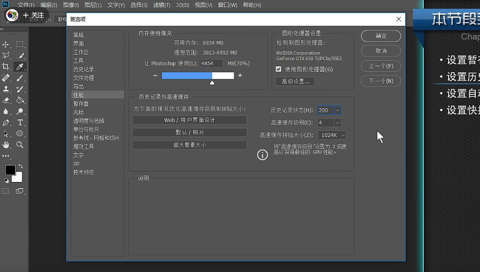
   这样子可以方便找回更多的操作。
3. 修改快捷键
   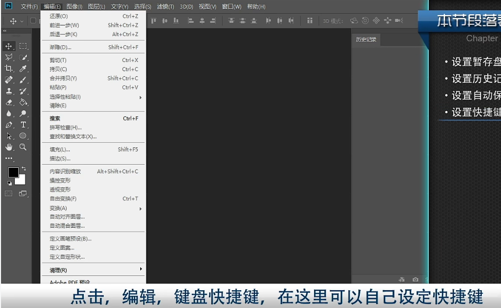
   在编辑栏中，键盘快捷键

---

#### A08、图层基本知识
1. 图层可以在图层面板中看到
2. 新建图层
   - 如图所示点击该键
      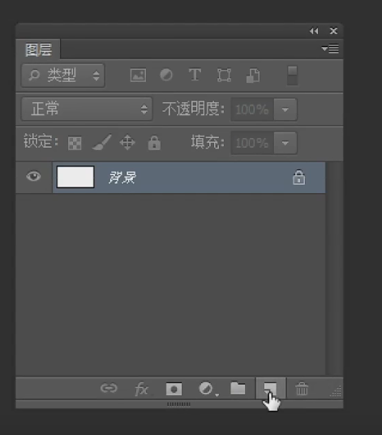
   - 或者先按住`alt`，再按下该键，会出现下图界面，可以编辑新图层的属性。
      
   - 或者快捷键：`ctrl`+`shift`+`N`
3. 双击图层图案，会弹出图层样式
   
4. 按下`alt`键，点击某一图层前的小眼睛，将会使其他图层隐藏不见，只该图层可见
   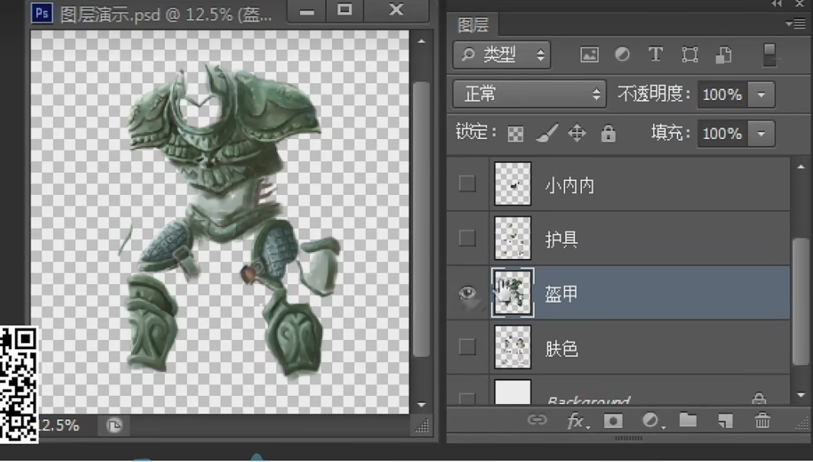
5. 图层是按照顺序叠加的，从上到下依次叠加，改变顺序，则图像会发生改变。
   快捷键：
   - `ctrl`+`{`：使得选中图层下移一层
   - `ctrl`+`}`：使得选中图层上移一层
6. 图层复制。
   快捷键：
   - 按住`alt`，鼠标拖拽某个图层，目标处就会出现复制的图层。
   - 或者`ctrl`+`j`
   - `ctrl`+`c`:复制当前图层
   - `ctrl`+`x`
   - `ctrl`+`v`
   - `ctrl`+`shift`+`v`:原位粘贴

---

#### A09、视图缩放
1. 抓手工具支持拖动图片。
   最常用的方式：任何情况下按下空格键，就会变成抓手模式，可以通过鼠标拖动图片。
2. 在抓手工具的展开栏中可以选择旋转工具
   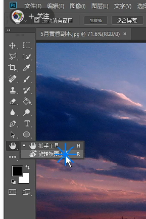
   快捷键：`R`
3. 可以通过修改左下角的数值来改变缩放程度。
   - 也可以通过放大镜来放大、缩小图像。
   - 点选工具编辑栏中的细微缩放后，可以实现按住鼠标左键不松，向左移动鼠标则图像放大，向右缩小
   - 也可以通过快捷键
     - `ctrl` + `+`：放大
     - `ctrl` + `-`：缩小
4. 导航器
   如图选项，出现导航器，通过导航器放大缩小
   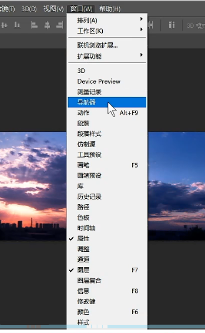
   导航器效果如下图所示：
   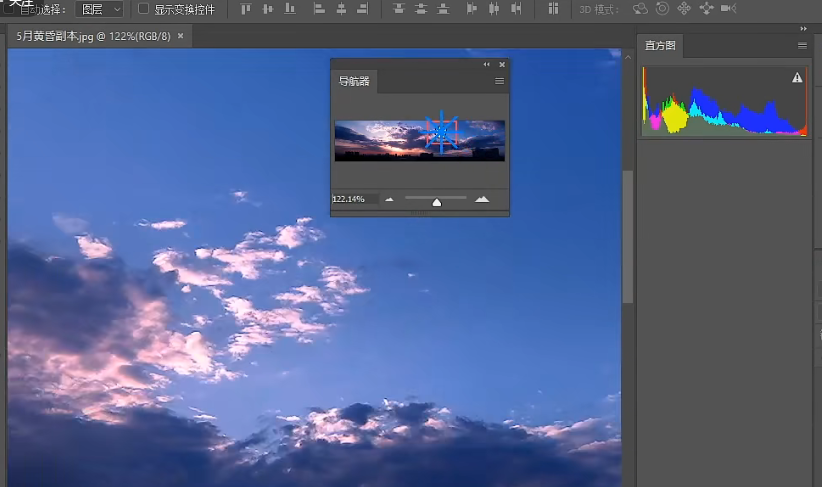

---

#### A10、移动工具
1. 移动工具可用来在不同文件之间移动图层。
   - 拖住选中图层，移动到要移动至的文件窗口处，便可以将图层放在该处。
   - 若想让拖动的图层在新图片中仍然在原本的位置，则在松开鼠标之前按住`shift`键。
2. 移动工具仅可以拖动选中的图层，但若勾选`自动选择`，便可以拖动工作区中任意接触的图层。如图
   
   - 而在没有勾选`自动选择`时，可以通过按住`ctrl`键来临时实现自动选择功能。
3. 在同一文件中移动图层时的快捷键：
   - 按住`ctrl`：临时的自动选择。
   - 按住`alt`:复制当前选中图层。
   - 按住`shift`：选中图层只可垂直、水平、斜向45°移动。
   - 方向键：微调选中图层。
   - `shift`+方向键：更快速度地调整选中图层。
   - `alt`+方向键：复制当前选中图层，并微调位置。
4. 选中`显示变换控件`后会出现图层外围的框框，可以用来调整其大小属性。
   如图。
   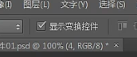 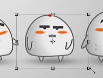

---

#### A11、选区知识
1. 选区就是选取一片区域，该区域中才可以被修改像素，其他部分无法编辑。
   - 另外，还可以仅移动选区内的内容。
   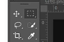
   如图，虚线框内的便是选区工具。
2. 选区操作：
   - 点击鼠标左键进行基本选区
   - `shift`+鼠标左键：正方形区域选择（需要先点击鼠标左键，再按`shift`）
   - `alt`+鼠标左键：从中心点开始区域选择
   - `shift`+`alt`+鼠标左键：从中心点开始正方形区域选择
3. 可以移动选区。在建立完区域后，鼠标仍然保持在选区工具下，则鼠标进入选区内部，可以进行区域移动。
4. `ctrl`+D 或者在选区外面点击一下：取消选区
   `ctrl`+`shift`+D：后悔取消选区，恢复刚刚取消的选区
   这两个命令在`命令`菜单中也可以找到。
5. `ctrl`+H：隐藏选区的外部虚线，但是选区依然存在
6. `ctrl`+c:仅复制当前选中图层中的选区部分
   `ctrl`+v:粘贴选中图层的选区部分，形成新的图层
   `ctrl`+x:剪贴当前选中图层的选区部分
   `ctrl`+`shift`+`v`:原位粘贴
7. 对于一些复杂但又经常使用的选区，可以保存选区，之后载入选区。鼠标在选区区域内部右键`存储选区`即可。
   之后在新文件中`载入选区`即可。

---

#### A12、选框工具
1. 选区组合方式
   如图所示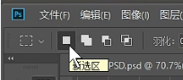
   一共有四种模式：
   - 新选区：创建新选区时，旧选区消失
   - 添加到选区：新选区与旧选区并存，且重合部分会连通，如图
      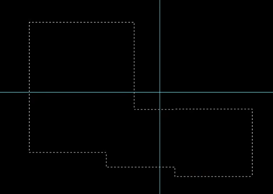
      - 在新选区模式时，按下`shift`+鼠标左键，临时变到`添加到选区`模式。
   - 从选区减去：画出的区域将从已有选区中减去
     - 按下`alt`+鼠标左键，可以在新选区模式中，临时变到`从选区减去`模式
   - 与选区交叉：画出的区域与已有选区的交叉部分保留。
     - 按下`shift`+`alt`+鼠标左键，可以临时变到`与选区交叉`模式。
2. 羽化选项。
   羽化设置像素大小后，即可使选区内和选区外出现渐变的边缘 
   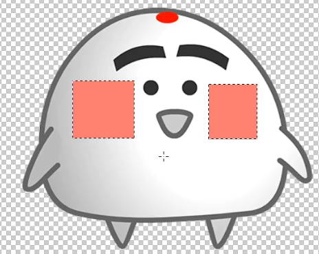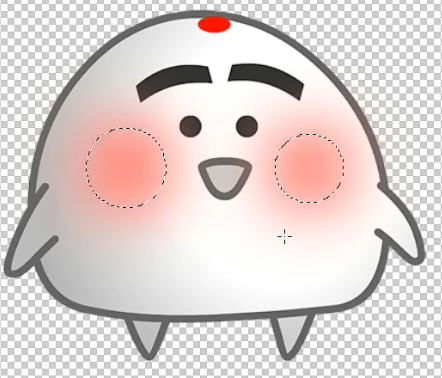
   如图所示。
   - 羽化之前，需要把像素设置完成，之后进行选区(选区区域会由正方形向圆形变化)
   - 但对于已完成的选区，也可以在`选择`菜单中选`修改`中的`羽化`以添加羽化。
      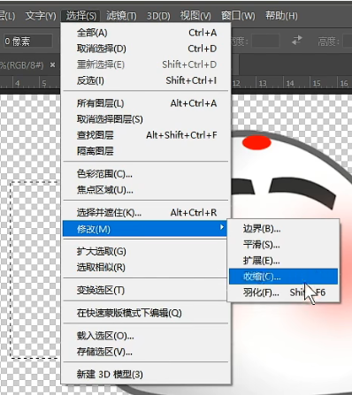
3. 样式选择。
   选取`固定比例`后，可以得到确定比例的区域
   `固定大小`同样
4. `消除锯齿`选择后，对于椭圆区域，其边缘上的锯齿会变柔和。
   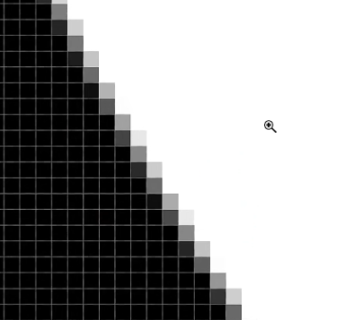
5. 按住选框工具不动，则会出现其他区域选区的工具。或者按住`alt`+鼠标左键，可以点开堆叠菜单。
   - 椭圆选区
   - 单行选区：只一行区域，高度为一个像素
   - 单列选区：只一列区域，宽度为一个像素

---
#### A13、套索工具和魔棒
这两样工具可以帮助进行自由地选区
1. 套索工具
   - 选中套索工具可以画出一个封闭区域，即为选区；也可以画一个不封闭区域，则鼠标松开，两点间自动连接，形成选区。
   - `多边形套索`：利用鼠标点几个点，则可以根据这几个点自动连接直线形成选区。
     - 回退：按下`backspace` or `delete`就可以回退一个点。
      （有的会出现问题，按下`backspace`后出现卡死问题，原因在于windows输入法与adobe快捷键出现兼容问题，调整windows输入法即可）
      - 取消当前选区：按下`esc`
      - 提前闭合：按下`ctrl`+`回车`或者双击鼠标左键。
    - `磁性套索`：其会自动出现锚点，自动判断像素边缘，从而让锚点自动贴附在边沿上。实际操作时，不需要鼠标点击，只用在边沿移动鼠标就可以自动产生锚点，但是也同样可以点击来提高选区速度。
      - 同样可以使用`backspace` or `delete`来回退
      - 其拥有几个特殊特性：宽度即为添加锚点时自动识别的像素大小；高对比度用于清晰边沿，低对比度用于模糊边沿；频率控制磁性控点的多少
      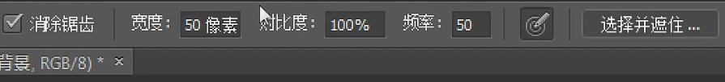
2. 魔棒工具

