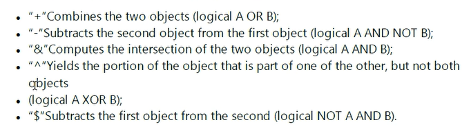

### 24/3/8

1. 只有0°视场和5°视场时，选取`“RMS vs 视场”`图进行观看，一般来说，最大最小点应出现在两端，但是若重点出现极值，那么说明需要添加更多的视场进行测试
   1. 而添加视场或波长后，系统就需要重新优化。
   2. `“RMS vs 波长”`同样
2. 大致的优化流程包括：
   1. 设置优化变量
   2. 定义优化函数
   3. 优化透镜
   4. 查看各项分析图
   5. 玻璃优化
3. 优化函数可以直接设置对各种像差进行优化，但是不推荐，因为：
   1. 很难计算
   2. 优化所使用的`高斯采样法`的`ring`可以实现对$z^{2 ring -1}$级的像差的操控，因此已经可以覆盖像差优化了
   3. 过去像差被提出来更好计算地优化成像系统，但如今计算水平大幅上涨，可以不使用那几种像差了，直接去优化最终的评定参数
   4. 优化可测标准就可以减小像差，除了畸变
4. 优化函数自行加优化的操作数时，应该加在`DMFS`上
5. `锤优化`在`玻璃优化`时去使用，一般都是会跑个一晚上。
6. 优化函数要多添加合理的约束，比如镜片边缘和中心厚度。


### 24/3/11
1. 非序列模式下，摆放的是物体，光线可以各个方向地传播。
2. 非序列模式会给出光线折射、反射后的子光线，之后是子子光线，通过`系统设置`可以设置`最小光线能量`，从而控制子光线的数量
3. 设置某个参数为`P`表示其将根据另一个某个参数而变。
4. 非序列与序列模式混合时，对于非序列组件，需要设置其光线输出口的位置
5. 混合模式时，非序列组件作为一个平面放置，其输出口的位置相对于进入面定义；同时非序列组件后需要一个后平面来保证其是一个完整组件；需要通过计算来得出输出光的位置，X、Y、Z，都是相对于其等效平面的相对坐标。
6. 非序列模式中，光源的各个参数
   1. 阵列光线条数：展示结构时画出的光线数量
   2. 分析光线条数：定量分析时光线的数量
   3. 能量
   4. 波数：选取定量分析的波长数字
   5. 颜色#：定义画笔颜色
   6. 在。。。内部：设定该光源在某个几何体内部，以模拟某模型内部发射的光源
7. 使用光线追踪，之后可以查看探测器的收集数据

### 24/3/13
1. 查看`实体模型图`或`3D示意图`时，可以利用过滤器。如`R2`表示只查看经过物体2反射的光线。`!R2`表示只查看没有经过物体2反射的光线。又或者`(H7&H9&!R6)|M2`表示撞击了物体7与9，且没有被6反射，或者没有经过物体2.
2. 非序列物体中，通过`原生布尔`型物体可以制造复杂图形，可以利用逻辑运算符将复杂物体进行嵌套。
   {width="400px"}
3. 膜层数据在膜层文件中写出，`COATING.DAT`
4. 非序列模式中，光线散射可以通过设置非序列物体的表面的散射文件来实现
   1. 可以设置`重点散射`，对于某些只关注散射光的情景
   2. 具体方法包括`散射路径`和`重点采样`
   3. 在模型查看中，打开`Scatter NSC Rays`才可以看到散射光线
5. 非序列模式中，在模型查看中打开`Split NSC Rays`才可以看到光线在模型表面处的分裂，即反射光线


### 24/3/20
1. 疑问：
   在仿真设计中，调整二极管光源的Y-width，其会影响X方向的光源分布是否是高斯还是超高斯分布，为什么？
   ```
   发现x方向光源分布是否为超高斯分布和Y-\theta 与Y-width的比值有关

   。。。这个与接收器的像元数有关，若Y-\theta太小，就会导致接收到的光线较少
   ```

### 24/3/21
1. **非序列优化**：
   常用的操作数为`NSDD`和`NSTR`
   - `NSDD`:清除探测器数据，并读出探测器数据
   - `NSTR`：进行光线追踪
   - `RECI`:返回倒数
   - `FREZ`:设置限制条件
2. 一般利用`RECI`来得到某个值的倒数，设定权重以进行优化