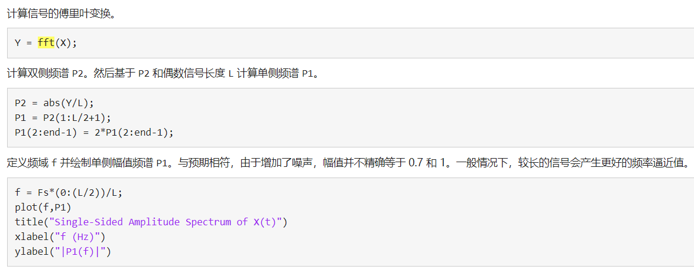
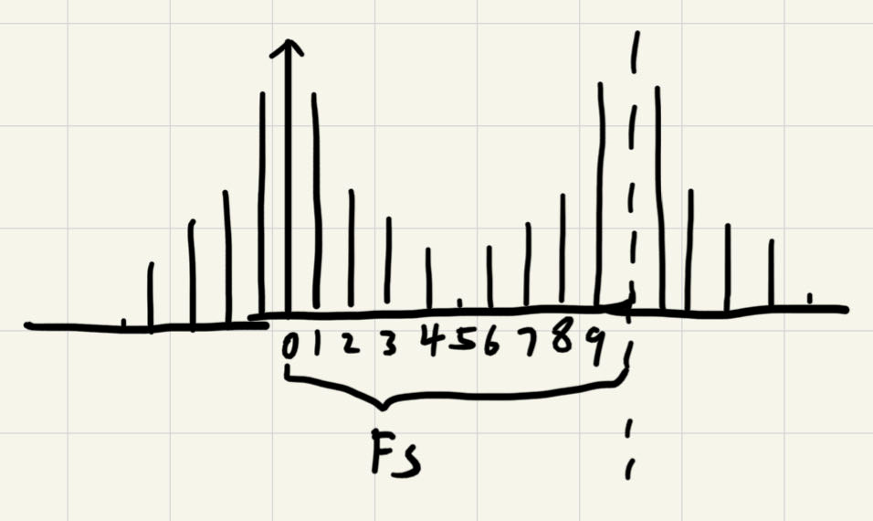
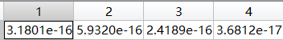
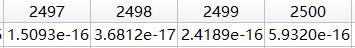
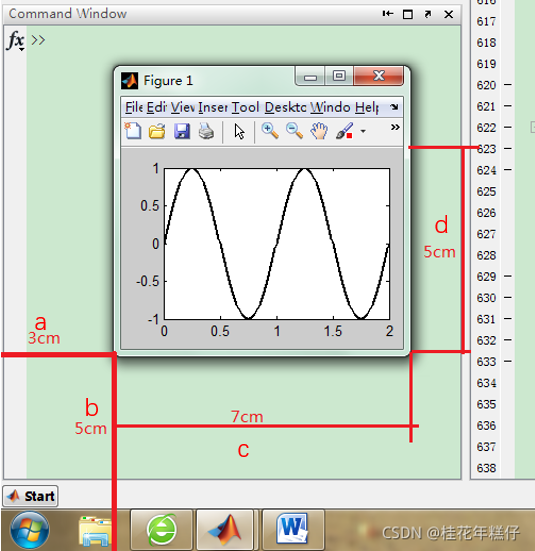

#### matlab小技巧
[TOC]
##### 1、如何利用movie保存动图

```matlab
fmat=moviein(100) %提前声明fmat是一个100帧的图像
for m=1:circle
    %%%%图像作图
    fmat(:,m)=getframe;  %抓取当前图窗中的图像
    %需要注意，getframe抓取的为当前图窗中的图像，若利用subplot...
    %在一个figure中有多个图像，则抓取的为最后一个图窗中的图像
    %fmat(:,m)=getframe(gcf);
    %此时为抓取整个窗口的图像
end

movie(fmat,10,30);  #以30帧的速率播放fmat 10次
```
`gca与gcf的区别`：
- gca指当前画图界面中的图形
- gcf为当前窗口的全部内容


如果想将这些动图保存为本地文件，则可以选择保存为<.gif>文件
- 利用frame2im
- 将图形数据frame一张张保存为image，之后imwrite保存下来

```matlab
for m=1:circle
    im=frame2im(fmat(:,m));
    [imind,cm]=rgb2ind(im,256);
    if m==1
        imwrite(imind,cm,'A.gif','gif','Loopcount',inf,"DelayTime",1,'WriteMode','overwrite');
        %Loopcount设置为inf，则gif图像会循环播放
        %DelayTime设置为1，则图像会在1s后播放下一帧
    else
        imwrite(imind,cm,'A.gif','gif','WriteMode','append',"DelayTime",1);
        %append使得图像追加在一个图像之后
    end
end
```
---
##### 2、一维信号处理中傅里叶fft变换后的幅度、坐标恢复
在信号处理时，傅里叶变换后需要进行幅度恢复，以及坐标恢复。

**幅度恢复：**

一维傅里叶变换时，即matlab中代码如下：
```matlab
%A为signal 大小为1xN
f=fft(A);
%双边谱时幅度需要 x 1/N，N为矩阵点数
f2=f.*(1/N);
%单边谱时，需要将非0频分量 x 2.
f1=f2(1:floor(N/2)+1);
f1(2：end-1)=f1(2:end-1)*2;
 
```
见matlab官网示例

若傅里叶逆变换时，则与正变换的相反。

**坐标恢复：**

具体见官网示例：[matlab的fft](https://ww2.mathworks.cn/help/matlab/ref/fft.html?s_tid=doc_ta)
信号域经傅里叶变换后为频域。
1. 设信号域的对信号的**采样频率为**$F_s$，**信号域点数为N**，则时域时间范围为（0:N-1）$* {1\over F_s}$。理论中，则频域中的 f 的范围为
    $$
    F_s
    $$
2. 傅里叶变换后的f的点数同样为N个，其间隔是N-1个，一个**错误的**点便是得出 f 的间隔为$  F_s \over (N-1)$，这个错误的原因在于其间隔虽然为N-1，但是实际上非周期离散信号的离散傅里叶变换的频域是一个无限的周期函数，其周期为$F_s$，而每个周期中的点数为N个，两周期中相同点的间隔数为N个。因此实际上，**正确的** f 的间隔应该为
    $$
    F_s \over  N
    $$
见图：

在变换后，fft（）后得到的信号其仅为0——9的离散点的信号，（N=10）
这一事实已通过matlab得到验证：（下图为对N=2500的信号处理，经fft变换后的频域实部）

可以发现变换后的频域实部中，F（1）没有对应相等的值。
3. 因此f的离散范围为（0:N-1）$* { F_s \over N}$
---

##### 3、fft2()进行夫琅合费衍射，变换后坐标的恢复（及可能对的幅度恢复）
傅里叶光学中夫琅合费衍射为衍射光的傅里叶变换，但在变换后其空间光谱的坐标为$(f_x,f_y)$，因此坐标需要恢复才可变成真实坐标。

傅里叶光学中，夫琅合费衍射表示如下：
$$
E(x,y)=C \cdot FFT\left\{ E(x_1,y_1)   \right\} \newline
C=exp \left\{ jk[z+{1 \over 2z} (x^2+y^2)]  \right\} \cdot {1\over j \lambda z}
$$

（其中z为传播距离）
但还需谨记，傅里叶变换中的空间频率的转换关系：
$$
f_x={x \over \lambda z} , f_y={ y\over \lambda z} 
$$

在FFT后其矩阵对应的横纵坐标对应$(f_x,f_y)$。

**坐标恢复：**

1. 根据信号与系统的知识，信号采样间隔与傅里叶变换后的频谱存在对应关系。
设信号采样间隔为$\Delta$，则变换后频谱的频谱范围为$1\over \Delta$。
2. 因此在二维FFT变换中，**变换前**其矩阵横纵坐标间隔分别为$\Delta_x, \Delta_y$，则**变换后**横纵坐标（即$f_x，f_y$）的**频域**范围分别为${1\over \Delta_x},{1 \over \Delta_y}$.
3. 则其矩阵中点的间隔为(N为矩阵采样点的**间隔数**，设横纵坐标间隔数分别为N、M)。为什么除以N+1见 **（2、）** 中。
   $$
    \Delta_{f_x} ={1\over \Delta_x (N+1)}, \newline
    \Delta_{f_y}={1\over \Delta_y (M+1)}
    $$
4. 根据已知关系可以将频域坐标($f_x,f_y$)转换为空间域坐标($x',y'$)
    $$
    f_x={x' \over \lambda z} , f_y={ y' \over \lambda z} 
    $$

    则可以得到变换后的横坐标的间隔（设$\Delta_x=\Delta_y=\Delta$）
    $$
    \Delta_{x'}={\lambda z \Delta_{f_x}}={\lambda z \over \Delta \cdot (N+1)}=\Delta_{y'}
    $$

5. 则变换后的空间频谱矩阵大小若为N+1 x N+1，其横纵坐标分别为
   ```matlab
    x=[-N/2:N/2].*delta_xp;
    y=x;
    [X,Y]=meshgrid(x,y);
   ```
   （其中delta_xp即为$\Delta_{x'}$）

**幅度恢复：**
（不知道对不对，但幅值会正常一点）

幅值恢复只需要在fft2（）之后除以x、y空间频率的周期.设变换前空间坐标的矩阵大小为 N+1 x M+1 ，其长度为 $L_x$ x $L_y$ 即
$$
E_{target}= {L_x\over N} {L_y\over M}  fft2(E_s)\cdot C_0
$$
```matlab
E_target=fftshift(fft2(E_S)).*(L/N)^2;
```

---

##### 4、消除surf画图时的网格线
利用surf可以画出三维图像，但有时会发现图像中非常黑暗，其原因并不是colorbar出了问题，而是surf画图时默认会加上网格的边界线，因此若坐标很密，则网格的边界线会掩盖住三维图像本身的颜色。
可以使用下列方法进行解决。
```matlab
surf(X,Y,Z);
shading flat; 
```

---

##### 5、在图像上写字
具体见博客[matlab如何在图像上写字](https://blog.csdn.net/jk_101/article/details/110733072)
这里仅给出常用的东西

1. 利用text函数写字
    ```matlab
    x = linspace(0,10,50);
    y = sin(x);
    plot(x,y)
    
    txt = '\leftarrow sin(\pi) = 0';
    text(pi,sin(pi),txt);
    ```
    text()函数中的坐标为画图时所对应的坐标。

2. text()中可调的参数有多种：
- 'FontSize':字体大小，一般10——18
- 'Color':颜色，为[r,g,b]三色矩阵，r\g\b均在（0，1）之间
    具体代码即
    ```matlab
    x = linspace(0,10,50);
    y = sin(x);
    plot(x,y)
    
    txt = '\leftarrow sin(\pi) = 0';
    text(pi,sin(pi),txt,'FontSize',14,'color',[1,0,0]);
    %显示红色、14号字
    ```

3. 若想在输入的txt中加入变量，则可以如下操作：
    ```matlab
    txt=['变量：',num2str(x)];
    text(pi,sin(pi),txt);
    ```
    注意字符串拼接时，中间需要加入','以隔开。
---

##### 6、拼接字符串

```matlab
for m=1:50
    filename=['picture/',num2str(m),'.png'];

    %画图

    img =gcf;
    print(img, '-dpng', '-r600', filename);
end
```

---

##### 7、保存图片
具体见[matlab保存图片](https://blog.csdn.net/gsgbgxp/article/details/124764861)。
可以利用print()函数保存

```matlab
img=gcf
print(img, '-dpng', '-r600', filename);
```
上述代码保存的是整个窗口内的图像。

---

##### 8、linspace()产生向量的数目不对

见代码
```matlab
N=L/delta;
x=linspace(-L/2,L/2,N);
```
有时候会发现x的向量长度为N-1,而不是N。
这是因为
```matlab
N=L/delta;
```
所得到的N可能是浮点数，而不是整数，linspace（）后的数量应该填入整数，因此填入浮点数时可能会少1

**解决办法**
```matlab
N=round(L/delta);
```
取整即可。

---
##### 9、linspace的浮点精度误差
代码如下
```matlab
N = 5000;
L = 10e-3;
a = linspace(-L/2, L/2, N+1);
```
代码中a中每个数据的间隔应当为2um，但是实际上，该代码运行过后会发现a(2499)=-4.000000000000001e-06。***其尾部保留了一个非常小的尾数***
**原因：**
是因为linspace()是利用浮点数进行运算的函数，因此有时候会由于精度问题而多出一个很小的尾数。
**解决：**
利用round()保留一定尾数即可。
```matlab
a=round(a,10); %保留a的数据中的10位小数
```

---

##### 10、设置画图窗口的长宽

具体见[设置画图窗口的长宽](https://blog.csdn.net/qq_40077565/article/details/121492530).

其实画图的各种属性都可以在画图窗口的编辑菜单里看到，然后通过set()函数对相应函数进行修改。
当需要对窗口长宽进行修改时，见下列代码：
```matlab
set(gcf,'unit','pixels','position',[178.6,307.4,1224,420]);
```
'unit'更改计量单位为像素。之后修改'position'属性，该属性为一个向量[a,b,c,d]
- a为窗口左侧距离电脑屏幕左侧的距离
- b为窗口下侧距离电脑屏幕下侧的距离
- c为窗口横向长度
- d为窗口纵向宽度



---


<script type="text/javascript" src="http://cdn.mathjax.org/mathjax/latest/MathJax.js?config=TeX-AMS-MML_HTMLorMML"></script>
<script type="text/x-mathjax-config">
  MathJax.Hub.Config({ tex2jax: {inlineMath: [['$', '$']]}, messageStyle: "none" });
</script>

