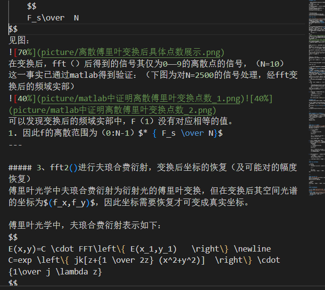
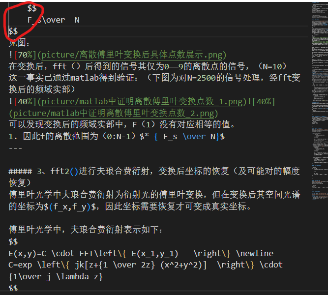
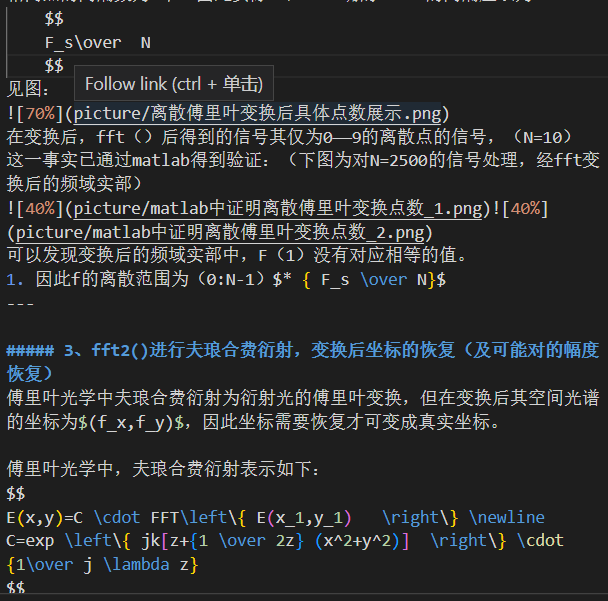
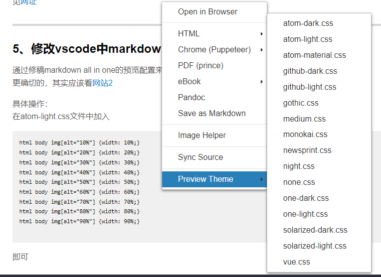

## 学习中出现的一些问题
[TOC]
### 1、如何解决pdf输出时公式无法显示的问题
 **2023/4/4**
在所编辑的.md文件末尾加上下列代码即可
```markdown

<script type="text/javascript" src="http://cdn.mathjax.org/mathjax/latest/MathJax.js?config=TeX-AMS-MML_HTMLorMML"></script>
<script type="text/x-mathjax-config">
  MathJax.Hub.Config({ tex2jax: {inlineMath: [['$', '$']]}, messageStyle: "none" });
</script>

```

### 2、<.md>文件中代码渲染出现问题

**问题：**



如图，可以发现代码渲染问题包括：
- 插入图片的代码中中括号渲染问题，一侧方括号为红色，表示没有对应的，但实际上有。
- 标题3中不再出现标题代码的渲染，即'#####'没有出现颜色渲染，且出现了‘()’的渲染

**解决办法：**

目前发现的原因为在该标题前存在latex公式插入符号没有对齐，即如图显示：

如图，在其中用红线圈出的地方出现没有对齐的问题。而在对齐了之后，就发现后面的渲染变成正常的了。

> markdown采用的渲染依据可能与缩进有关，因此需要将代码的层级划分清晰，才可以有清晰的代码渲染。

### 3、加黑加斜体无法同时出现

**问题：**

这是***问题***。

**解决办法：**

实验发现加黑加斜体同时出现时，其前侧后侧都不能是文字才可以（可以是符号），如下：

这不是 ***问题***。
这不是，***问题***。

### 4、修改插入图片时，图片自动存放的目录
见[网址](https://blog.csdn.net/u010649766/article/details/88745690)

---

### 5、修改vscode中markdown插入的图片的大小
通过修稿markdown all in one的预览配置来达到效果，具体见[网址](https://blog.csdn.net/hippyoo/article/details/130145695)
更确切的，其实应该看[网站2](https://stackoverflow.com/questions/14675913/changing-image-size-in-markdown)

具体操作：
在atom-light.css文件中加入（因为默认用的是atom-light.css模板）
```
html body img[alt="10%"] {width: 10%;} //10%为当前显示窗口完整宽度的10%
html body img[alt="20%"] {width: 20%;}
html body img[alt="30%"] {width: 30%;}
html body img[alt="40%"] {width: 40%;}
html body img[alt="50%"] {width: 50%;}
html body img[alt="60%"] {width: 60%;}
html body img[alt="70%"] {width: 70%;}
html body img[alt="80%"] {width: 80%;}
html body img[alt="90%"] {width: 90%;}

```
即可
