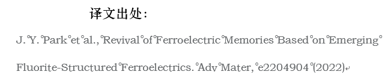
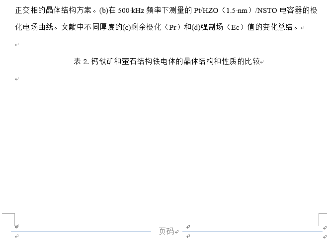
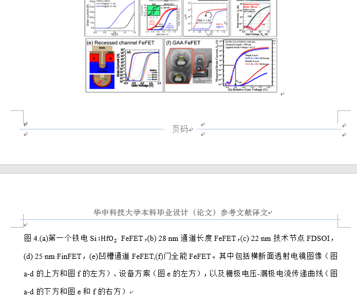

#### 修改意见

[TOC]

##### 1、译文出处

> 中间的小圈
##### 2、题目

> 这个我感觉内容都在横线的中间比较好吧，但是可能也不用改
##### 3、红色字要删除

##### 4、图和表的上下要空一行
> 一般我会空
##### 5、图和表的题注要比正文小一号

##### 6、没有加页码

##### 7、图和表的下面不要留三行`及`以上空白

##### 8、图和题注不要分开在两页

##### 9、题注可以修改前后缩进来使得其与正文段落格式区分开

> 如图可以修改其段落前后各自缩进三个字符，这样可以与正文段落区分开，否则看着很不清晰

##### 10、参考文献格式如我上次所说

