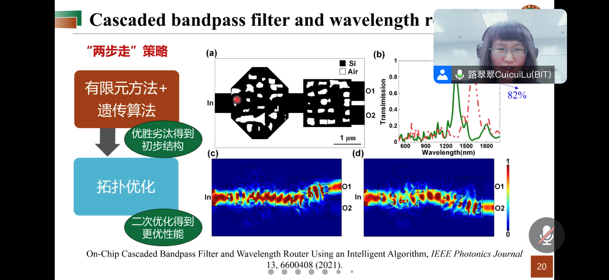
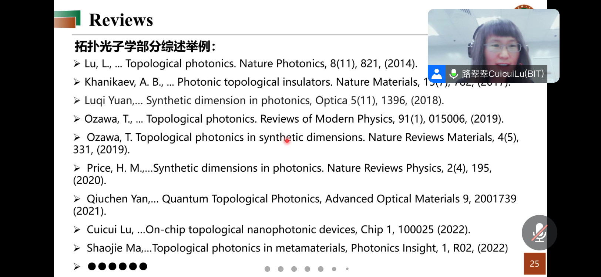

## 微纳光子器件智能算法设计于拓扑态实现
> 路翠翠 北京理工大学
---
这个公开课没有好好听，主要是路老师利用《遗传算法+有限元》进而设计一些光子器件，同时又讲了一些拓扑态光子的理论。


1. 路老师讲其实**matlab中的遗传算法工具箱**已经够用了。
2. 对于有限个体个数的可以用这种算法进行优化，但是如果单元结构特别多，就不能用了，要用《**传输矩阵法**》进行。

另外记录了一下路老师推荐的拓扑光子学的一些综述：

```
Lu, L., ... Topological photonics. Nature Photonics, 8(11), 821,(2014)
Khanikaev, A. B., ... Photonic topological insulators. Nature Materials
Luqi Yuan,... Synthetic dimension in photonics, Optica 5(11), 1396,(2018)
Ozawa, T, ... Topological photonics. Reviews of Modern Physics, 91(1), 015006,(2019)
Ozawa, T Topological photonics in synthetic dimensions. Nature Reviews Materials, 4(5)331,(2019).
Price, H.M.....Synthetic dimensions in photonics. Nature Reviews Physics, 2(4), 195(2020).
Qiuchen Yan,.. Quantum Topological Photonics, Advanced Optical Materials 9, 2001739(2021).
Cuicui Lu, .On-chip topological nanophotonic devices, Chip 1, 100025 (2022)Shaojie Ma....Topological photonics in metamaterials, Photonics lnsight,1, R02, (2022)
```