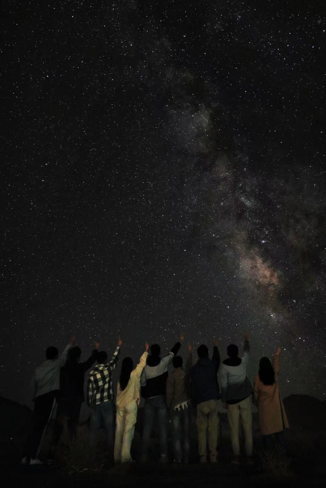
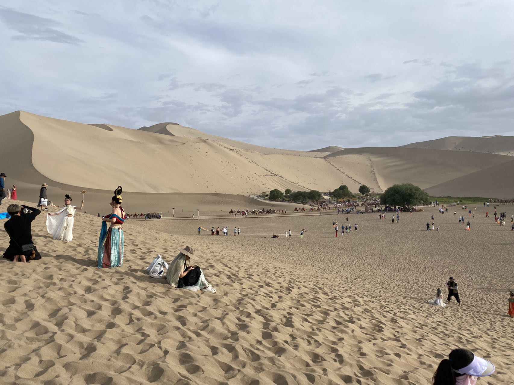

1. 一定要做好防晒，全身都要遮住的那种，还有戴好墨镜，那边太阳太晒了，我脖子当时晒了一个上午就晒伤了。。
2. 要带好学生证哦，很多景点可以学生票，当时有的售票处会说我毕业了，然后我就说我是五年制的，最后也顺利买到学生票刷开景区的门了emmmmmm。
3. 初到高原上不跑跑跳跳就一般不会高反，走路慢一点就行。
4. 一路上景区里面或者周围都会有卖纪念品的，但是如果遇到那种卖首饰的，比如原石手链，其实基本都是假的，或者掺着卖的（当时我们导游说的）。
5. 关于各个景点：
   1. 青海湖我当时去的是二郎剑景区，讲实话感觉一般，因为人实在太多了。
   2. 茶卡盐湖巨好看，可能当时天气很好，我们那天天上有一堆乌云，但是中间有个洞，光从里面射下来了，丁达尔效应非常好看。景区里面有海盐冰淇淋，还可以租胶鞋去水里拍照。
   3. 回来后发现大柴旦旁边似乎有一个北纬37°星空营地，可以在晚上的时候看漫天繁星，但是我们当时不知道。。
   
   效果是这样的。
   4. 水上雅丹很美哦，个人感觉仅次于茶卡盐湖，里面就是有水也有戈壁（我的朋友圈背景就是水上雅丹）
   5. 敦煌有个沙洲夜市，里面贼热闹，但是有些东西又贵又难吃，不过也是相当值得一去的。另外有个敦煌书局，我们当时想去但是没去成，里面应该是卖一些纪念品的。莫高窟能买A票必须A票，但是一般A票需要提前一个月预约，临近的就只有B票了，除了A、B票外还有特窟，A、B票逛完就可以去特窟售票处买特窟的（看需要），一个特窟好像200还是100多，特窟里的东西可能更加好看点（？），但是我们没去。
   6. 鸣沙山月牙泉真的贼好看，那个沙漠的沙丘特别高，买票进去之后可以爬沙丘，很锻炼身体！里面还有几千只骆驼组成的驼队，超级超级长。沙丘上面可以滑沙，坐在一个木板上面滑下来，贼爽。可能第一次进到沙漠里面，感觉贼刺激。但是记得在门口提前买鞋套，景区门口的鞋套很便宜，但里面就很贵了，戴上鞋套爬沙丘会容易很多。
   
   7. 祁连大草原很美，蓝天白云草原，跟画里似的，草原上还有很多鼠兔，是一种很小只的兔子，但是跑的贼快，捉不到。。另外听说还有土拨鼠，但是我们当时没见到。