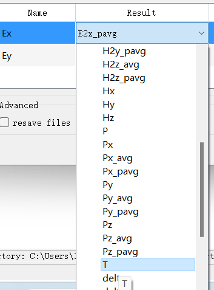
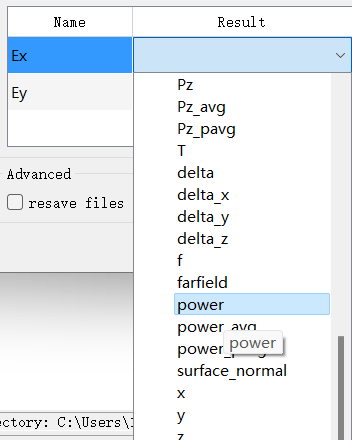

## 我想您帮我看看：
1. 我设置光在z轴传播，那么点的相位是通过
   > angle（Ex+1i*Ey）       **（1）**
   
   求的吗？
2. 这个fdtd`仿真区域`设置的有没有问题?
   1.  扫描单元结构的时候，应该设置周期性边界吗？还是周期性对称边界？还是PML呢？
   2.  FDTD的仿真区域的边界即是结构衬底的边缘吗？

3. 我扫描相位的方法是通过得到每一轮那个点监视器的Ex和Ey，再通过(1)的式子得到每一轮扫描的相位，您是按照这个方法吗？
4. 对于传输率的扫描是选取monitor里的T进行扫描的吗？
   
   我之前选择power，
   
   结果是很小的具体值，选择T之后，结果就是归一化的`0——1`的值。所以T是用光源的能量归一化了吗？power是未归一化的吗？