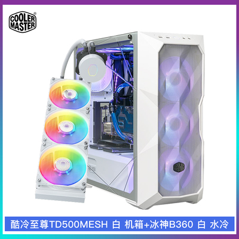
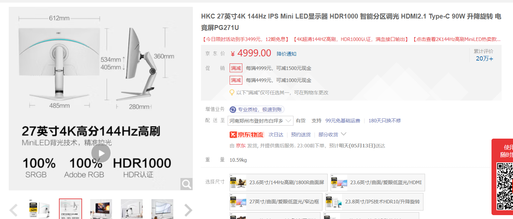
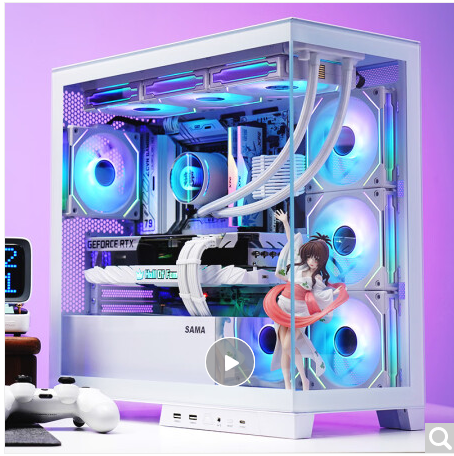

#### 23/5/12 周五

**想法：**
1. 个人电脑主要应对的就是游戏需求，渴望有一台配置相当不错的电脑来进行各种游戏的游玩。
2. 那么根据这种需求，主要要看的就是显卡>cpu，因此需要在显卡上投入很大的比重的金钱。
3. 另外还有需要重点投入的部分就是显示器，因为显示器的好坏直接决定了眼睛看到的内容，因此一个好一点的显示器可以带来好得多的视觉体验！

**目前的电脑配置清单：**
- cpu+主板：13600kf+微星B760M迫击炮 WIFI D5      （白色）
  - 2960 淘宝
- 显卡：rtx4070ti 七彩虹 ultra w （白色）
  - 6099 淘宝
- 内存：宏基掠夺者 DDR5 6000Hz 32g 星光银 （白色）
  - 864 京东
- 硬盘：宏基GM7000 2TB
  - 754 京东
- 电源：酷冷至尊GX750 750W 白色款 （白色）
  - 599 京东
- 散热器：酷冷至尊 冰神B360 （白色）
  - 459 京东
- 机箱：酷冷至尊 TD500 MESH V2 白色 （白色）
  - 499 京东

总价：2960+6099+864+754+599+459+499=1,2234
（但到时候真的购买的话可以更便宜一点，比如酷冷至尊的机箱和水冷可以一起买，套装会便宜一点，还可以换不同的平台看看）

这款组合是全部白色系的，非常的nice。

**这套配置的想法：**
1. cpu+主板：这套采用了DDR5的内存，相比DDR4有了一定的提升。另外采用了13代i5，这个性能估计可以用N年了。
2. 显卡：显卡方面其实对比了rtx4070，4070的价格一般在4500左右，但是4070ti只比4070高了1500，所以咬咬牙直接上4070ti，直接可以玩个n年。丐版的显卡就够用了。或者变成其他的白色系显卡也可以，基本都是6000左右的。
3. 内存：性价比高，没怎么研究。
4. 硬盘：这个硬盘很强，性价比高。
5. 电源：金牌全模组电源，应该够猛。电源功率一般和cpu和显卡有关，750W应该够用了，感觉我用这么多钱买一个这么高配置的电脑，应该后续很多年都不会想换配置了。
6. 散热器：采用了水冷，散热能力杠杠的。采用了360°的。
7. 机箱：这个机箱老帅了。当然后续也可以换成别的机箱。



**显示器：**
显示器直接上最nb的！


   - 3499

HKC mini-LED显示器，27英寸，4k，144hz，HDR1000,支持升降旋转，只能分区调光，100%ARGB色域，响应速度1ms
- 接口：HDMI2.1,DP1.4,TYPE-C

> 在显示器的选择中，以前我很喜欢曲面屏，但是曲面屏需要很大时才可以有很好的体验，曲面屏一般使用VA面板，响应速度慢，有拖尾，直面屏多使用IPS面板，响应速度块，体验更好。因此以后如果不是很大的显示器的话，就选择直面屏就好了。

这个配置，使用4k打游戏的话，许多顶级3A游戏都可以高画质流畅运行，估计这个配置可以干个n年了。

**总价：**
那么主机加上显示器的话，总价就来到了1，5733。

确实有点难实现。。。

---

#### 23/5/16 周二更新
**主板：**
发现可以更换为rog B760m wifi ddr5 小吹雪，价格在淘宝为3120，比起微星的也就贵了160，但是颜值提高了贼多。
**显卡：**
另外方面，可以考虑铭瑄 4070ti cratic，淘宝价格6079.或者选择微星4070ti 白魔龙，淘宝价格6449，作为次旗舰的微星显卡，散热和其他方面应该更加牛。
**电源：**
不知道要不要买850w，上面配置的酷冷至尊gx750并不是atx3.0，因此对于40系显卡供电需要用转接线。850w atx3.0 可以考虑鑫谷GM850冰山版， 京东价格699.

---

#### 23/5/18 更新

**散热器：**
因为博士要读5年，这期间我就不准备对电脑更新了，那么用水冷的话就很有可能有漏液的风险，看了下酷冷至尊是三年质保，有点危险，可以换瓦尔基里，产品基本都是5年质保，推荐瓦尔基里C360W-RGB 白色版，559 京东。
**内存：**
内存方面，6000Hz的经常没货，那么可以稍微加点钱买6600Hz的，京东价格949

---

#### 23/5/19 更新

突然感觉我以后要读书的这么多年里面也不知道会不会有那么充足的时间打游戏。。。
并且如果我玩游戏的话，其实目前我在玩的也就是联盟、战锤全面战争这些游戏偏多。那么其实组装一台特别好的电脑感觉实用性一般。所以又想了想，觉得之前想出来的电脑配置里，显卡可以降一降，变成4070或者甚至3060ti都可以，4070就用4k显示屏，买个2000+的就可以了，3060ti就上2k，显示屏1000+。
但是cpu的话不能降，因为其他的很多性能都靠cpu拉起来了。或者也可以换成13400f
电源换成650W就行了（对应4070和另两款cpu，因为4070功率很小了）

**更新的电脑配置清单：(完全性价比)**
- cpu+主板：13600kf+微星B760M 迫击炮wifi ddr5
  - 2900 淘宝
- 显卡：4070 铭瑄 icraft 
  - 4500 淘宝
- 内存：宏基掠夺者DDR5 银白 32g 6600Mhz
  - 729 京东
- 硬盘：宏基GM7000 2TB
  - 599 京东
- 散热：瓦尔基里 C360 
  - 589 京东
- 电源：安钛克 NE750
  - 599 京东
- 机箱：先马 新境界 白色
  - 379 京东
- 显示器：AOC U27G3X
  - 京东 2699

主机总价：10295
总价：1，2994


但是网上对于4070的评价非常不好，更多推荐4070ti，现在4070ti丐版6000左右，比4070高了1500，到时候可以先买其他东西，然后攒一些钱再上4070ti。
这样子，总价就1，3000左右。

当然也可以研究生时期看平时忙不忙，如果根本没有时间打游戏，那显卡买3060ti 2600多，就足够了。还是配这个显示器，那么价格差不多在1万左右，如果这样就可以加点钱上13600kf还有水冷了。13400f升级成13600kf贵600

散热后期可能更希望换成瓦尔基里C360W-RGB 白色版，559 京东，比较喜欢这个。女武神！

如果搭配3060ti，那么配置就变成了如下：


**更新的电脑配置清单：(3060ti)**
- cpu+主板：13600f+微星B760M 迫击炮wifi ddr5
  - 2938 淘宝
  ```
  或者主板换成微星B760M 迫击炮wifi ddr5 MAX
  - 2988 淘宝
  贵了50
  ```
- 显卡：铭瑄 3060ti g6x icraft oc 
  - 2800 淘宝
- 内存：宏基掠夺者DDR5凌霜 32g 6000Mhz
  - 639 淘宝
- 硬盘：宏基GM7000 2TB
  - 724 京东
- 散热：瓦尔基里 C360W-RGB 白色版
  - 559 京东
- 电源：安钛克NE750 金牌全模组
  - 569 京东
- 机箱：长城海王星7 白色
  - 269 京东
  ```
  或者换成先马新境界 白色
  - 379 京东
  内部空间大的能放手办，并且更加窄，体积更小。
  ```
- 显示器：泰坦军团 P2SA2V 27寸 4k
  - 2399 京东 
  ```
  或者换成HKC 27英寸 VG273Upro
  - 2699 京东
  似乎性能比泰坦军团更好。

  或者换成AOC U27G3X
  - 2699 京东
  有硬件防蓝光，同时大厂做工好。
  ```

主机价格：8498
加上显示器：10897

这套配置，除了显卡是3060ti之外，其他的基本都是顶配。
因此以后如果想升级的话，就升级显卡就可以了。
并且整体颜值都是白色，十分nice。

---

#### 23/6/4
今天想到的三种配置：

1. **13600kf+ddr5+4070+水冷**
   - cpu+主板：13600kf+微星B760M 迫击炮wifi ddr5
     - 2900 淘宝
   - 显卡：4070 铭瑄 icraft 
     - 4500 淘宝
   - 内存：宏基掠夺者DDR5 银白 32g 6600Mhz
     - 729 京东
   - 硬盘：宏基GM7000 2TB
     - 599 京东
   - 散热：瓦尔基里 C360 
     - 589 京东
   - 电源：安钛克 NE750
     - 599 京东
   - 机箱：先马 新境界 白色
     - 379 京东
   - 显示器：AOC U27G3X
     - 京东 2699


    主机总价：10295
    总价：1，2994

2. **13400f+ddr4+4070+风冷**

   - cpu+主板：13400f+微星B760M 迫击炮wifi ddr4
     - 2200 淘宝
   - 显卡：4070 铭瑄 icraft 
     - 4500 淘宝
   - 内存：光威DDR4 32g 3200Mhz
     - 329 京东
   - 硬盘：宏基GM7000 2TB
     - 599 京东
   - 散热：利民PA120 SE 
     - 149 京东
   - 电源：安钛克 NE650
     - 499 京东
   - 机箱：先马 新境界 白色
     - 379 京东
   - 显示器：AOC U27G3X
     - 京东 2699

    主机总价：8655
    总价：1，1354

3. **13400f+ddr5+4070+风冷**

   - cpu+主板：13400f+微星B760M 迫击炮wifi ddr5
     - 2300 淘宝
   - 显卡：4070 铭瑄 icraft 
     - 4500 淘宝
   - 内存：宏基掠夺者32g 凌霜 6000Mhz
     - 629 京东
   - 硬盘：宏基GM7000 2TB
     - 599 京东
   - 散热：利民PA120 SE 
     - 149 京东
   - 电源：安钛克 NE650
     - 499 京东
   - 机箱：先马 新境界 白色
    - 379 京东
   - 显示器：AOC U27G3X
     - 京东 2699

    主机总价：9055
    总价：1，1754

目前最想要的配置就是：**4k显示器+13600kf+水冷+4070+ddr5**

---

#### 23/6/5

- cpu+主板：13600kf+微星B760M 迫击炮wifi ddr5
  - 2900 淘宝
- 显卡：4070 铭瑄 icraft 
  - 4500 淘宝
- 内存：宏基掠夺者32g 银白 6600Mhz
  - 729 京东
- 硬盘：宏基GM7000 2TB
  - 599 京东
- 散热：瓦尔基里 c360 
  - 449 京东
- 电源：安钛克 NE650
  - 499 京东
- 机箱：先马 新境界 白色
  - 379 京东
- 显示器：AOC U27G3X
  - 京东 2699

主机总价：1，0005
总价：1，2754


13600kf散热较高，用风冷的话也要好一点的，280+，还不如直接上水冷了。
之后买的话可以先搞个主机，我有个屏幕，可以先玩着，之后再搞个屏幕。


本来以为这就是我的**最终版本**了。但是没想到遇到了更nb的网上的配置。

- cpu+主板：13600kf+铭瑄B760M 终结者wifi ddr4
  - 2500 淘宝
- 显卡：4070ti 铭瑄  
  - 5800 淘宝
- 内存：光威天策32g  3600Mhz
  - 379 京东
- 硬盘：宏基GM7000 2TB
  - 599 京东
- 散热：利民ax120 se 
  - 140 京东
- 电源：华硕 tuf750 原生atx3.0
  - 679 京东
- 机箱：乔思伯D31 白色mesh版
  - 239 京东
- 显示器：AOC U27G3X
  - 京东 2699

主机总价：1，0336
总价：1，3035

这个配置中 **13600kf加上4070ti** 属实非常nb了。
另外等下半年我要买的时候可能cpu和显卡以及固态硬盘、内存、显示器都会再降一降了。电脑配件迭代太快了。
最后可能10000以内可以拿下主机，2300拿下显示器。
可以先组装主机，用着我的老显示器，之后再攒钱买显示器。

看了看网上，13600kf配铭瑄的b760终结者似乎会有点问题，可以加钱配微星的b760m迫击炮，2900.但是这样的话，再加个400块钱就可以ddr5了。。。

主板兼容性差似乎就经常会出各种问题，铭瑄的主板就兼容性较差，可能与内存条出现兼容问题，网上搜索到有人讲铭瑄B760m终结者+光威天策的内存条会出现蓝屏等问题，另外金百达内存似乎也有问题。

以后再说吧。。。


#### 23/6/6
- cpu+主板：13600kf+微星B760M 迫击炮wifi ddr5
  - 2900 淘宝
- 显卡：amd 讯景 6950xt  
  - 4500 淘宝
- 内存：宏基掠夺者32g  6600Mhz 银白
  - 729 京东
- 硬盘：宏基GM7000 2TB
  - 599 京东
- 散热：瓦尔基里 c360 
  - 469 京东
- 电源：安钛克hcg 850w
  - 799 京东
- 机箱：乔思伯D31 白色mesh版
  - 239 京东
- 显示器：AOC U27G3X
  - 京东 2699

主机价格：1，0235
**6950xt**这个显卡传统游戏性能就比**4070ti**低一点，但是价格低了1000以上。如果采用这个搭配的话，就可以上迫击炮主板加ddr5了。
电源选择了hcg的850w，电源更好一点，更安全。
或者加钱上**7900xt**，5500左右，4k分辨率下吊打4070ti。

电脑配件价格迭代过快，半年后价格可能会全部下跌，最后可能11000的配置，10000不到就可以拿下。

A卡相对于N卡确实存在诸多不太方便的地方，所以这几天就在反复犹豫，**下列为4070ti+ddr5**的配置：

- cpu+主板：13600kf+微星B760M 迫击炮wifi ddr5
  - 2900 淘宝
- 显卡：4070ti铭瑄  
  - 5500 淘宝
- 内存：宏基掠夺者32g  6000Mhz 凌霜
  - 600 京东
- 硬盘：宏基GM7000 2TB
  - 599 京东
- 散热：利民ax 120 
  - 140 京东
- 电源：华硕tuf 750w atx3.0
  - 679 京东
- 机箱：乔思伯D31 白色mesh版
  - 239 京东
- 显示器：AOC U27G3X
  - 京东 2699

主机价格：1，0657
```
7900xt价格也在5500左右，咸鱼甚至有二手的5000左右。
```

---

#### 23/6/7
目前最中意的配置：
- cpu+主板：13600kf+微星B760M 迫击炮wifi ddr5
  - 2900 淘宝
- 显卡：讯景7900xt  
  - 5500 淘宝
- 内存：宏基掠夺者32g  6000Mhz 凌霜
  - 600 京东
- 硬盘：宏基GM7000 2TB
  - 599 京东
- 散热：利民ax 120 
  - 140 京东
- 电源：安钛克hcg 850w
  - 779 京东
- 机箱：乔思伯D31 白色mesh版
  - 239 京东
- 显示器：AOC U27G3X
  - 京东 2699

主机价格：1，0757

（主机价格肯定会降，电子产品价格迭代太快了）

---

#### 23/6/15
目前最中意的配置：
- cpu+主板：13600kf+微星B760M 迫击炮wifi ddr5
  - 2900 淘宝
- 显卡：讯景6950xt  
  - 4500 淘宝
- 内存：宏基掠夺者32g  6000Mhz 凌霜
  - 600 京东
- 硬盘：宏基GM7000 2TB
  - 599 京东
- 散热：瓦尔基里 c360
  - 469 京东
- 电源：安钛克 ne 850w
  - 599 京东
- 机箱：乔思伯D31 白色mesh版
  - 239 京东
- 显示器：AOC U27G3X
  - 京东 2699

主机价格：9906

6950xt的性能已经完全够用了，需要配4k显示器，或者换4070加2k显示器，4070可以搞得事情更多。

---
#### 23/7/18
现在突然发现，好像以后也没有那么多游戏想玩，过去用1080p玩了四年游戏，突然变成4k的画面可能跟突然变成2k的画面所带给我的体验是差不多的，而4k高刷的显示器却是那么贵。所以还不如买一个2k高刷的就可以了。

- cpu+主板：13400f+铭瑄终结者b760m
  - 2049 淘宝
- 显卡：4070 铭瑄电竞之心
  - 4500 淘宝
- 内存：科赋32g  3600Mhz 
  - 499 京东
- 硬盘：宏基GM7000 2TB
  - 599 京东
- 散热：利民pa120se
  - 159 京东
- 电源：安钛克 ne 650w
  - 469 京东
- 机箱：乔思伯D31 黑色mesh版
  - 279 京东
- 显示器：AOC 2k 170hz
  - 1499 京东

主机价格：8554
双11可能都会降价。

---
#### 23/7/23
如今确定了4070后，依靠它的低功耗，我又想搞一个很小很紧凑的主机了。一个很小的matx主机。

- cpu+主板：13400+迫击炮b760m wifi ddr5
  - 2489 淘宝
- 显卡：4070 华硕雪豹黑
  - 4559 淘宝
- 内存：宏基掠夺者 ddr5 6000mhz 
  - 600 京东
- 硬盘：宏基GM7000 2TB
  - 599 京东
- 散热：利民pa120纯黑版
  - 213 京东
- 电源：安钛克 ne 650w
  - 469 京东
- 机箱：玩嘉 铝元素 黑
  - 399 京东
- 显示器：AOC 2k 170hz
  - 1499 京东

主机价格：9328

我在想，到时候资金不够，其实可以先用13400核显玩，之后再买显卡。

更具性价比的一款：
- cpu+主板：13600kf+铭瑄b760m终结者 wifi d4
  - 2589 淘宝
- 显卡：4070 华硕雪豹白
  - 4599 淘宝
- 内存：金百达 ddr4 3600mhz 32g
  - 420 京东
- 硬盘：宏基GM7000 1TB
  - 399 京东
- 散热：利民fc140 纯白
  - 290 咸鱼
- 电源：安钛克 ne 750w 白
  - 579 京东
- 机箱：玩嘉 铝元素 白
  - 399 京东

主机价格：9275

黑色系或者白色系，黑色系比白色便宜200左右。

---
#### 23/8/3
最近又发现了更小款的机箱可以选择，同时体验了几天上班感觉，发现以后玩游戏的时间真的可能不多了。。。所以13600kf其实不如13400f。

- cpu+主板：13490+铭瑄b760m终结者 wifi d4
  - 2089 淘宝
- 显卡：4070 华硕雪豹白
  - 4599 淘宝
- 内存：金百达 ddr4 3600mhz 32g
  - 420 京东
- 硬盘：宏基GM7000 1TB
  - 399 京东
- 散热：乔思伯 CR-1400EVO
  - 89 京东
- 电源：安钛克 ne 750w 白
  - 579 京东
- 机箱：傻瓜超人k88 青春版
  - 179 京东

主机价格：8354

---
#### 23/8/4
发现了一款DDR4内存，阿斯嘉特的女武神16g*2也相当不错，有RGB灯条，价格就贵一点。

13600kf的cpu需要配银魂风冷。13400f就配个最简单的就行。

---
#### 23/8/7
今天了解了一下amd的cpu，发现7600比13400f的性价比高多了，而另外与之相匹配较好的主板就是技嘉aorus pro ax。
7600有集显，因此或许还可以先用集显撑着，之后换独显。

或者换7500F加上映泰的b650主板

- cpu+主板：7500f+映泰b650mp-e pro
  - 1800 pdd
- 显卡：4070 华硕雪豹白
  - 4599 淘宝
- 内存：宏基 ddr5 6000mhz 16g*2
  - 599 京东
- 硬盘：宏基GM7000 1TB
  - 399 京东
- 散热：乔思伯 CR-1400EVO
  - 89 京东
- 电源：安钛克 ne 750w 白
  - 579 京东
- 机箱：傻瓜超人k88 青春版
  - 179 京东

主机价格：8244

---
#### 23/8/9
7500f可以说是碾压13400f的cpu了。而通过b站研究，最值得买的就是映泰的b650mp-e pro主板。amd 5的cpu只能搭配ddr5的内存条。另外由于7500f可以轻松超频进行使用，因此热量可能较大，需要搭配较强的风冷散热器，因此一套配置如下：

- cpu+主板：7500f+映泰b650mp-e pro
  - 1800 pdd
- 显卡：4070 华硕雪豹黑
  - 4459 淘宝
- 内存：宏基 ddr5 6000mhz 16g*2 凌霜
  - 599 京东
- 硬盘：宏基GM7000 1TB
  - 399 京东
- 散热：利民fs140 
  - 200 京东
- 电源：安钛克 ne 750w 黑
  - 539 京东
- 机箱：玩嘉 铝元素 黑
  - 250 pdd

主机价格：8200

---
#### 23/9/13
又经过了这么久的沉淀，我通过了如下这个配置单：
- cpu+主板：7500f+映泰b650mp-e pro
  - 1800 pdd
- 显卡：讯景6950xt
  - 4459 京东
- 内存：宏基 ddr5 6000mhz 16g*2 凌霜
  - 599 京东
- 硬盘：宏基GM7000 1TB
  - 399 京东
- 散热：利民fs140 
  - 200 京东
- 电源：安钛克 ne 850w 黑
  - 679 京东
- 机箱：乔斯伯 D31
  - 299 京东

sum:8435
除掉显卡:3976

显示器：AOC 1399或者1999

---
#### 23/9/17
最近发现华硕出了一种新型主板，天选b760m-BTF.背插主板。也就是插线口全部移至背面，正面全部是散热马甲。因此搭载这种主板，机箱里面几乎看不到线材，可以实现非常的干净。
同时看中了一款机箱：先马-新境界。这款机箱支持背插主板。同时两面玻璃，中间无立柱，使得机箱侧透特别好


未来买电脑大概率只能分开买了，因为这一段时间要买的东西太多了也。。。

这个机箱里面要放一个手办最舒服，但是我竟然没有什么喜欢的动漫人物。。。

### 23/9/22
最近发现还是想买13600kf的cpu，另外搭配铭瑄的z790终结者，这个主板有5个m2插口，另外各种堆料也很多。

- cpu+主板：13600kf+铭瑄z790m终结者
  - 3300 
- 显卡：华硕4070
  - 4459 淘宝
- 内存：宏基 ddr5 6000mhz 16g*2 凌霜
  - 599 京东
- 硬盘：宏基GM7000 1TB
  - 399 京东
- 散热：利民fs140 
  - 200 京东
- 电源：安钛克 ne 850w 黑
  - 679 京东
- 机箱：先马新境界
  - 349 京东

### 23/10/4
最近又看中了带鱼屏，34寸的大小，21：9
大小刚好几乎占满我的电脑桌，同时右边还可以放下一个电脑机箱。


### 23/10/15
之后1万元要花的地方：
红米k60至尊版 2600*2+switch配王国之泪2500+还萌萌的2380=10080
想给自己买个椅子599，给老姐送个神仙水690=1290   +10080=11370

之后可能还会到的工资2350*2-1100=3600+10000=13600

### 23/10/29
要买的东西：5000+700+1300+2380=9380
未到的钱：1250+500+500
剩下的钱：2250+620=2870
自己要花的钱：420面霜+380鞋+200装饰=1000

### 23/11/17
剩余的钱
10000=5000+2380+690   +1800


### 24/1/28
在给自己攒钱了，想把电脑主机放在桌子上的架子上，所以需要计算一下各个配件加起来的重量，似乎好重啊。。。

- cpu+主板：13600kf+铭瑄z790m终结者
  - 2600 
  - 1.439kg
- 显卡：华硕4070
  - 4200
  - 1.57kg
- 内存：宏基 ddr5 6000mhz 16g*2 凌霜
  - 699
  - 0.24kg
- 硬盘：宏基GM7000 1TB
  - 439
  - 0.24kg
- 散热：先马xw360 
  - 699
  - 2.642kg
- 电源：安钛克 ne 750w 黑
  - 499
  - 2.55kg
- 机箱：先马新境界
  - 299
  - 9.89kg

总重量：18.571kg
总价格：9435

最后打算买一个支撑杆，撑着上面的隔板才敢放电脑主机

### 24/1/30
- cpu+主板：13600kf+铭瑄z790m终结者
  - 2600 
  - 1.439kg
- 显卡：华硕4070
  - 4200
  - 1.57kg
- 内存：宏基 ddr5 6000mhz 16g*2 凌霜
  - 699
  - 0.24kg
- 硬盘：宏基GM7000 1TB
  - 439
  - 0.24kg
- 散热：利民FC140 
  - 359
- 电源：安钛克 ne 750w 黑
  - 499
  - 2.55kg
- 机箱：先马新境界
  - 299
  - 9.89kg
  
总价格：9100

### 24/2/1
- cpu+主板：13400f+铭瑄b760m终结者
  - 2000 
  - 1.439kg
- 显卡：铭瑄4070s
  - 4500
  - 1.57kg
- 内存：金白达或阿斯嘉特
  - 579
  - 0.24kg
- 硬盘：宏基GM7000 1TB
  - 439
  - 0.24kg
- 散热：乔思伯 
  - 100
- 电源：安钛克 ne 650w 黑
  - 399
  - 2.55kg
- 机箱：先马新境界
  - 299
  - 9.89kg
  
总价格：8200
或者7500f，cpu+主板1700，内存换ddr5 6000mhz 700

7500f+技嘉 冰雕ice 2150

### 24/2/6
- cpu+主板：7500f + 技嘉 冰雕b650m
  - 2150 
  - 1.439kg
- 显卡：7800xt 华硕或技嘉
  - 3700
  - 1.57kg
- 内存：宏基掠夺者 6000mhz
  - 699
  - 0.24kg
- 硬盘：凯侠rc200 1t
  - 379
  - 0.24kg
- 散热：九州冰神冰立方
  - 329
- 电源：艾湃电竞  650w 白
  - 399
  - 2.55kg
- 机箱：先马新境界
  - 279
  - 9.89kg

总价：7935

蓝宝石rx7800 极地版 4000.打折更低。


### 24/3/23
- cpu+主板：12600kf+铭瑄b760m wifi6e
  - 1750 
  - 1.439kg
- 显卡：7900xt 讯景
  - 5300
  - 1.57kg
- 内存：金百达 3600mhz
  - 420
  - 0.24kg
- 硬盘：致态7100
  - 560
  - 0.24kg
- 散热：九州冰神冰立方
  - 329
- 电源：安钛克  ne850 白
  - 650
  - 2.55kg

总价：9000(去除机箱)


### 24/5/8
最后因为种种原因，我选了7600+7900xt的组合，目前除了显卡都买了。并且因为各种担忧，我给各个硬件都升级了。。。
- 因为很多人说amd显卡可能会掉驱动，无法开机甚至，因此我直接选择了核显，但是因为12600k找不到，所以选择了7600.
- 而驱动问题跟主板、内存、电源都有关系，因此我直接上了顶级
  - 主板选择了技嘉的b650m冰雕；
  - 内存选择了宏基掠夺者ddr5 凌霜6000Mhz 32g，因为6400mhz的不支持expo，6000Mhz的才支持
  - 电源直接顶级，海韵atx3.0 1000w。之前买了安钛克ne850，但是装机了之后听到了嗡嗡声，并且也害怕之后买了7900xt，它非常依赖电源的好坏（据说amd显卡会出现一些功率骤升，因此电源要求很高）
- 固态方面，既然其他的都是顶级的了，那么固态也选择了致钛7100，1tb

最后总价计算：
- cpu+主板：7600+技嘉b650m冰雕
  - 2200
- 显卡：7900xt 讯景海外版pro
  - 5000 预计
- 内存：宏基掠夺者 凌霜 6000mhz 16*2
  - 743
- 硬盘：致态7100 1tb
  - 631
- 散热：九州冰神冰立方
  - 329
- 电源：海韵focus gx1000黑 atx3.0
  - 1291


总价：5194+5000

.。。。。。。。。。。。。。。。。。。。。。。。。。。。。
竟然贵了这么多
没事，这配置，稳了，绝对不会出问题
- 电源海韵可以用10年，传家宝。下次换电脑就不用换了，1000w可以用到很久以后了
- ddr5的内存条也可以用好久
- 固态也是好固态，也能用好几年
- 主板是旗舰主板，之后有钱了直接换7900x3d，之后的80系也可以继续用
- 整体就是战未来！