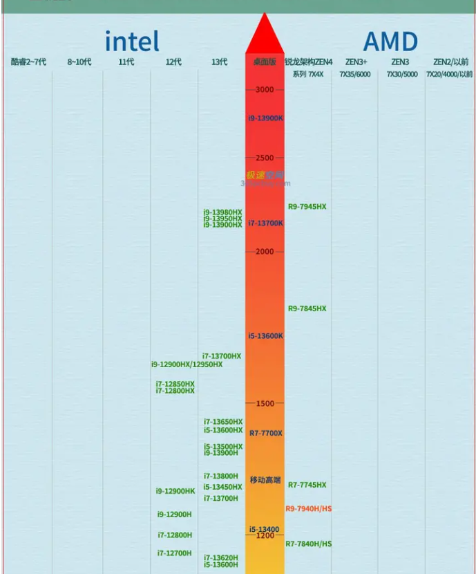
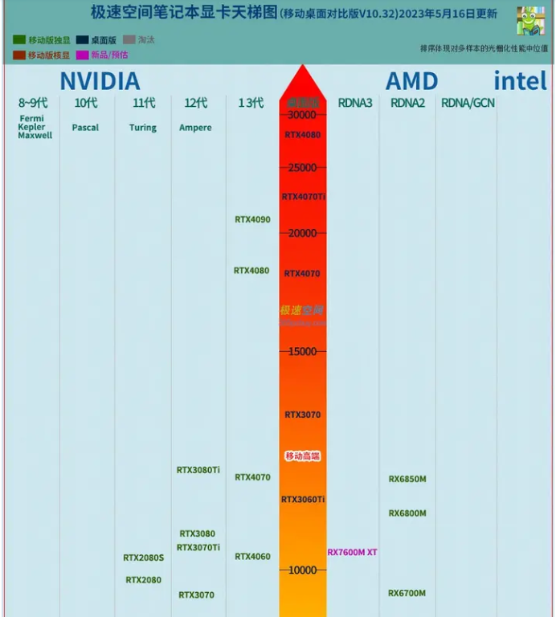
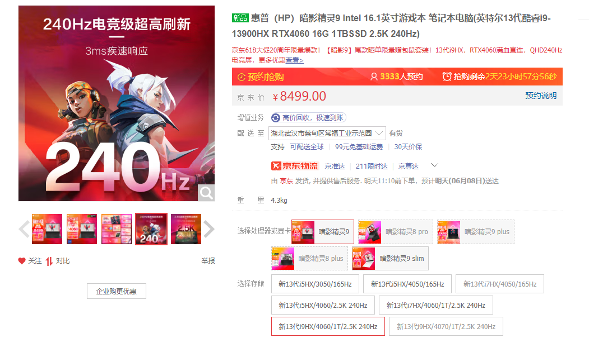

### 一、笔记本电脑怎么看
1. **cpu**：决定了之后电脑仿真的速度，许多仿真软件如matlab、lumerical、电路仿真软件等等，都依靠cpu的能力，目前笔记本cpu天梯图见网站：[CPU天梯图](https://www.zhihu.com/tardis/zm/art/376305519?source_id=1005)
   (直接上图)
   
   - 目前cpu有两大品牌：AMD与intel，（一般较多选择的是intel）。intel中一段时间便会推出一批cpu，称之为不同代，目前已经更新到了13代cpu，每一代中基本会分i3、i5、i7、i9，i9指当前代中最高等级的cpu（就比如我四年前买的笔记本，搭载的还是第9代i5 cpu）。
   - 上图中越高，性能越强，中间上升箭头中为台式机中cpu型号。
2. **显卡**：显卡决定了与显示相关的能力，例如游戏画面显示、视频剪辑、3D软件建模等。目前笔记本显卡天梯图见网站：[显卡天梯图](https://www.zhihu.com/tardis/zm/art/376320771?source_id=1005)
   (直接上图)
   
   - 显卡主要分为英伟达(NVIDIA)与AMD、intel，intel可以不看，而目前英伟达市场占有率要远高于AMD，因此基本只用考虑英伟达即可。
   - 上图中越高，性能越强，中间箭头中为台式机中显卡型号。
3. **内存**：内存影响了电脑多开应用的能力（即，内存太低，如8g，则开了较多应用同时进行就可能蓝屏）。同时许多仿真软件如matlab也对内存大小有要求，越大越好，目前个人电脑32g就很大了。
   DDR5与DDR4是内存的技术代数，DDR5优于DDR4，性能更强。
   内存频率一般也是越高越好，但也不能太高。
4. **笔记本屏幕**：代表了笔记本的显示能力，看的参数主要就是分辨率和刷新率。
   - 目前主流的屏幕分辨率已经来到了2k，即像素点个数为2560x1440，分辨率越高，则画面越细腻。（许多笔记本号称2.5k，但其实就是2k，主要看像素点个数）
   - 刷新率越高越好，120hz及以上就算高刷了，体验会很爽。
5. **硬盘**：简单，硬盘越大越好。
6. **品牌**：不追求品牌，但是一线品牌普遍的优点包括：
   - 做工好：也即笔记本更稳定，各个配件更不容易坏。
   - 售后好：坏了也有正规售后处理。
   - 体验感好（？）

### 二、推荐
1. **目前推荐机型**：惠普暗夜精灵9
    
    主要参数：
   - cpu：intel i9-13900HX
   - 显卡：英伟达rtx4060
   - 内存：DDR5 5600 Mhz 16Gb(后面可自己加装)
   - 屏幕：2.5k（2560x1440），240hz
   - 固态：1T（后面不够了可以自己加）

    次要加分项：
   - 屏幕：低蓝光，可以180°开合
   - wifi：wifi6E网卡，支持6G波段的WiFi信号，网络流畅
   - 有一个不错的前置摄像头
   - 26键全键盘设计
   - 品牌：惠普算是个人笔记本一线品牌了

2. **参考笔记本：**
    姜某一非常昂贵的笔记本（不要）
   - cpu：intel i9-13900H
   - 显卡：英伟达rtx4070
   - 内存：DDR5 4800 64Gb
   - 屏幕：2.5k，200hz以上
   - 固态：2t

    暗夜精灵9相比上述笔记本cpu好得多，显卡上基本相同，（4060与4070性能基本一样，但是差价非常大，所以许多笔记本推荐中讲述，要么4060要么4080）。内存同样为ddr5，频率却更高，后期如果不够，可以自己加装，固态硬盘同样。

3. **总结：** 这个笔记本最大的优点就是价格，8500左右，目前最顶级的cpu以及相当不错的显卡rtx4060，目前市面上的游戏 99.9% 都可以快乐玩耍。
   但这款好像还需要预约，应该是最新款，可能不太好买？另外最近还有618，到时候不知道价格会不会更低。
   但也需要注意的是电脑价格迭代较快，所以其实如果目前不太紧急，可以先观望着，下半年的双11+电脑贬值，可能价格会很低。
   但是电脑这种东西其实也就是消耗品了，（早买早享受），所以买了之后发现贬值也不用难受，因为享受了很久了，这个体验是买不来的。