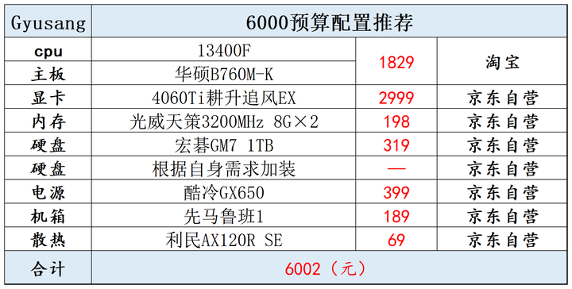

萌萌的电脑比我目标装机的配置整体降一个档位即可，因为她平时也并不经常打游戏。
具体就是按照知乎的装机推荐进行的。
如图

1. 其中仅将**主板**换成 微星B760m 迫击炮 wifi ddr4 即可。约2200+。
2. **显卡**换为七彩虹rtx4060ti ultra W oc。白色系。
3. **内存**可以暂且为16g，主板上还可以继续添加，或者直接上32g的内存，贵了100元多一点。
4. **电源**换为安钛克NE650，价格相同，质量更好。
5. **主机**可以选择白色的，更小型的matx主机，更好看。
   1. 乔思伯D30
   2. 乔思伯D31

经过下面更新后，可能总价在**6500**左右。（主板更换、主机更换）
由于预算有限，自然不能更换为ddr5内存，一般来说16g内存已经够用了，后期更新的话可以再加装一些内存。（如果要更新为ddr5内存，则价格需要再增加500元，来到7000元了，对于13400的cpu来说，上ddr5并不划算）

显示器推荐：AOC Q27G2S
- 硬件低蓝光，适合长期使用
- 2k 170hz
- HDR400
- fast IPS屏幕
- 价格1399  京东

另一个4k 60hz的屏幕：AOC U27N3C 价格1499 京东

---

#### 23/6/5
近期更新如下：
- cpu+主板：13400f+铭瑄B760M 终结者wifi ddr4
  - 1900 淘宝
- 显卡：4060ti 铭瑄  
  - 2800 淘宝
- 内存：光威天策32g  3200Mhz
  - 329 京东
- 硬盘：宏基GM7000 2TB
  - 599 京东
- 散热：利民ax120 se 
  - 80 京东
- 电源：安钛克 ne650
  - 499 京东
- 机箱：乔思伯D31 白色mesh版
  - 239 京东

主机价格：6446
