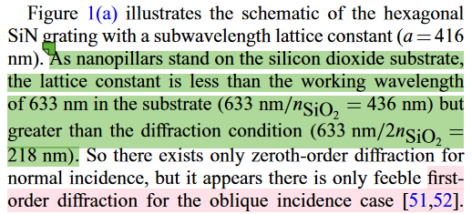
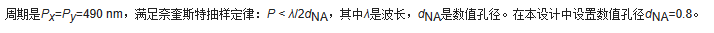

### 关于超表面周期的选择
1. 可以按照公式
   $$
{\lambda \over 2n_{衬底}}<P<{\lambda \over n_{衬底}}
$$
其中P是周期，$\lambda$是波长
公式参见论文《Silicon Nitride Metalenses for Close-to-One Numerical Aperture and Wide-Angle Visible Imaging》

2. 我在另一篇文章中也看到了一个依据的公式
$$
P<{\lambda \over 2NA}
$$
其中NA是数值孔径
铁哥说这个也是对的，但是不知道为啥。文章参见《Design of dual-wavelength polarization control metasurface lens》（西北工业大学学报上的一个文章）
