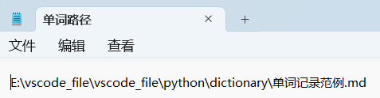
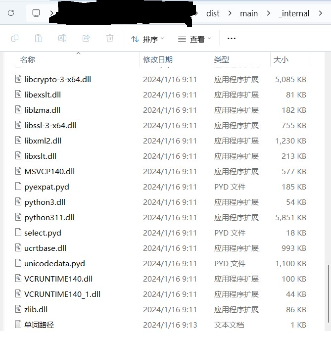
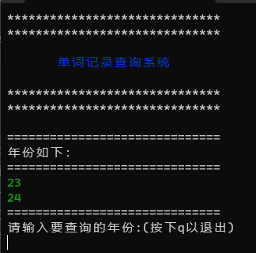
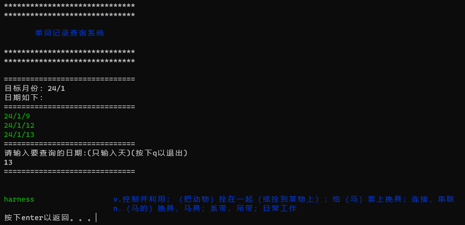

### 使用说明
[TOC]
#### 使用流程

1. 可运行程序为`./dist/main/main.exe`。可自行创建快捷方式。
   点击`main.exe`开始执行
2. 根目录的`单词路径.txt`储存单词文件的绝对地址
   - `单词路径.txt`记录单词文件的地址，单词文件中为记录的单词
   - 若该文件不存在，则第一次运行时会创建，并需要使用者输入单词文件的绝对地址，之后在文件变动时可手动进入该文件中修改路径
   - 若该文件存在，则直接读取
   > `单词文件.txt`中正确内容示范
   > {width="400px"}
   >`单词路径.txt`在图中位置
   > {width="300px"}
1. 读取成功，如图所示
   {width="300px"}
2. 选取单词目录的顺序为：输入年份> 输入月份> 输入具体日期（天）
   - 输入`q`可以返回上一阶段
   - `ctrl+c`强制退出该程序
3. 得到结果如图
   {width="400px"}
   左边为单词，右边为相关释义
   - 目前支持搜索的为单词、短语
   - 短语首先寻找固定短语，之后寻找网络释义，若都没有，则会显示没有找到
#### 单词文件格式
```
# 年
## 年/月
### 年/月/日
1.单词1
2.单词2

### 年/月/日
1.单词1

## 年/月
### 年/月/日
1.单词1

```
- 即三个#后跟`年/月/日`
- 两个#后跟`年/月`
- 一个#后跟`年`
- 单词文件默认为`.md`文件
> 特别注意，目录一定要有年、月、日！！！见范例文件
> (原谅我是个懒惰的程序员。。。)

#### 单词文件地址

1. 程序首先检测当前根目录（即`./dist/main/`）是否存在`英语单词记录.md`文件，若存在，则读取，若不存在，则
2. 之后寻找根目录的`单词路径.txt`文件，其中储存单词文件的绝对地址
   - 若文件`单词路径.txt`不存在，则创建并等待输入地址；
     - 输入后检测地址是否正确，若不正确则重新输入，若正确则填入`单词路径.txt`文件中
   - 若存在，则读取其中地址


> 单词文件地址记录在`单词路径.txt`中，填入的为单词文件的绝对路径


#### 注意
1. 采用`有道翻译`作为单词源，有时候会发现需要连接vpn才可以爬取网站成功