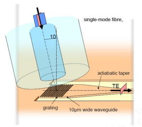
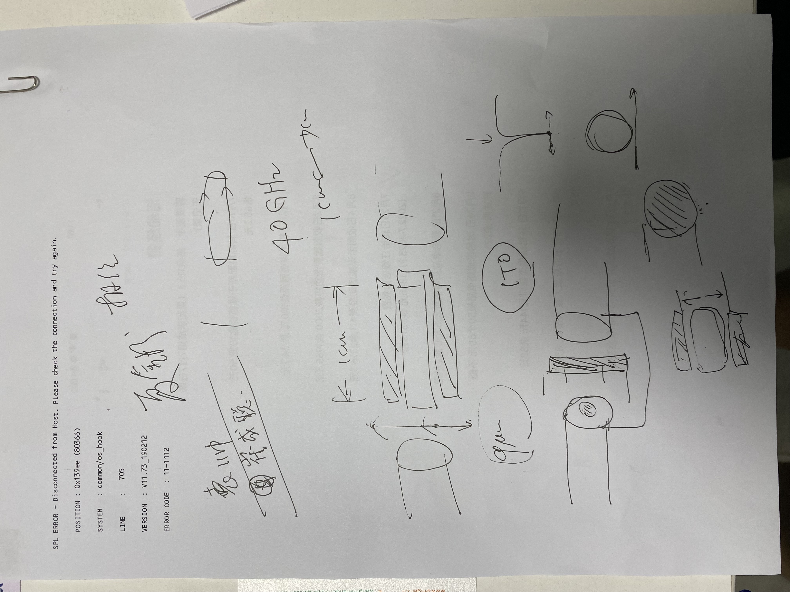
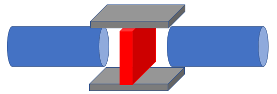

# 23/9/28
> 今天上午就四个方面跟老师进行了谈话，包括：
>> 1、毕业设计的激光光斑整形是否有做下去的必要，能发论文吗？
2、关于之前讨论的光纤-波导耦合超表面
3、关于之后的方向：
>>> 基于铌酸锂材料的可编程超表面
基于神经网络的超表面
应用于波导上的超表面
>
>>4、博士的规划

## 1
可以做，但是需要有两点：
1. 查找一下文献，看一看之前有没有已经提过这样的idea
2. 再探讨一下结果，验证结果是正确的，不能闹学术笑话

如果单仿真的话，只能发小文章，如果能够实验出来，可以发一下相对好一点的
实验方面：
1. 老师说实验室有1000多nm的激光器，再买一个准直器就可以实现一个很小的光斑的激光输出
2. 另外还可以在实验室搭建测试光路，利用透镜进行调节光斑
3. 实验室中还有一个红外CCD可以探测光斑成像
## 2
老师讲了一下目前确实主要有两个方向的光纤-波导耦合方法：
1. 端面耦合：
   1. 主要利用的就是倒锥耦合器
   2. 但是缺点：需要在侧面耦合，消耗了耦合密度（也就是占用了片子侧边的空间资源）；另外测试较难，需要把片子切开才可以
2. 垂直耦合：
   1. 垂直耦合器
   
   2. 这种形式的优点为：不占用侧边空间，提高了集成度；便于芯片测试；可以更好封装。
   因此这种形式的实际价值更大

而也因此，垂直耦合目前更有发展前景，端面耦合做的意义不大，老师说 **我可以试一试把上面的光栅结构变成超表面**，老师特别提醒的几个点：
1. 这个器件主要考虑的指标还是耦合效率，最好的结果便是在1db，或者小于1db。相比而言，实现偏振分束等器件其实理论意义更大，不具有太多的实际意义。
2. 为了提高耦合效率，可以看一看将这个结构做成多层超表面
   > 这里提了一点，提高耦合效率可以在背面制作**金属反射板**来实现，但是老师讲这个方式**很不适合大规模实际应用**，因为目前应用的工艺基于晶圆成品进行，也就是衬底是二氧化硅，再在上面制作各种结构，加上金属反射板的话就是要在基底下面加金属片。
   他讲，曾经看到过**多层超表面**代替加金属反射板实现高耦合效率的，可以看看

***而除此之外，老师还跟我讲了一个曾经袁帅师兄做的东西：***
#### 一个基于超表面的光调制器
老师的草稿如下

- 目前的调制器例如，多利用铌酸锂调制器来进行，但是它的缺点就是调制距离太长了。
> 老师说，大概1cm长的铌酸锂调制器才可以实现$\pi$的相位变化。也就是说它尺寸太大了
- 具体的调制器使用图片如图所示。需要实现一个光纤到调制器的耦合，以及调制器到光纤的耦合，另外调制器尺寸横向尺寸也与光纤不匹配，同时长度也较长。
  

**因此**之前的时候袁帅师兄做过一个实验，在两个波导中间插入一个铌酸锂超表面，外侧加上电极，来进行光信号的调制。如图

- 中间的超表面器件就好像一个光纤固定器件，两侧的光纤插上就可以实现调制。这样子的器件就会尺寸较小，根据`尺寸越小，器件带宽越大`[^1]的原理，因此器件就会实现一个很高的带宽。因此这个方向的器件的优点就是：
  1. 器件尺寸小，不需要实现相位匹配[^2]，带宽大
  2. 方便使用，即插即用

值得注意的是：
1. 老师说袁帅师兄之前是在超表面整个的外部加上了电极，这样子导致其整体的调制效率不高。而提高调制效率的办法可以是在每个单元上加电极，如果是一般电极的话，可能会减小透过率，但是老师提到可以用**ITO**进行，ITO是透明电极，在可见光波段是透明的，因此将ITO加入每个单元结构上后，并不会出现透过率的减小。
2. 另外，老师特别强调了这个将ITO融入每一个超表面单元中是还没有过的，可以试一试。
3. 老师说以前组里只有王玉西学长一个是做相位超表面的，其他都是在做共振超表面。共振超表面就类似谐振腔一样，将光束缚在里面进行多次反射。
4. 老师说

## 3
- 基于铌酸锂材料的可编程超表面
- 基于神经网络的超表面
- 应用于波导上的超表面

### 基于铌酸锂材料的可编程超表面
1. 这一部分的东西，最近也有许多人在做，但是老师讲其中的困难在于：
   - 铌酸锂加电后仍然需要1cm才可以实现$\pi$的相位变化，因此很难在很小的尺寸实现一个加电调制的可编程超表面
   - 铌酸锂做成竖直柱状结构很难
   - 做成宽光谱调制也难
2. 但是针对铌酸锂需要很长距离才可以实现$\pi$的相位变化的困难，他讲可以试一下下面的方法：
   - 采用一种谐振腔的形式，光在铌酸锂中多次反射，从而减小了铌酸锂的长度。
        > 但此时新的问题出现：
        谐振的发生是与波长相关的，那么此时很难做到宽波长范围的调制
        但是针对这种情况，我觉得是不是可以通过加上不同的电压来实现呢？这个需要后续的尝试。
3. **总体而言，这个方向可以试一试**

### 基于神经网络的超表面
1. 这个主题其实分为几方面：
   - 利用神经网络去设计超表面
   - 利用超表面去实现神经网络
   - 利用神经网络去实现自调节可重构超表面
2. 关于利用神经网络去设计超表面，老师提出了他认为的形式：
   一个基础的空白神经网络，运行出来的超表面，其成像结果与标准成像对比，然后反馈回神经网络，继续迭代，直到神经网络运行出的超表面实现了很好的成像效果。
   > 我的评价：
   这种方式就类似于GS算法。但是最大的缺陷在于神经网络的计算硬件资源很大，可能需要很多的运行资源，而计算出来的神经网络对于其他的成像也没有使用价值。
   神经网络最大的意义应该是通过大量的学习，使得模型具有延展性。

3. 这个主题的三个方向都可以试一试，但是课题组都没有基础，因此可能会面临很多困难。。。（虽然目前来说对于其他方向也没有基础）

### 应用于波导上的超表面
老师说，这个方面的东西，可以试一试那个[垂直耦合器](#2)方面的，但是其他的，例如，在波导上刻上超表面以实现模式转换或其他功能，这些其实都很没有价值了，因为已经有许多可以使用的更高效更简单的方法进行。

## 4
老师讲，我这个方向属于比较开放性的，需要多去想，发动脑洞，思考该做什么，因此探索性比较强。这博士几年，可以先花1、2年时间去做一下探索性的东西，后面如果发现实在太难，无法毕业，就可以改方向，发一些文章以顺利毕业。因此不必太焦虑，要多去做。

## 5、总结
接下来要去做的：
1. 整理验证本科毕业设计的内容，验证对错，验证之后进行实验，之后看看能不能发论文。
2. 光纤-波导垂直耦合器中超表面的应用
3. 基于铌酸锂超表面的调制器，询问袁帅师兄，看他们相关的博士论文，进行这方面的继续研究
4. 基于铌酸锂的可编程超表面的研究
5. 神经网络与超表面的结合
   - 基于铌酸锂材料的可编程超表面
   - 基于神经网络的超表面
   - 应用于波导上的超表面

老师说：
1. 之后我要去做什么方向的研究，最重要的一点就是去思考这种东西有什么优势，具体的方法就是去调研，确保所要研究的东西是**有优势**并且**没有致命缺陷**存在的。

[^1]:老师讲，类似于人讲话时，瘦子声音细，胖子声音粗，即表示频率与器件共振长度有关。
[^2]: 老师说，许多器件的原理都是光场与电场的相互作用，而出现调制的情景便是出现共振的情况，即两者相位匹配，这是电场与光场相位相同，可以发现相互作用（其实我在一篇论文中看到过）。但是*为什么器件尺寸小就不用相位匹配？*
老师说是器件尺寸太小，相位不匹配的影响也不大，不懂。。。

