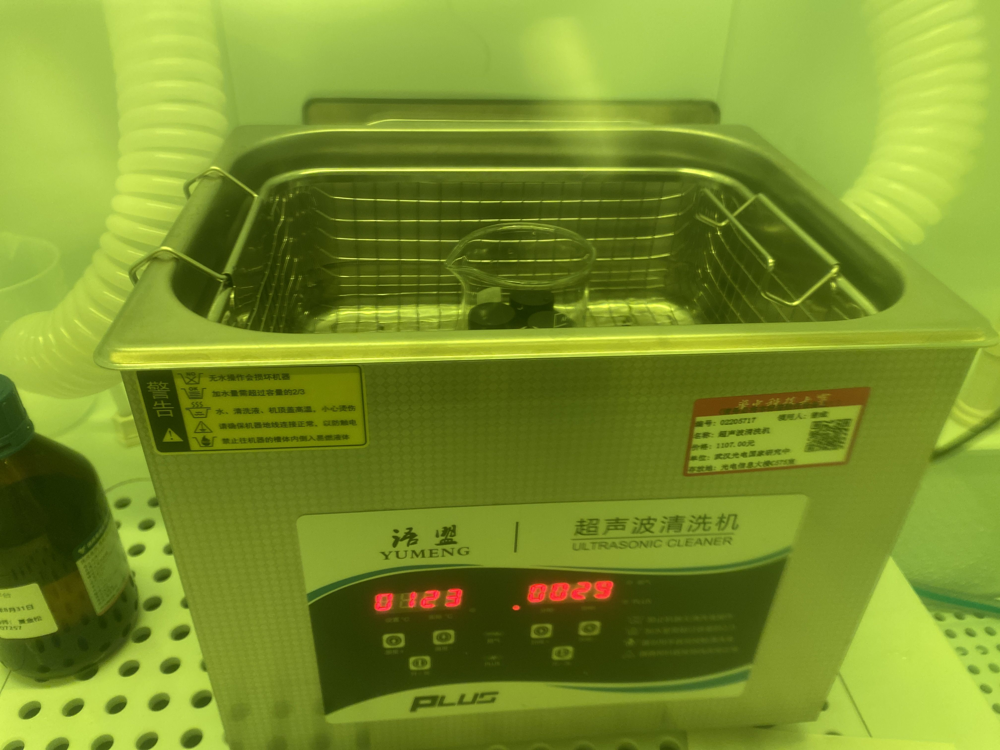
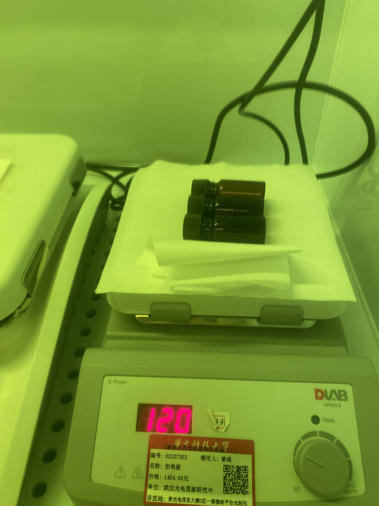
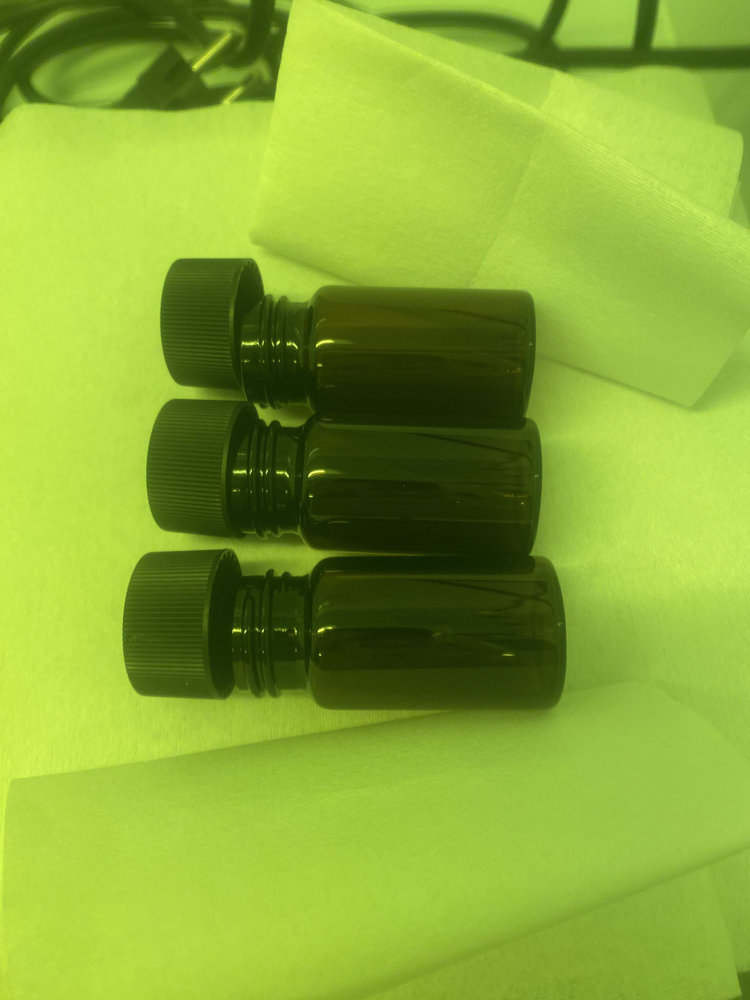
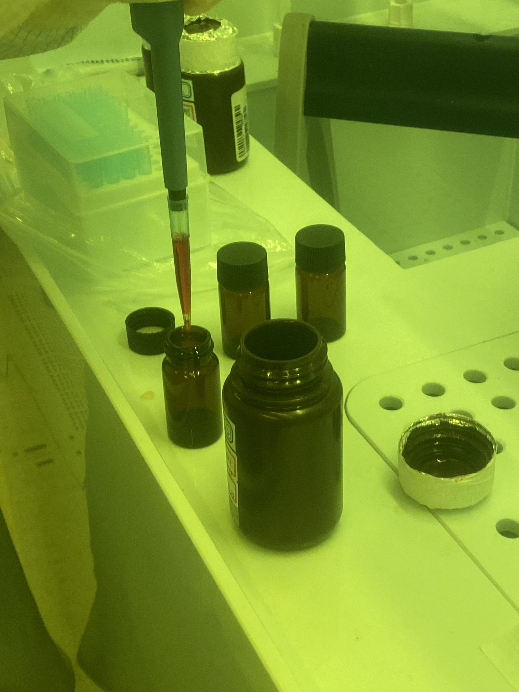
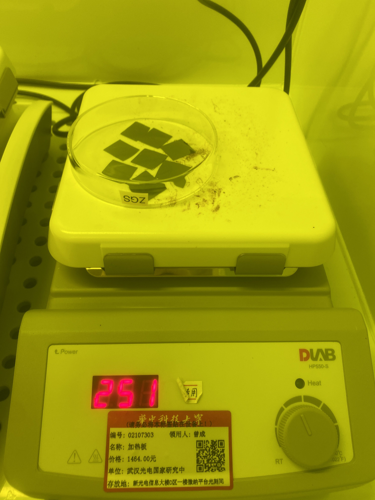
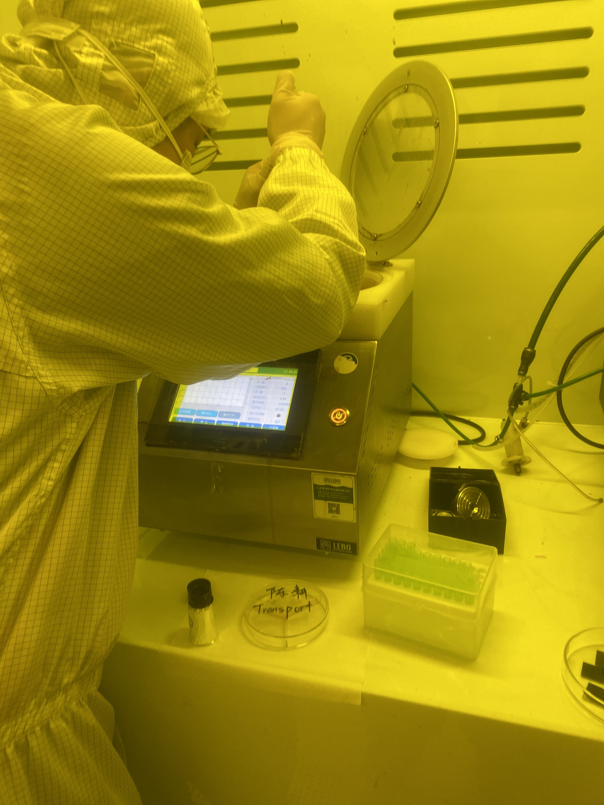
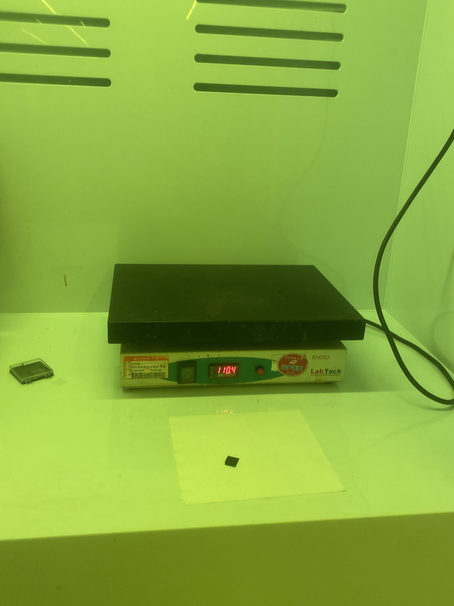

今天对**光刻胶的转移、匀胶**进行了学习。

### 光刻胶的转移
因为原本光刻胶的瓶子太大，用着不方便并且大瓶子容易被污染，因此需要转移到小瓶中

1. **先对小瓶子进行有机清洗**
   1. 装入丙酮或NMP，再将小瓶子放入烧杯中，烧杯中加水，与小瓶子中页面气瓶，烧杯放入超声波清洗机中，设置温度为室温，防止温度过高，设置5分钟。
   
   2. 用丙酮清洗之后，废液倒入废液池中，再在小瓶子中加入异丙醇，同样操作
   3. 最后，用水进行同样的操作。
   4. 将水倒掉后，用气枪将小瓶子洗干净，再将小瓶子放在热盘上，下面垫上纸。热盘温度120°，加热一个小时。
   
2. 小瓶子清洗完成后，利用移液枪转移光刻胶。先用风枪吹一下移液枪的头部，移液枪上装上滴管，再用风枪吹一下滴管。开始转移光刻胶
   
3. 转移完毕后用锡纸包住小瓶进行密封并贴上标签

### 匀胶
1. 在允胶前先将片子有机清洗，然后用等离子去胶机打一下氧，可以让之后匀胶效果更好，打氧5-10min即可。
2. 打氧之后在热盘上进行烘烤，时间一般越久越好，将片子放在上面，用一个培养皿盖住。
   
   > 注意碳头镊子不能直接接触高温热盘，可以用尾端将片子挪出来再夹取
3. 对片子进行匀胶，使用下图的机器，一般需要修改的参数就是旋转速度和加速度
   
   操作步骤：
   - 打开真空，对准测试，如果没有对准就调整一下位置
   - 进行匀胶，利用移液枪或倾倒都可以（最好不要有气泡）
   - 编辑程序，运行程序
4. 匀胶之后需要进行前烘，一般前烘时间、温度需要很精确，需要计时
   
   > 同样需要小心碳头镊子不要接触高温