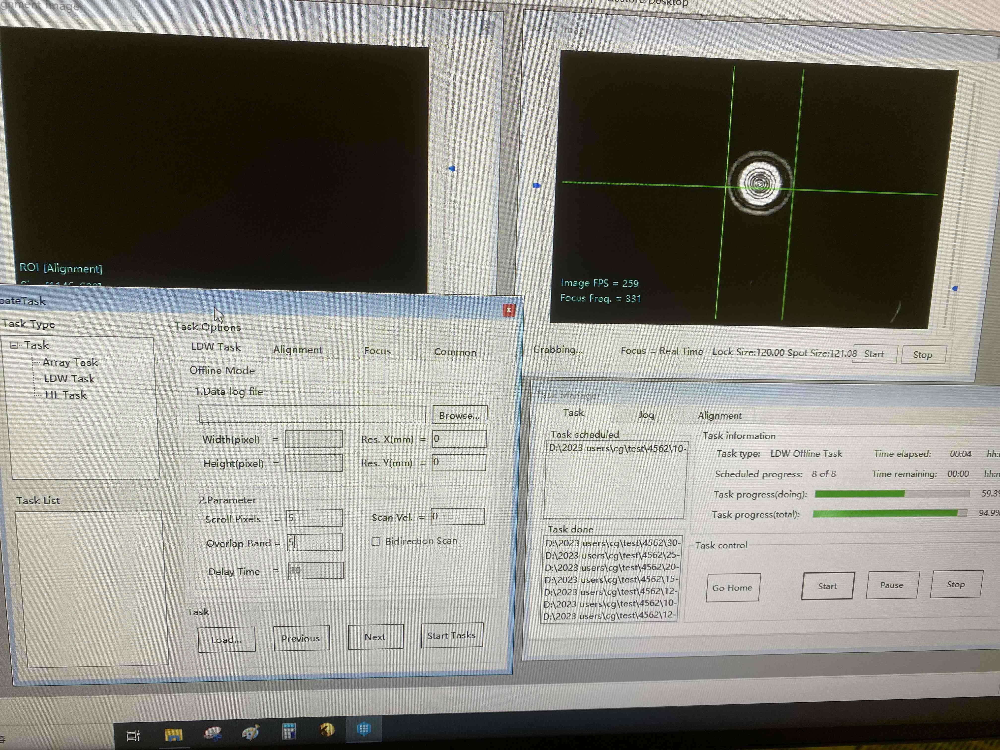
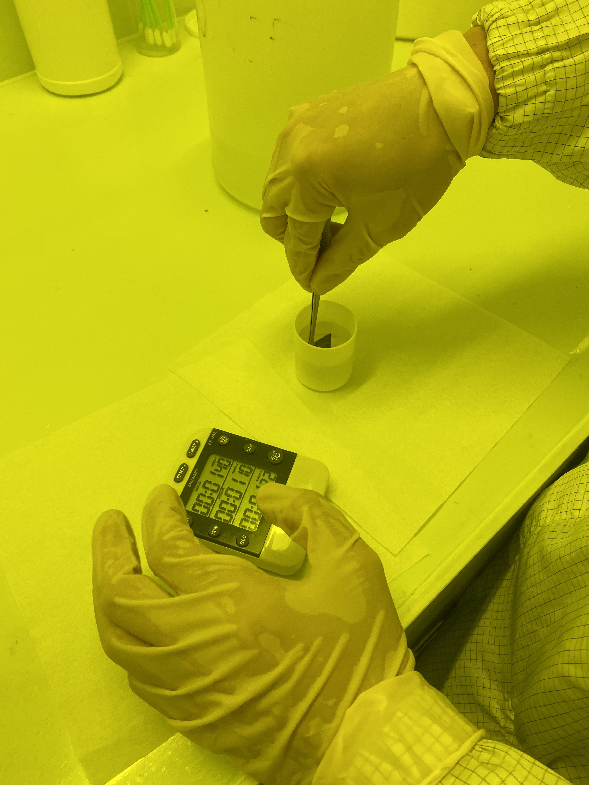

今天对**无掩膜激光器、显影**进行了学习。

### 无掩膜激光器
就简单看了一下操作
1. 无掩膜激光器操作的步骤
   - 打开盖板，放入片子在中间。机器右边有个黑色旋钮，打开真空，固定片子。下面两个旋钮，左侧控制下图右侧图像的光亮度，右侧旋钮控制下图左侧图像的光亮度
   - 点击`load`，载物台进入
   - `Task Manager`页面，`Jog`页面，操作摄像头位置找到片子左下角。z轴到-17之前z轴速度选择1mm/s，之后换成0.1mm/s，调整目标为下图右侧图像先缩小后增大，直径变为120左右（期间可以调整亮度旋钮）。之后打开图像，打开光源，之后开始水平移动，直到找到片子左下角（还可以调整片子的角度），然后再水平向右向上移动2mm。
   - 点击`LDK task`，开始设置任务文件（任务文件已经处理过了，但是这一步我不懂）。如下图所示，选择文件。在Paramter界面即设置曝光参数
     - 首先需要说明，曝光中，版图被分成横向的几条，对每一条实现纵向的光束扫射
     - `Scroll Pixels`表示纵向光束扫射的速度，因此这个值越大，曝光剂量越小
     - `Overlap Band`表示每条被扫描的次数，因此这个值越大，曝光剂量越大
   - 设置剂量之后，来到`Alignment`页面，片子上的第一个版图的位置选择`Current Position`，表示以当前位置开始。对于第二个即以后的版图，可以选择`Previous *****`，表示以相对于前一片版图的位置开始。（需要仔细确认清楚！）
   - 最后来到`Common`页面，点击`next`就可以创建扫描文件，进行正确命名。
   - 所有版图文件都转为激光扫描文件后，在下图的`Task Type`中，右键添加激光扫描文件，（注意文件先后！），全部添加后可以右键`layout`查看版图分布是否正确。
   - 点击`start`开始
2. 如图所示
   

### 显影

1. 利用计时器进行精确显影，并不是越久越好，太久了可能会掉更多的胶
2. 用镊子夹着片子，最后5、6s可以摇晃一下片子。
3. 显影后直接将片子放在水下面冲洗，然后用风枪吹干净进行下一步即可。