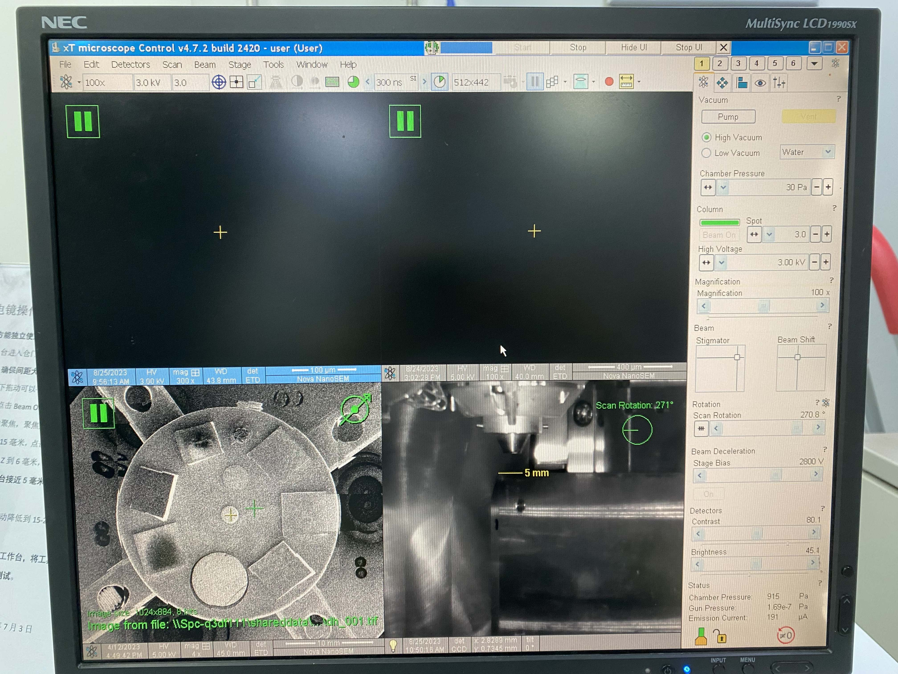
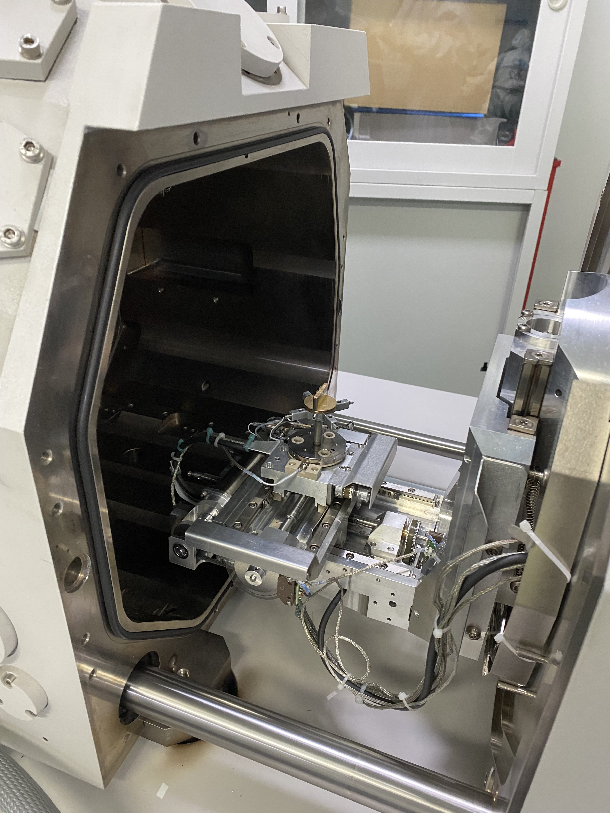

今天大致学习了**电镜**

### 电镜
1. 先从台子上找一个托片，如果要观察端面就需要找一个竖着的托片，用导电双面胶将片子粘贴到竖面上。
   - 在电镜观察时，导电性越强越好，因此对于**测试片**，可以镀上一层金粉，（利用镀金粉的仪器，先设置镀的时间，再点击start开始抽气即可），但是之后这个片子就报废了。
   - 而对于**正式片**，不能镀金粉，就可以在片子上缠绕导电双面胶，（在无结构的区域）
2. 步骤：
   
   - 首先点击vent，放气，等到差不多就可以打开舱门，将托片放入，（选好角度），用螺柱旋紧底部螺钉，固定住托片，接着将舱门关上，点击pump抽气。知道压强小于8e-3
    
   - 点击beam打开电子束，一般主要看的就是左上角的区域，是电镜视野。之后开始粗调焦距，将片子距离电镜由远到近一步步调焦，每次调完都要点击link to z，即将调焦完的z距离同步到三维坐标中。观察中可以改变托片的水平角度R和倾斜角度T。
     - 需要注意片子靠近电镜时一定不要撞到电镜。
   - 观察完毕后，先关闭电子束，之后将托片调到原位，之后点击vent，最后取出片子，关闭舱门后点击Pump。
   - 快捷键：
     - `shift`+`f12`:转动电镜方向
     - `f7`:选取调焦区域进行调焦。鼠标右键左右拖动是调焦。`shift`+鼠标上下左右拖动：调色散 or 拖动beam stigmator中的点来调像散
     - `f5`：将当前页面放大
     - `+`,`-`:放大缩小
     - `f2`：暂停，之后会弹出保存图片的弹窗
3. 调焦时可以调节电压的大小，一般导电性越好电压可以越大，则越清晰；同时可以调光阑的大小。
4. 点击`auto 对比度调节`来使当前图像对比度自动调节。
5. 操作电脑上可以选择保存照片到《shared documents》中，之后在另一个电脑上拷贝到光盘里面。光盘在左侧桌子上会提供。将文件拷贝到光盘里后记得点击《write》