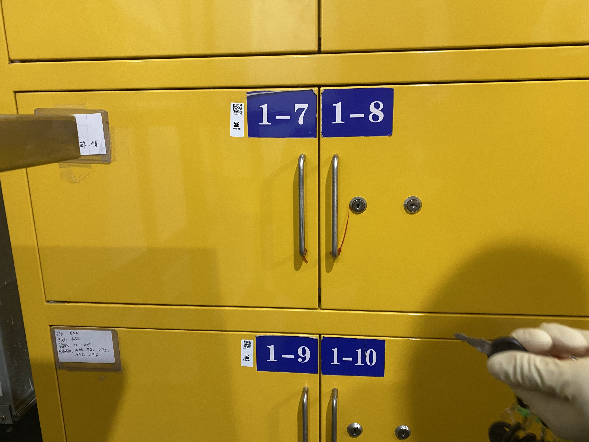
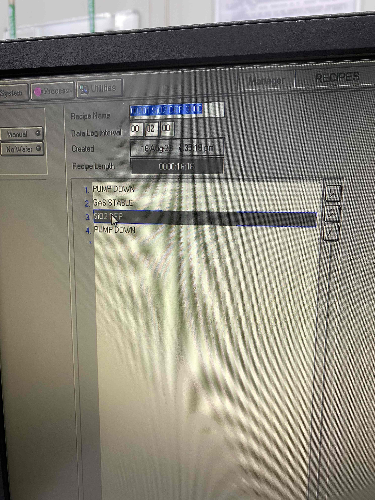
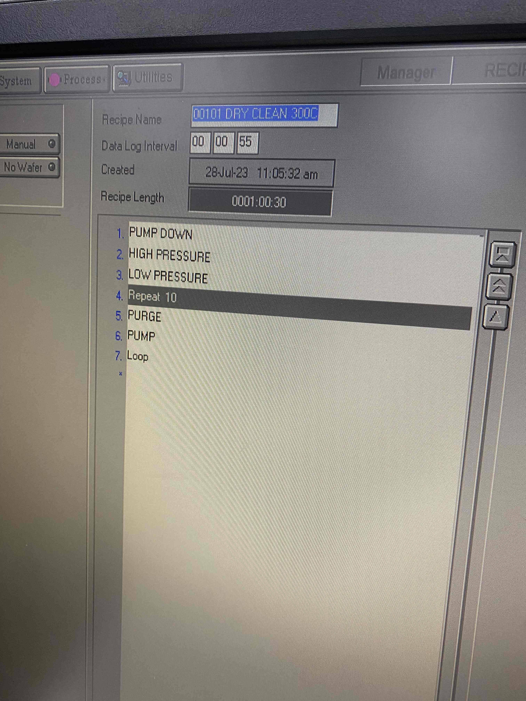

今天对**药品拿放、片子清洗、SiO2生长**进行了学习。

[TOC]

### 药品拿放
1. 在取药品时，柜子的钥匙在进入超净间玻璃大门的右边帆布兜里面。
2. 药品存放在柜子1-7、1-8中。
    .
3. 若取药品发现没有了，可以在实验室平台里面进行预约，从而找实验室老师进行新药品的获取。
4. 拿到药品后，不能直接带进去，需要放在一个柜台里面，注意：柜台同一时间仅能有一边打开。
    等进去后，再拿柜台里面的东西。

### 片子清洗
1. 有机清洗步骤
   - 拿取烧杯与放片子的小台子，进行清洗
   - 用丙酮或NMP（丙酮加强版）倒入烧杯中，放入放置片子的小台子
     - 一般推荐用NMP，因为丙酮有剧毒，同时NMP还可以去光刻胶
   - 将烧杯放在超声波台子上进行清洗，一般设置5-10分钟
   - 之后再用异丙醇（IPA）进行清洗，5-10分钟，用于清除丙醇。
   - 异丙醇泡完之后用镊子夹着冲一下水，之后放在滤纸上，用风吹一下水，再找个培养皿，将片子放在热机上对片子加热，烘干水分，（裸片）可以温度200°，烘干15min。
     - 在吹片子上的液体时，需要从上往下吹，镊子需要将片子稳定住，防止片子被吹飞。
2. 有机清洗是推荐在每一道工艺都进行的，除了有光刻胶时或者其他会与水反应的材料时。
3. 清洗之后的废液要倒在废料桶里面，但酸碱中和液倒在酸碱中和桶里面。碱可以直接倒，如果是酸则需要先用碳酸氢钠进行中和，中和后再倒入。

### SiO2生长
1. （在Si上生长SiO2）
   首先对Si片用酒精进行清洗，使用布擦拭时，要向同侧进行擦除，不要来回反复擦除。
2. 对PECVD机器进行操作
   - 点击stop,vent界面，进行放气，等倒计时进入第二阶段的90s以下时可以打开舱门。打开时，将旋钮旋到up，之后两侧按住按钮，舱门即可打开。
   - 打开后，小心内部的高温，需将片子小心放到平台上。
   - 将舱门关闭，关闭时旋钮扭到down，两边按下即可，最后需要多按几下，确保舱门紧闭。
   - 点击stop,evacate，进行抽气，等压强降至2mtor以下后，才可以进行程序的运行。
     - 生长SiO2的程序一般如图所示
        
     - 程序中第一步进行抽气，第二步充入反应气体，第三步加射频电压，使表面发生离子沉积，第四步进行抽气。
     - 主要修改DEP的时间，通过设备后面的小黑板上的数据（即沉积速度）得到需要改为多久时间。
   - 等程序运行之后，电stop,vent，最后拿出片子，注意片子需首先进行散热，即放在纸上，之后再将片子放在盒子里进行存放。
3. 在生长之后要进行洗腔，一般生长SiO2后，用下列程序进行洗腔：
    
   在程序中，需要更改的步骤为高压、低压。一般生长了多久，高压、低压就分别调成多久。