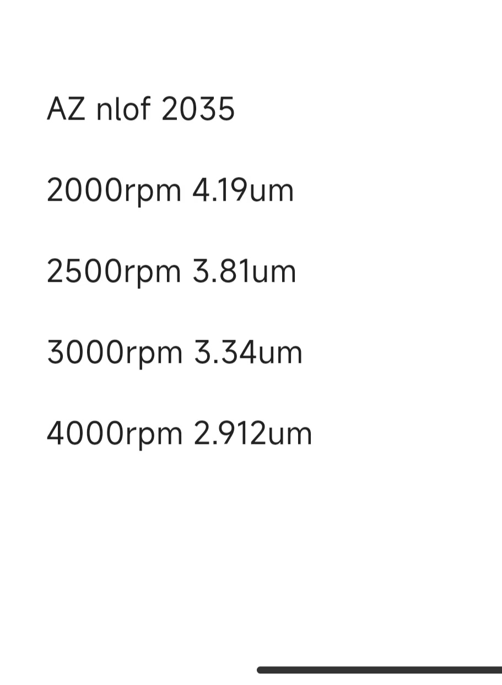
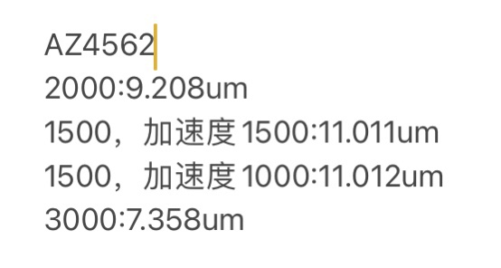

今天对实验对AZ4562光刻胶的各种参数进行探索和实验，李宇航对AZ2305光刻胶进行了实验

之前实验得到的AZ4562和AZ2305的旋涂速度和对应厚度
{width="400px"}
{width="400px"}
### 实验过程
1. 有机清洗
2. 打氧10min（AZ4562和AZ2305）
3. 在热盘上烘烤30分钟，温度250°（both）
4. 分别旋涂并前烘两种胶
   1. AZ4562：
      1. 2000rpm，加速度1500，旋涂时间1min。光刻胶倒在片子上，用移液枪吸走气泡
      2. 热盘上~100°，前烘60s
   2. AZ2305：
      1. 4000rpm，加速度1500，旋涂时间1min。
      2. 热盘上~110°，前烘60s
5. 对AZ4562进行无掩膜光刻
   1. 选取曝光剂量为
    @import "23.10.17.csv"
    其中2-7曝光剂量最大
6. AZ4562曝光后进行显影，显影时间疑似1min？（应该是2min），AZ 300MIF
7. 对AZ2305曝光，剂量选择与4562相同。
8. 曝光后应该后烘60s，110°，但是忘记了，所以显影时候，胶全部脱落。
   1. 对于负胶，后烘使胶变性

### 实验结果
1. 对AZ4562使用显微镜进行观察，首先将片子掰开变成相应区域的大小。再用显微镜观察不同曝光剂量下，哪个实现真正曝光到底了。
2. 发现2-5的边缘部分光栅部分曝光到底，但是中间区域没有曝光到底。
   > 不知道是否与显影时间不足有关
   2-7的片子无法观测，因此不知道具体情况。其他剂量的片子都没有实现曝光到底
3. 实验中观察到的光栅端部的晕状现象是由于光刻胶曝光显影后呈梯形导致。中间观察到的彩色部分也是光刻胶反射的现象。
