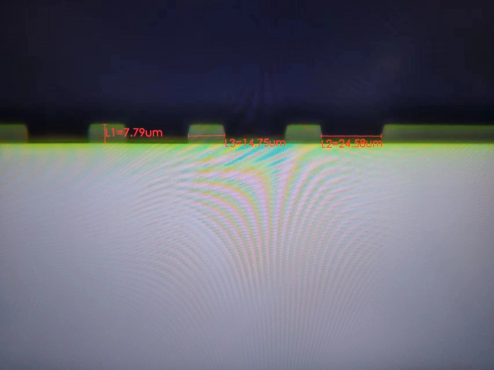
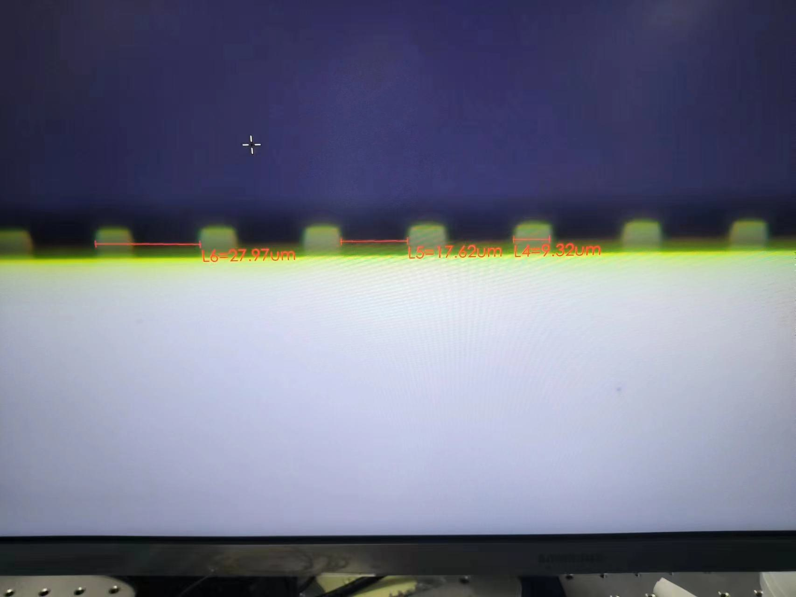

对于上次实验结果进行了侧面检查，发现结果如图所示
128分图，2-5剂量
{width="400px"}{width="400px"}
虽然实现了曝光到底，但是问题在于剂量过大，使得实际加工出的占空比不为50%。如上所示，设计图案中，占空比均为50%。

### 实验目标
1. 探索合适的剂量，使得能够成功曝透，同时实现占空比与设计相同。

### 实验过程
利用之前的片子进行实验，发现背面具有很多的沾污。超声清洗10min，加热10min仍然无法解决问题，最后耕哥利用硫酸对片子进行了清洗。
1. 匀胶2000rpm，1min
2. 前烘100°，1min
3. 曝光剂量选择：
@import "23.10.24.csv"

### 实验结果
1. 光刻胶全部飘了。
2. 怀疑是光刻胶黏附度不够，下次加增粘剂，再次实验。
> 或者也有可能是硫酸处理后，没有打氧。
> 另外李宇航提出，可能可以加入后烘看看，因为后烘可以进一步减小溶剂存在，使得胶的粘附性更高。
