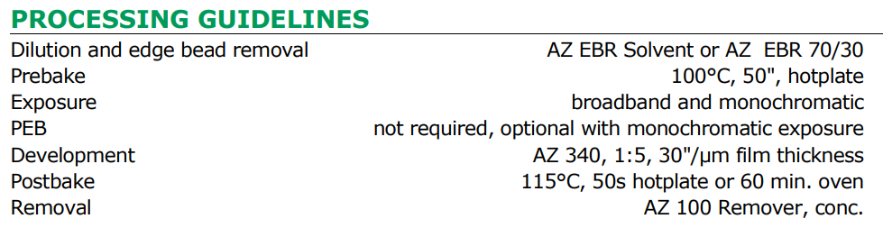
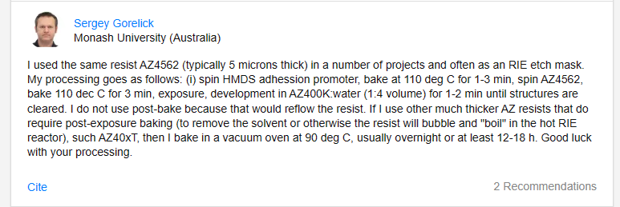

# AZ4562光刻胶
> 主要对官网描述和官网提供的详细说明（其实也就3面）进行了总结
> 没找到别的工艺说明

[TOC]

## 一、对官网描述进行学习：
官网叙述见[AZ4562官网描述链接](https://www.microchemicals.com/products/photoresists/az_4562.html)
1. 这是一个正胶，即掩模下的胶在显影后留下
2. 对g、h、i射线敏感（约320-440nm）
3. 厚度可达3-30um
4. 其与AZ 4533同属于AZ 4500系列，两者对比如表格所示
   @import "AZ4500se_1.csv"
5. 若AZ4562胶厚大于30um，最好用AZ 40XT光刻胶。因为使用该胶时，软烘烤、曝光、显影等非常耗时，同时太厚时，AZ4562也会在曝光时形成N~2~气泡。
6. 显影液要求
   - 含金属离子的显影液：1：4稀释的KOH基 **AZ 400K**（厚度更高时，用1：3.5——1：3的稀释浓度）
   - 不含金属离子的显影液：基于TMAH基的**AZ 326 MIF**、**AZ 726 MIF**或 **AZ 826MIF**显影液（不稀释）
7. 去胶剂要求
   - 未交联的光刻胶薄膜：**AZ 100**作为去胶剂，**DMSO**或其他有机溶剂作为剥离剂
   - 已交联的光刻胶薄膜（在等离子过程中例如干法刻蚀或离子注入，经过了>140°的高温步骤）：使用**不含NMP**的**TechniStrip P1316**

## 二、进一步对文件进行学习:
[详细文件链接](tds_az_4500_series.pdf)

### 一些说明：
   - 这个AZ4500系列是开发出来被用于旋涂厚度>3um的情况。
        当厚度过厚时，所需要的曝光能量极具增加；因此对于较厚的膜，需要用合适的能量大小以使得膜底层都可以被曝光；但是大能量带来的是许多副作用：光刻胶表面能量太大使得光刻胶交联（crosslinking）,这种效应与深紫外硬化类似。
        另外，标准光刻胶还会产生过多N~2~，他们会陷在厚涂层中，不会快速扩散，甚至导致光刻胶的脱离。
    - 利用特殊的光敏化合物（低吸收、减小N成分）制成了AZ 4500系列。
### 旋涂时要注意的点：
   AZ4562可以仅一步就旋涂10um厚的膜（2000rpm），使用额外的特殊技巧对于更厚的厚度。
   - 正常的旋涂时间由约30s降低到3s（即快速旋涂）。借此实现20um厚度，但是衬底需要以水平位置留在旋转器上1分钟，来允许干燥
   - AZ4562可以在步骤中加入多次烘烤循环，以多次旋涂。中间的烘烤步骤的温度不能超过90°或者最终的前烘温度。

对于更厚的厚度，一些指导需要遵守：
   - 旋涂后，光刻胶要在室温下放置至少15min来使得溶剂蒸发，在放入熔炉前烘之前。否则光刻胶表面就会干燥太快，留在表面的溶剂就会产生气泡，使得光刻胶脱离。
   - 使用热盘而不是熔炉更好。尤其是让温度逐渐增加到最终温度。

旋涂厚度更加精细的表：
    @import "AZ4500se_2.csv"
### 显影步骤的注意：
   背景：严重过曝光的正光刻胶也只有很低的溶解速率。
   - 饱和值是100nm/s
   - 推荐在2um/min时进行，并且要记得调整曝光剂量。
   - AZ 4500系列光刻胶可以用任何常用的纳基、钾基显影剂，**AZ 340** 用用水稀释1：5  is good。**AZ 400K**也行
### 文档推荐的工艺步骤：
   
### 安全建议：
   - 这个光刻胶的溶剂是PGMEA.要小心，它是易燃液体，需要远离氧气、火光，在0°-25°下保存。

## 三、学习总结

1. 是个正胶
2. 敏感的光线范围310nm-440nm
3. 旋涂厚度可达3-30um，但厚度大于30um时最好不要用
### 旋涂   
1. 参考旋涂厚度表：
    @import "AZ4500se_2.csv"
2. 不同厚度时的方法
   - 0-10um：直接旋涂
   - \>10um：
      - 正常的旋涂时间由约30s降低到3s（即快速旋涂）同时将衬底以水平位置留在旋转器上1分钟，来进行干燥
      - 进行多次旋涂：旋涂后进行烘干，之后再次旋涂，烘烤步骤的温度不能超过90°或者最终的前烘温度。
   - 对于高薄膜厚度需要注意的特殊点：
     - 旋涂后，放入熔炉前烘之前，光刻胶在室温下放置至少15min。
     - 使用热盘而不是熔炉。尤其是让温度逐渐增加到最终温度。
### 显影
1. 饱和值是100nm/s
2. 推荐在2um/min时进行，并且要记得调整合适的曝光剂量。
3. 可以用任何常用的纳基、钾基显影剂，**AZ 340** 用水稀释1：5  is good。**AZ 400K**也行

---
[一个网页](https://www.researchgate.net/post/How-to-overcome-the-reflow-of-positive-photoresist-AZ4562)上一个人的工艺分享：

> 2017年的一个回答

他用的是5um厚
- 旋涂HMDS黏附增强剂，在110°烘烤1-3min。
- 旋涂AZ4562。烘烤110°，3min
- 曝光
- 在AZ400K：水为1：4体积下，显影1-2min。知道结构清晰
- 不进行后烘，因为后烘会导致reflow。
- 用其他更厚的AZ胶需要后烘时，他就放在一个真空烤箱里，90°烤12-18h。
