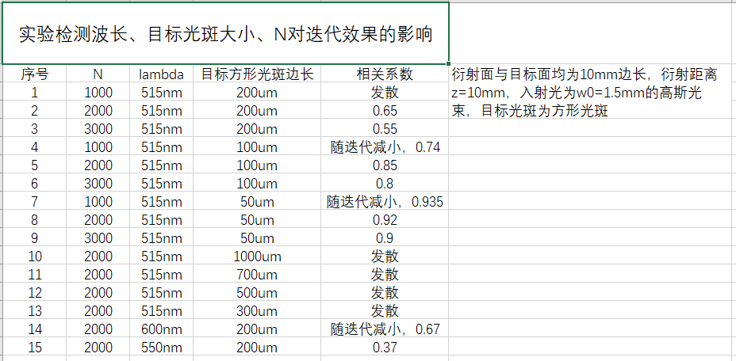

#### 2023/4/27
关于GS算法的一些问题。
1. 我进行了大量的仿真，发现用瑞利-索末菲衍射的GS算法的迭代效果跟许多因素都有关，这些因素如下：
   - 目标光斑大小
   - 衍射面、接收面采样间距
   - 衍射面、接收面大小
   - 波长
    
    具体的一部分仿真记录如图所示：
    
    **学长，您以前遇到过这种情况吗**？
    老师觉得这是因为我的代码还有问题，要我继续研究。但我想用这个求出来相位面然后继续往下做了，光斑小到几个微米的时候，迭代结果还是可以的，那我可以用这个继续进行吗，毕设要做不完了···
2. 在Lumerical官网Metalens的介绍中，在组装形成整体透镜时，可以保存结构不同半径时对应的光通过后的近场图像，再将其拼接起来组成整个超透镜的近场图像，这个近场指的就是在结构1个波长后的地方吗？（学长上次跟我讲测相位是在结构1个波长后的地方测的）