[TOC]
#### 3/23之前
光斑整形即指光场能量的重新分配，使光场均匀化，或者改变光斑形状，由圆形变为方形等。

而光斑整形超透镜需要确定其应用的场景，具体包括：
1. 应用的光的波长——决定了超透镜材料的选择
2. 光场的大小——超透镜需要做到的大小
3. 应用场景——光场均匀化还是光斑形状变化或其他。

  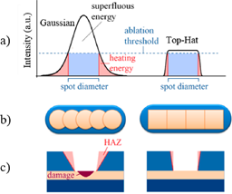  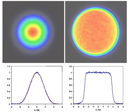
  图1  &emsp;&emsp;&emsp;&emsp;&emsp;&emsp;&emsp;&emsp;&emsp;&emsp;&emsp;&emsp;&emsp;&emsp;&emsp;图2
  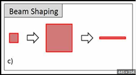 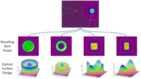
  图3    &emsp;&emsp;&emsp;&emsp;&emsp;&emsp;&emsp;&emsp;&emsp;&emsp;&emsp;&emsp;&emsp;&emsp;&emsp;图4
  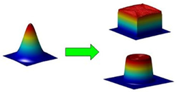
  图5

**目前已想到的应用场景**：
1. 光纤中模场一般为高斯分布，且随着传播距离变长，单模光纤中，能量会主要集中在中心，多模光纤中则会出现严重的色散，而由于不同波长的光其分布不同，因此光斑的模场均匀化可以使得单模光纤内光场更加均匀，而多模光纤中色散减弱。对该场景的分析：
   - ①超表面具有其独特的优势，即小且薄，模场直径一般在um量级，因此使用超表面会较为匹配；
   - ②对单模光纤，波长单一，则可以选择适当的材料对其相位需求进行设计，理论上不算复杂；
   - ③对多模光纤，由于波长众多，而不同波长时，超表面的折射率将存在差异，因此材料与设计较难实现，但目前多为单模光纤，多模光纤使用较少了。
2. 激光光束的整形，其实光纤中的光也为激光，但光纤中的光一般只需要光场均匀化即可，而该条的激光光束整形指将光束进行任意整形。如激光焊接中的激光，如图1，若对其进行整形，光场均匀化以及由圆形整形为方形，则加工精度将得到提升。分析：激光焊接中的激光其功率较大，温度较高，需要耐高温的材料，其尺寸上较容易满足。
3. 可见光波段的整形，暂且并未想到应用的方向。

---
#### 3/23 周四
目前已经确认该课题的目的是进行激光光束的光斑整形。实现激光圆形，高斯基模光斑到这四种光斑的转换。
 
提出的目标是将几十um的激光光斑整形为几um，且其圆斑形状为上述形状。
经过对激光技术的调研，发现使用的激光精细加工中
1. 使用780nm的飞秒激光进行激光光斑直径100-200um的加工。
2. 利用UV紫外光源进行加工，光斑为几um。
考虑到衍射极限，因此波长越小的光其衍射极限光斑越小。

考虑了`515nm`的飞秒激光作为预设激光器。最为理想的应该为UV光源，如`355nm`或`335nm`。但该范围内，通过文献查阅，用二氧化铪$HfO_2$材料最为合适。但目前我们的实验材料多为氮化镓、硅、二氧化硅，怀疑利用二氧化铪材料无法做出来实物。而515nm时对应了氮化镓的应用范围。通过文献查阅，可以发现氮化镓具有很高的激光损伤阈值，可以满足高能激光的要求，通过加工工艺方面更为成熟。因此确定了515nm激光器，同时材料平台为氮化镓，基底为SiO2.

---
#### 3/27 周一
3月23日的记录出错了，学长的论文中出现的设计为氮化硅的设计，并不是氮化镓。搜索后并未得到对于氮化硅损伤阈值的研究。

---
#### 3/28 周二
与老师谈话后，得到了许多知识，见谈话记录。<沟通记录.md>
确定了激光器波长为 ***515nm***，超表面材料为 ***氮化硅***。
1. ***目前看过的文献中对材料性质的总结***
   1. $TiO_2$.
      - 具有高折射率，在可见光波段低损耗[^1]。
      - 一篇论文设计[^1]中，利用结晶二氧化钛作为超表面结构，工作波长为633nm
      - 衬底为$SiO_2$.[^1]
      >  结晶二氧化钛和二氧化钛有区别吗？
   2. Si
      - Si用于近红外[^2]
      - 一篇论文描述，1550nm下，n=3.48，损耗忽略不计.[^3]
   3. amorpgous Si（非晶硅）
      - 波长大于650nm，损耗可忽略不计[^4]
   4. Ge
      - 用于红外，波长更大.[^5]
   5. $Si_3N_4$
      - 折射率<2,工作于可见光波段[^6]。
   6. $HfO_2$ 
      - 波长小于400nm时，n>2.1.[^7]
      - 禁带能量更大，对应了深紫外（deep-UV，$190nm<\lambda<280nm$）,即该区域中，损耗可忽略不计。[^7]
      - 衬底为$SiO_2$.[^7]

[^1]:Yaoyao Liang and others, ‘High-Efficiency, near-Diffraction Limited, Dielectric Metasurface Lenses Based on Crystalline Titanium Dioxide at Visible Wavelengths’, Nanomaterials, 8.5 (2018), 288.
[^2]:2023/3/28与老师沟通得到。
[^3]:Yuxi Wang and others, ‘Dielectric Metalens-Based Hartmann–Shack Array for a High-Efficiency Optical Multiparameter Detection System’, Photonics Research, 8.4 (2020), 482 <https://doi.org/10.1364/PRJ.383772>.
[^4]:Amir Arbabi and others, ‘Miniature Optical Planar Camera Based on a Wide-Angle Metasurface Doublet Corrected for Monochromatic Aberrations’, Nature Communications, 7.1 (2016), 13682.
[^5]: 2023/3/28与老师沟通得到。
[^6]: 2023/3/28与老师沟通得到。
[^7]:Cheng Zhang and others, ‘Low-Loss Metasurface Optics down to the Deep Ultraviolet Region’, Light: Science & Applications, 9.1 (2020), 55.

2. 谈话后，确定本毕业设计内容为：将约 ***1——2mm*** 的光斑，经过超表面后，聚焦至焦平面上，达到 ***几um*** 的光斑，同时实现各种形状的光斑整形。
   > 市面上的DOE可以将激光光斑缩小至几十um。原本计划中间先利用DOE将光斑缩小至几十um，再通过超表面将光斑缩小至几um。但是老师推荐使用超表面直接省略掉中间的DOE。

3. 进一步需要学习GS算法，或GSW算法，通过该算法可以从目标光强分布得到相位剖面的分布。该方法属于本设计的 ***核心内容***，之后在从事其他项目时同样需要该算法的参与。
4. 接下来本周要做的事情：
   1. 学习算法
   2. 单元仿真
   3. 闲暇时看点论文

---
#### 4/13 周四

前几星期的成果：

**成果**
1. 找到了说明实际生产中 ***证明需要特殊激光光斑形状*** 的论文。
   
2. 学习GS算法的过程中学到了一些东西
   - 学到了一些matlab中的小技巧，见<matlab小技巧>
   - 了解了夫琅合费衍射利用fft2进行，转换后坐标如何正确变换。
   - 学到了一个Rayliegh-Som公式，在$z>\lambda$时都可以用来计算衍射过程。

前两星期一直在搞GS算法，但是遇到了好多问题。

**GS算法研究过程**

1. 最开始时中间的衍射过程利用FFT进行，即假设中间衍射过程为夫琅合费衍射。衍射面和观测面大小均为10mm，目标面的光强分布为一个正方形光斑，边长1mm。传播距离100m。
   - 但实验发现，随着迭代次数增加，其光强均匀度到后面基本不变，并且保持在非常低的水平。
   - 发现目标面上的光强大小*严重偏离实际值*，但是使用的公式是物理光学课本中的公式，因此非常困惑，之后一段时间一直在纠结 ***如何获取正确的目标面的光强大小***。
2. 持续探索，希望得到准确的目标面光强大小。但是一直 ***失败***。
3. 通过向学长请教，他给我推荐了几篇论文，其中一篇谈到了衍射过程可以使用的公式（传播距离z大于$\lambda$即可使用）。见图[^8]。
   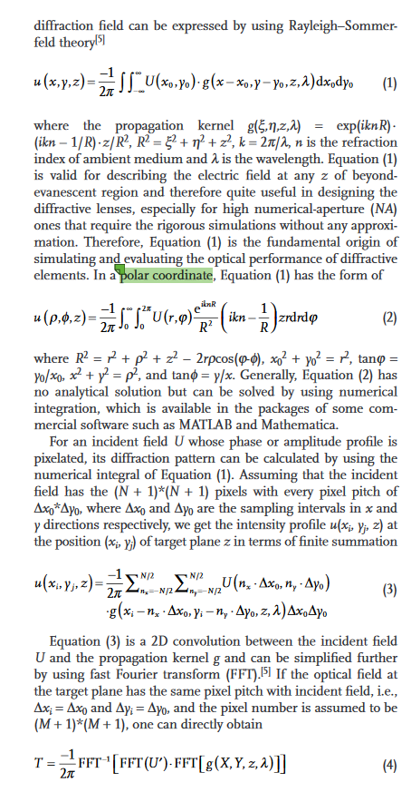

[^8]:Kun Huang and others, ‘Planar Diffractive Lenses: Fundamentals, Functionalities, and Applications’, Advanced Materials, 30.26 (2018), 1704556 <https://doi.org/10.1002/adma.201704556>.

4. 之后我便开始用这个公式进行研究。但是发现效果甚至远不如夫琅合费衍射时的FFT2.（实验时距离z=10mm）。但很快发现通过扩大观测面大小，便可以改善算法迭代的情况。
   - 扩大观测面大小、缩小光斑体积似乎都可以增强迭代效果。但是由于算力有限，实验仅充分证明了扩大观测面大小可以增强迭代效果。
5. 但是迭代效果仍然很差，于是去与老师进行了沟通。老师推荐找一个简单的目标面进行反衍射。例如一个小点，将超表面当作一个聚焦球透镜。通过GS算法后求得的相位剖面与已知的聚焦球透镜进行对比，来验证这个代码是否正确。

---
#### 4/18 周二

**上周工作内容：**
在与老师沟通之后，我进行了如下工作：
1. 假设目标是一个圆点，入射光为一个圆形平面光，通过GS算法进行迭代，看一下迭代后得到的相位剖面是否与理论的一致。因为聚焦透镜的相位剖面如下所示，是已知的[^9]：
   $$
   \phi(x,y)=-{2\pi \over \lambda} \cdot (\sqrt{x^2+y^2+f^2}-f)+const
   $$
   （式中f为焦距，(x,y)为透镜上相对于中心的坐标，const为中心处的相位，可以为0）
   但是迭代后发现存在偏差，即与理论的相位剖面存在不小的差别。
   > 但是其实同样实现了聚焦的效果，聚焦后的光斑与目标光斑的相关系数很高。
2. 下载了知网上的许多与"衍射光学元件"、“GS算法”等关键词相关的硕士、博士论文，对其进行研究学习。但是发现有些硕士论文中的结果无法复现，以及一些理论与教科书上的存在差别。
   一些论文中提出了对于GS算法的改进版本，但是用于我的实验环境中并不符合。因此看的十分迷茫。
   
**但事情突然有了转机**

[^9]:Yuxi Wang and others, ‘Dielectric Metalens-Based Hartmann–Shack Array for a High-Efficiency Optical Multiparameter Detection System’, Photonics Research, 8.4 (2020), 482 <https://doi.org/10.1364/PRJ.383772>.

上周五，在我将波长调至550nm时，GS算法的迭代情况很好，可以出现清晰的图像了。也即其迭代结果并没有发生发散。

针对这一情况，我继续开始进行了实验，进行了多组对比的仿真，结果发现GS算法迭代效果与下列因素均有关系：
- 波长。
  - 其他条件相同时，波长大的迭代效果更好。
  - 但这一方面不需要探究，因为本毕设的波长固定为515nm。
- 光斑大小。
  - 其他条件相同，光斑越小，迭代效果越好。
  - 高斯光斑（w0=1.5mm）自然传播，衍射后，接收面上光斑$1\over 2$光强处半径约为1.5mm。
  - 私以为光斑大小与衍射面、接收面大小应该相关，光斑越小，则接收面相比于光斑便越大。因此光斑越小等效于接收面越大。
- 衍射面大小。
- 接收面大小。
  - 衍射面大小与接收面大小一般为越大越好。***推测其与空间频率有关***
- 空间坐标采样间隔。
  - 随采样间隔减小，迭代效果先变好，再变差。

**目前承待解决的问题**
- [ ] 迭代效果与上述因素间的联系的原因是什么？
- [x] 一般来说衍射面和接收面越大，迭代效果越好，但是目标设计的超表面大小不能太大：入射光斑半径1.5mm，则超表面边长6mm左右即可。
   那么是否可以在GS迭代时选取很大的衍射面和接收面，之后截取中心边长6mm的区域作为超表面的相位剖面？
   > 通过实验，发现在设置衍射面、接收面40mm算法迭代之后，再截取其中10mm区域的相位剖面作为超表面的区域，仍然能够实现很好的成像效果。
- [x] 将理想的聚焦透镜的相位剖面与利用GS算法迭代出的相位剖面进行对比，图片以待后续使用。
   > 利用GS算法得到的聚焦透镜的相位剖面与理想的差别较大，但是仍然能够实现很好的聚焦效果（但聚焦效果比理想的差）

---
#### 4/19 周三

**目前进展**

方案：
1. 波长515nm，超表面聚焦距离10mm，目标光斑在10um以下。入射高斯光束半径为1.5mm.设计算法中采样间隔为2um，超表面大小为5mm。目标光斑中
   - 方形光斑边长8um，
   - 圆形光斑半径4um，
   - 圆环光斑内径2um，外径4um，
   - 钎焊光斑6um x 8um。

2. 具体设计中，利用30mm边长的衍射面和接收面进行迭代，之后截取中间的5mm大小的作为超表面的相位.
3. 由于采样间隔为2um，因此超表面单元结构的尺寸也为2um。

**问题**

1. 但是遇到了问题便是，当设定边长30mm，采样间隔2um时，其矩阵大小为15000 x 15000，我的电脑无法运算，因此需要使用实验室的服务器才可以。
2. 以及之前遇到的问题`迭代效果和各种因素之间存在关联`并未解决。

---
#### 4/20 周四
今天去和老师进行了沟通沟通记录如下：

**与老师进行沟通**
1. 关于聚焦透镜的对比，老师觉得是否有可能是我的采样间隔为10um，太小了，因此导致实际中可能是个方形光斑。因此推荐我可以利用更大尺寸的方形光斑来进行迭代，观察其相位剖面是否还是那种`奇怪形状`。
   > 因此之后迭代时我还要给出每一次迭代的相位剖面的图像。
2. 另外在我说出了迭代关系和许多因素都有关后，老师还是觉得我用的算法有问题，需要我再去对算法进行确认与进一步的研究，明确该算法究竟是否可以。***主要看看杨振宇老师的课题组论文，或者找胡铁学长***。老师透露之前，他们做的许多设计，其聚焦距离是在几十um的级别，这时候杨振宇老师组里面肯定有知道如何逆向设计的人。
3. 老师透露在超表面设计中，其相位跨度一般为几个$\pi$就可以了，不能有太大的$\pi$的跨度(展示聚焦透镜时，它有几千个$\pi$)

**下一步工作内容**
1. 再仿真以下方形光斑，其相位剖面与聚焦透镜仿真的进行对比，查看是否相似。
2. 找论文或者找学长请教10mm级别如何用GS算法逆向设计。
3. 在推演过程中，关注中间过程的相位剖面。
4. 找潘老师了解服务器咋用的。

**今天做了什么**
1. 打出了一个代码，代码功能：
   - 将超表面的相位剖面以中心点为最大值，向四周逐渐递减，利用相位的周期是2$\pi$。
   - 输入量为相位矩阵，其值为以2$\pi$为周期的相位。
   - 输出量为相位矩阵，中心点最大，向四周递减。
2. 下载了一些杨振宇老师、张敏明老师课题组的硕士、博士论文。等待学习。

---
#### 4/21 周五

今天把那个相位变换的代码重新打了一下，因为昨天打的代码的时间复杂度太高了，转换一个500x500的矩阵就需要十几分钟。今天在使用矩阵记录点的坐标后，该代码的运行速度得到了极大的提升，对于500x500的矩阵，转换仅需要十几s。

**构想一下得到相位分布后需要做的事情**
1. 单元结构的扫描。
   1. 选择单元结构的形状，例如一个圆柱，扫描其半径和高度，选取一个高度下的所有半径都有很高的 ***透过率***，且找到一个半径范围，在此范围内实现了$2 \pi$的 ***相位覆盖***。其相位是在超表面后1个波长处得到的。
   2. 值得注意的是，在得到大致的半径与相位的关系后，需要进行更精细的 相位vs半径 扫描，记录下扫描结果，同时保存不同半径时其超表面近场的结果（以待后续拼接成整个超表面的近场）
2. 开始利用近场库拼接得到整体透镜的近场，将近场输出为<.zbf>文件，输入到zemax中，以待远场分析。
3. 在zemax中利用POP工具进行远场分析。

---
#### 4/27 周四

前几天流感生病了，一直卧床，奔波于医院、宿舍之间，并未进行毕设。今天身体稍稍好了一点，于是再记录一点点。

1. 之后要利用氮化硅作为结构材料跑一下透过率和相位，先分辨率较大地跑，再细跑，得到不同结构尺寸对应的相位和近场分布。
   可以参考王玉西学长的这个论文
   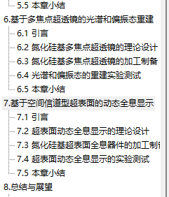 中的<基于空间信道型超表面的动态全息显示>

   其中也是利用氮化硅材料，作用于633nm波长。并且发现其的相位信息同样利用了GS算法得到，但是其是利用FFT得到的，因此最后测试中利用了许多透镜。

---
#### 4/28 周五

今天上午去和学长一起做实验，又与胡铁学长交谈了一番，发现了一些之前想的有问题的地方。
1. 一般周期需要小于波长，这样才没有多级衍射效应。我之前的想法是超表面的单元结构为2um x 2um，所以是太大了。对于515nm的光，应该选取500nm x 500nm的周期。也因此，需要对光斑重新进行设计了。
   - 超表面的周期：指的是结构的底部晶格宽度。
2. 超表面的设计流程中，需要首先建好结构库。对于结构的选择，一般如果需要达到 ***偏振不敏感*** 的效果，则选取圆柱即可，选取一定的高度，不同的半径。而如果是需要达到 ***偏振敏感***，则需要选取椭圆柱。
   - 结构库：即结构采取不同尺寸对应的光的相位和穿透率。
3. 在重建超表面整个镜面时可以选择拼接结构库的近场以得到整个镜面的近场，进而再得到远场的方法。这个近场得到远场，可以通过zemax中的远场传播工具实现，也可以利用FDTD中的投影法实现，其实由近场到远场就是一个衍射积分的过程，利用了衍射，也可以自己写一个衍射过程来完成。
   - 这个近场只要是一个波长以上即可。

**最新的方案：**
1. 超表面周期500nm，超表面大小5mm x 5mm，聚焦距离10mm，入射光斑直径3mm。目标图像大小为8um或10um，空间采样间隔为500nm。

**今日进度记录：**
1. 扫描结构为圆柱，（因为偏振不敏感），扫描高度为700nm到800nm，越大，则透过率越小。而半径的扫描范围为0.07um——0.22um，发现高度需要高一点，才可以实现大的相位覆盖。（***因此存在一个制衡***）
2. 最后扫描结果使我大致选择高度在730nm左右，半径范围0.08um——0.23um。但是发现扫描时其实现的相位覆盖为5.X,不为2$\pi$，不知道是不是因为扫描精度的原因。***承待进一步扫描***

---
#### 5/2 周二

前几天将已经扫描的数据发给胡铁学长看了一下，这才知道，原来结构周期小于波长的同时，不是指仅小于一点就可以了
- 例如，波长515nm，周期500nm，就 ***不行***
- 学长推荐我的为，波长515nm，周期不能大于 ***360nm***。

因此改变周期为360nm继续扫描。

**扫描过程记录**
1. 先利用我的电脑扫描了一下结构高度700——800nm，圆柱半径25nm——175nm。`扫描结果对应<A1>`结果发现在这个高度范围内，通过率还是很小，同时发现相位范围为几个2$\pi$，因此换用实验室服务器，跑500——800nm的高度范围，半径范围25nm——175nm。
2. 在扫描后，`扫描结果对应<A2>`，我求取扫描结果的通过率在半径范围内的平均值其图像为此
   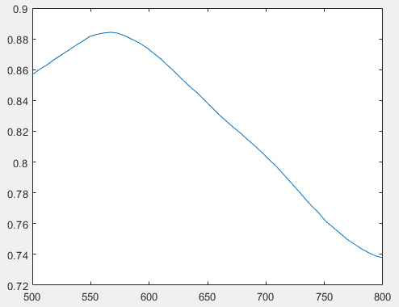。
   又通过与相位数据进行对应，相位需要满足在半径范围内的至少一个2$\pi$的相位覆盖，发现其至少需要高度为622.44nm，但是由于半径细分不够细，因此相位步距较大，因此选取了620nm和630nm的两高度，进行再次精细扫描。
3. 扫描620nm高度和630nm高度，扫描范围为25nm——175nm半径，半径步距为1nm。扫描结果显示
   - 相位覆盖范围分别为：6.3112 与    6.3999
   - 透过率图像如下
      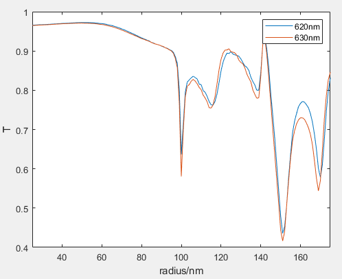
   还是有一部分区域透过率特别小。但是咨询胡铁学长之后，他说这个也可以接受。
   但我不死心，想找个更小周期的，看看透过率可不可以更高。

---
#### 5/3 周三

今天设置T=300nm，半径扫描范围为20nm——140nm。

**扫描结果：**
- 透过率很高，基本在90%以上。
  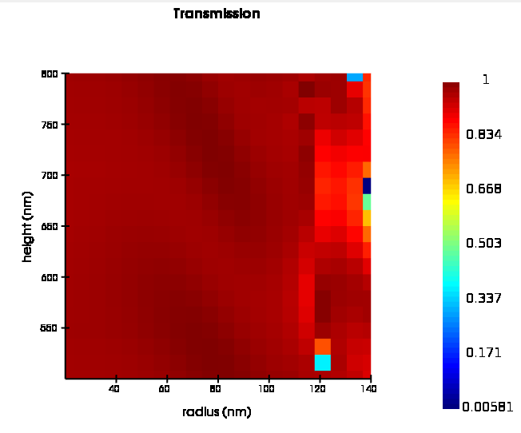
- 但相位覆盖范围不容乐观
  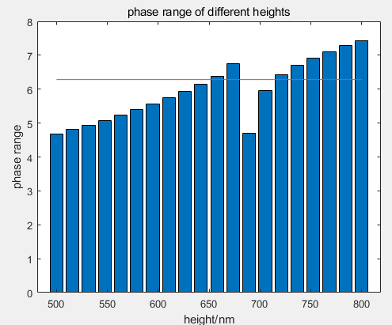 
  （这个图有点问题，但我懒得改了）

**扫描过程记录：**

1. 这个时候我突然意识到了曾经老师讲的 ***深宽比*** 的要求。许多设计在理论上很好，但是实际制作，加工时候却做不出来，就是因为深宽比太大了。一般要求深宽比${H \over d}<10$，但在实际制造加工中，却需要深宽比${H \over d}<5$.
   在今天扫描的T=300nm的情况下，实现$2\pi$相位覆盖范围的至少需要是H=660nm左右，但是此时扫描的半径范围中，最小半径为20nm，相当于直径40nm，${H\over D}=16.5$，这个深宽比基本表示无法加工出来。

2. 之后我又进行了进一步的做图，选出相位覆盖范围大于$2\pi$的高度，之后削减其相位覆盖范围到$2\pi$，（因为其半径较小的部分与半径较大的部分存在一部分相位重叠，通过削减半径较小的部分来实现），之后得到刚好覆盖$2\pi$相位范围的半径范围中的半径最小值，这也就得到了每个高度时的最大深宽比。

   300nm周期时在削减后，不同高度时的最小半径图：
   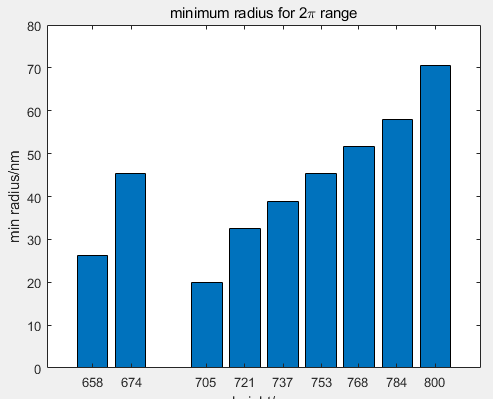
   可以发现，部分高度时的最大深宽比在5——10之间。
   回过头去，T=360nm时，高度620nm、630nm时，在削减相位范围后，其深宽比如图。
   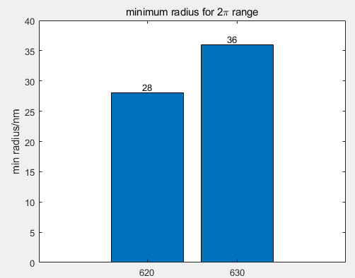

3. 目前选择继续对300nm周期时进行细扫，查看最大深宽比是否优秀。
   如果不行，就选360nm周期时，高度630nm。

---
#### 5/4 周四

扫描出了结果，但是分析越来越复杂了。
昨天我用了一种方法：削减相位重叠的较小半径，从而减小最大深宽比。
但是今天扫描300nm周期的结果出来了，我同样利用这种方法进行，发现存在一些问题：
- 在扫描时，半径范围【20nm，140nm】，随着半径变大，相位变化：1.0到3.0左右，再到-3.0左右，再继续增大直到最后。
- 在半径较小时，随着半径变化，相位变化的步距较小，基本为一点点变化的
- 但随着半径变大，例如半径120nm以后，相位变化的步距就会很大，同时再次出现了跳变现象，如图
  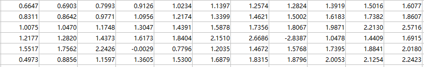
  图中，横轴为高度，纵轴从上到下为增加的半径。可以发现随着半径增加，相位不是单调增加，而是发生了跳变。同时可以发现即便是单调增加的，相位变化的步距也非常大。
  - 昨天我想出的办法是在相位重叠时，削减半径较小的部分来减小最大深宽比，但如果半径较大时相位变化的步距较大，那么削减较小的半径范围后，可以相位覆盖可以覆盖$2\pi$，但其步距过大，无法覆盖很多的相位分布。
  - 同时，随着半径的增加（如图的最后两行其实为半径的最大部分），最后会发生相位的跳变，这一部分在实际使用中无法应用，因此应当舍去。
  - 因此，最终，哪怕得到了许多图像，仍然需要我去主观地根据相位数据来选取合适的高度。

---
#### 5/5 周五

**工作内容：**

1. 今天完成的主要工作内容就是，画出了四种需要实现的目标光斑（以300nm）的间距。
   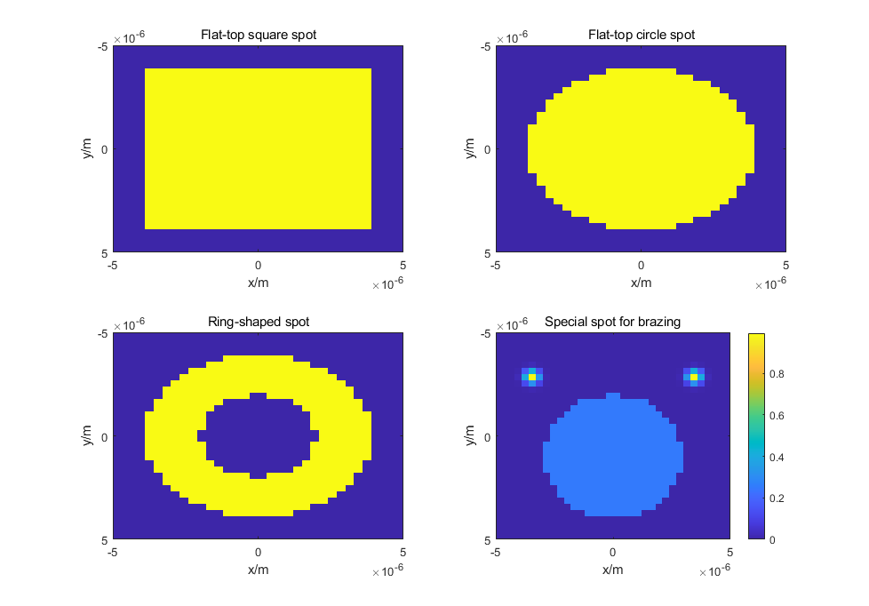;
2. 之后相位获取仍然出现了问题，因此继续对此进行探讨和解决。

---
#### 5/6 周六

5.4号当天，经过与学长的讨论，我最终确定了结构库的各种参数：

| 高度  | 周期  | 半径范围 | 随后细扫的步距 | Ex采样大小 |
| :---: | :---: | :------: | :------------: | :--------: |
| 740nm | 300nm | 50——135nm |   1nm(半径)    |   6 x 6    |
- 圆柱高度为740nm
- 周期300nm
- 半径范围为50nm——135nm（这个范围的选定剔除了半径较大时相位的突变，同时剔除了半径较小的区域）
- 在细扫中，是按照半径步距1nm进行的扫描，学长说这个已经非常精细了。
- 保存的Ex近场数据采样6个点，后续如果计算不动，可以进一步扩大采样间隔。

从昨天开始就开始了对相位的获取，但是出人意料的是，相位获取又出现了问题：
1. 起初选定的入射光斑大小为直径3mm，因此选定了超表面大小为5mm x 5mm。此时采样间隔变成了300nm，因此参与运算的矩阵大小为16000+ x 16000+ 。计算量相当的大，如果后续要加入Ex的近场数据进行远场计算的话，Ex采样是按照6个像素进行的，那么矩阵就变成了大小100000左右，近乎不可能计算。（虽然可以增大Ex的采样间隔）
   > 因此我通过再次调查激光器，发现了一个激光器，同样波长为515nm，但是光斑大小为1.1mm，同样可以作为激光微细加工激光器进行使用。因此我更改入射的高斯光束半径为0.55mm，将超表面大小改为2mm，进行迭代。
   
2. 但随后获取相位的效果出乎意料的变差了，但是经过这两天的不断计算，发现算法迭代的效果还跟聚焦距离有关，情况如下：
   - 之前计算时是按照10mm大小的超表面，10mm的聚焦距离进行的，取得了很好的迭代效果。
   - 当换成5mm大小，聚焦距离仍为10mm后，效果变差。
   - 当换成2mm大小，聚焦距离仍为10mm后，迭代效果更差，呈现的基本是一个高斯光斑，而不是平顶方形光斑。
   - 但当保持大小为2mm，聚焦距离变为4mm后，迭代效果明显变好了，迭代出的是一个接近方形的光斑了。
3. 因此，得到结论是，迭代效果与 <超表面的大小与聚焦距离的比例> 有关。

---
#### 5/8 周一

如今已经完成了对于四种光斑的迭代算法，由于迭代效果与<超表面的大小与聚焦距离的比例>有关，因此在对每个光斑迭代时同时进行了6种不同参数的迭代：
(入射光斑半径0.55mm)
1. z=2mm, L=2mm
2. z=3mm, L=2mm
3. z=4mm, L=2mm
4. z=1.5mm, L=1.5mm
5. z=2mm, L=1.5mm
6. z=3mm, L=1.5mm

在仿真之后，发现圆形光斑与方形光斑最好的情况是第三种情况
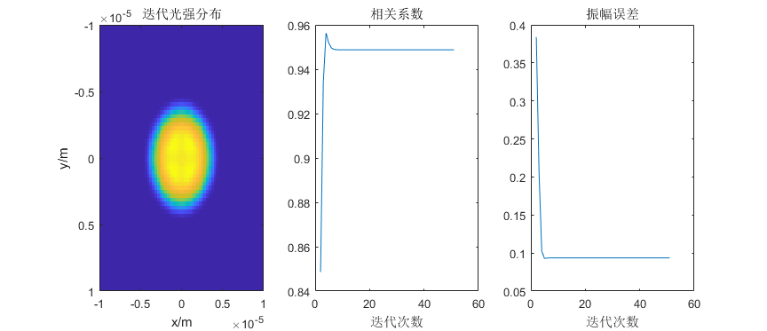
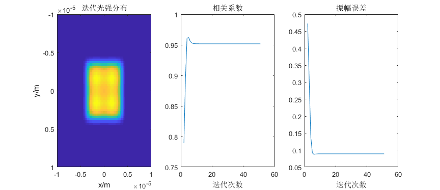
圆环状光斑最好的是第一种情况

钎焊光斑最好的是第四种情况
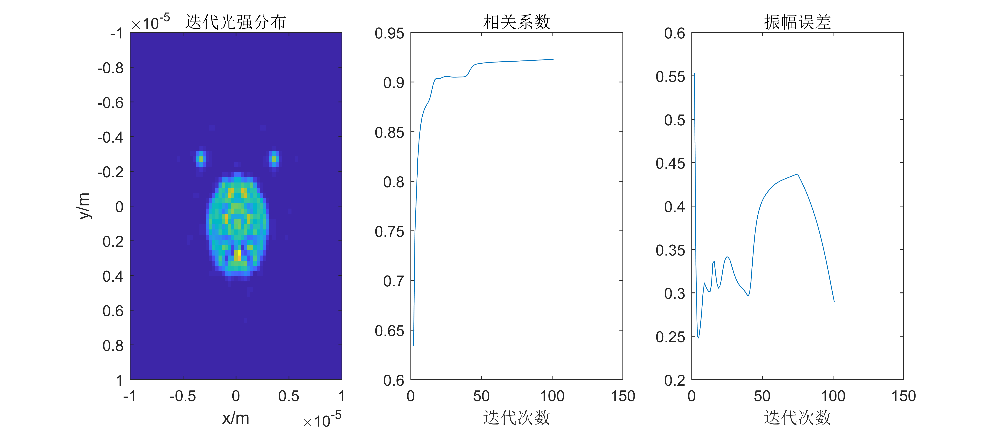
值得注意的是其他光斑只进行了50次迭代，钎焊光斑因此第一次迭代效果不行，之后进行了100次迭代。但钎焊光斑的实现仍然是这四种光斑中最难的。
之后便确认了根据这几种情况保存的相位来组成整体透镜了。

---
#### 毕设答辩后记录
1. 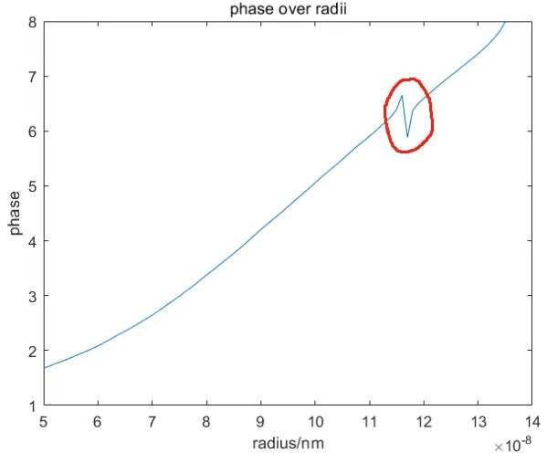{width="400px"}
   这种情况，铁哥说是因为谐振引起的，可以通过适当降低柱子的高度，或者直接剔除这些结构来消除。
2. 在扫描时会出现透过率大于1的存在
