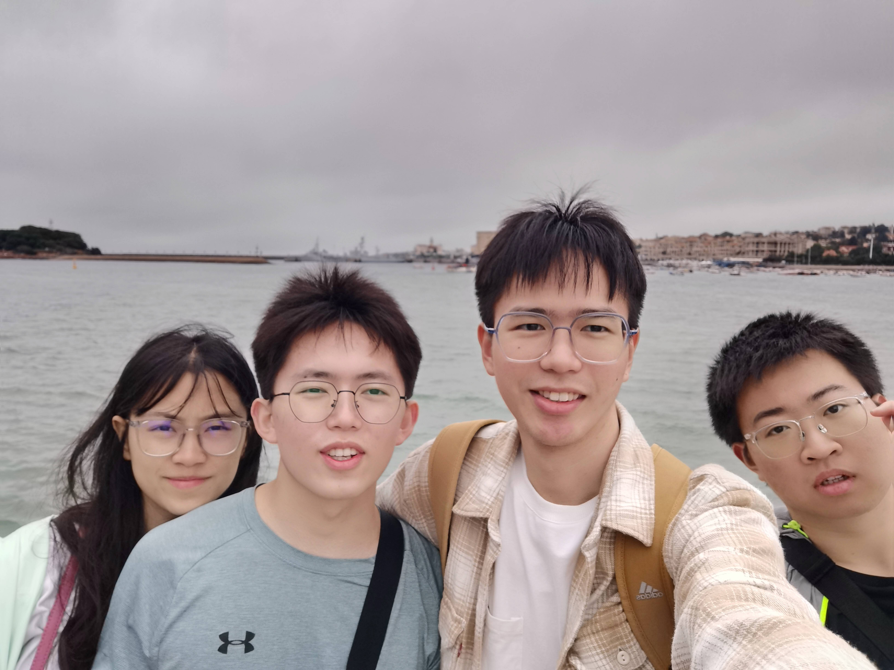
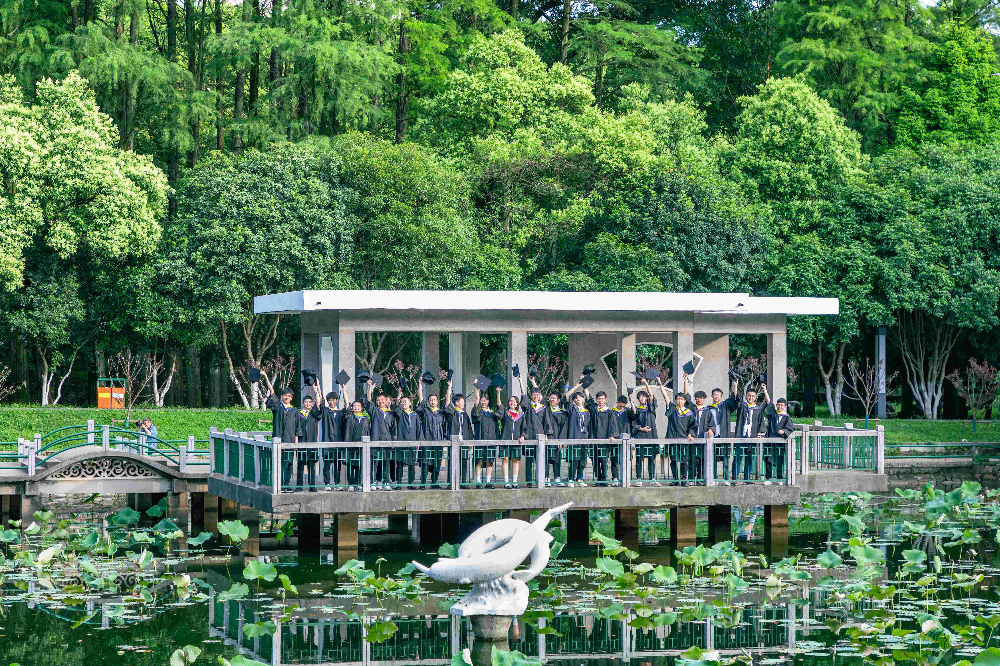
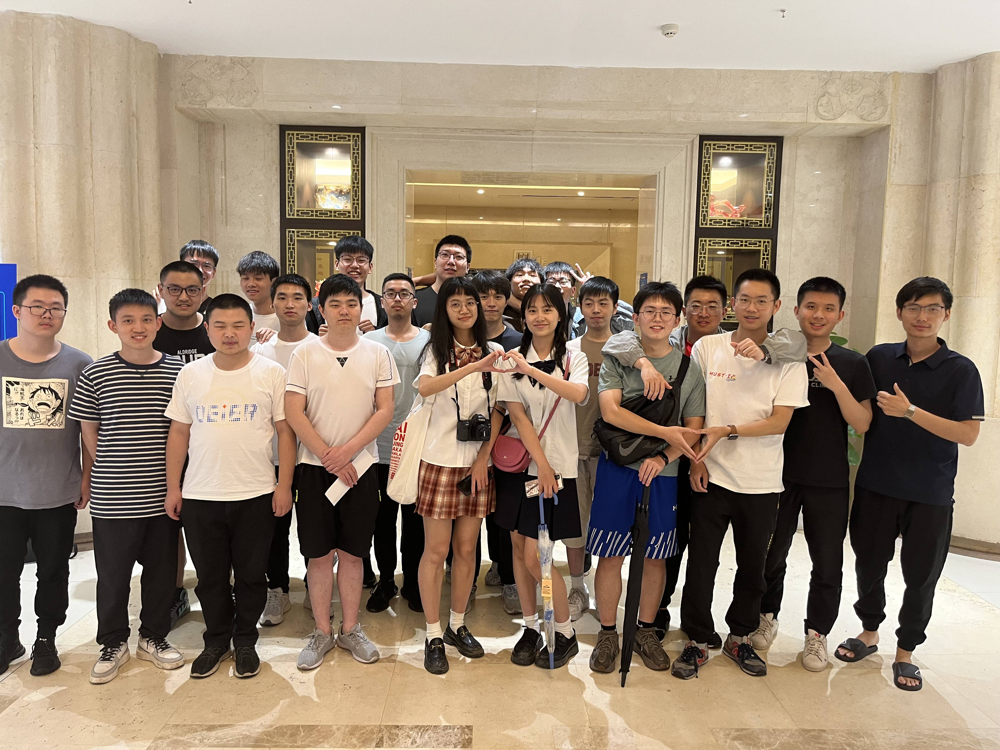
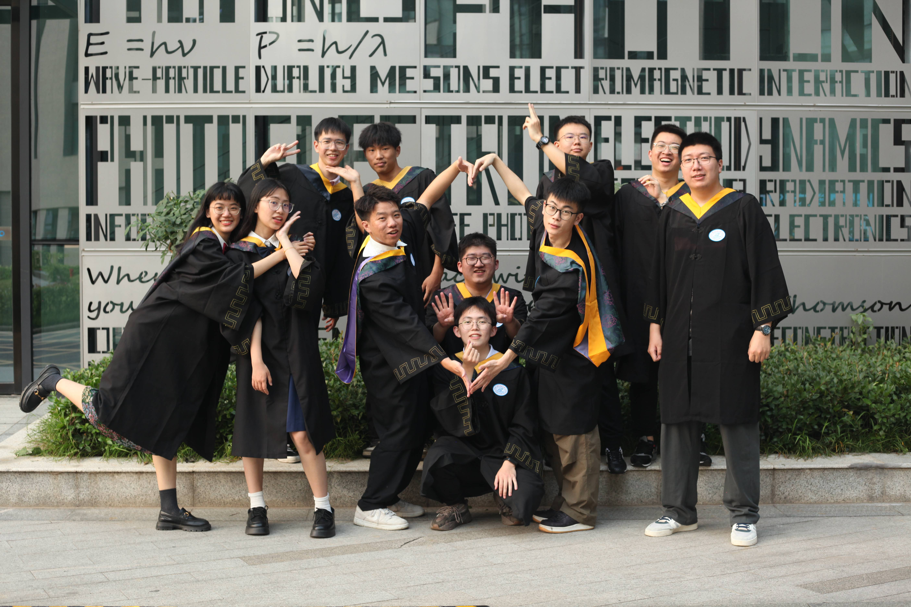
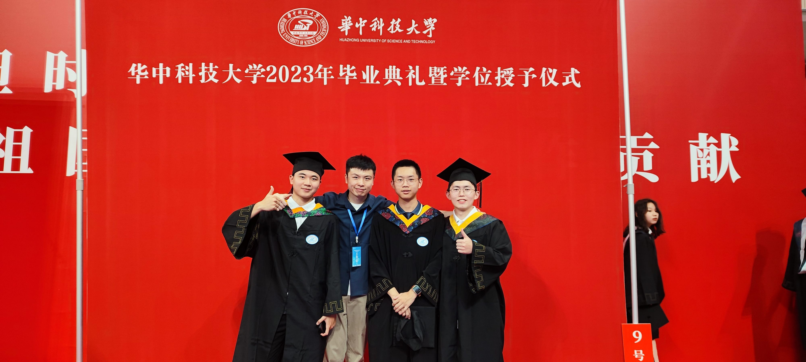
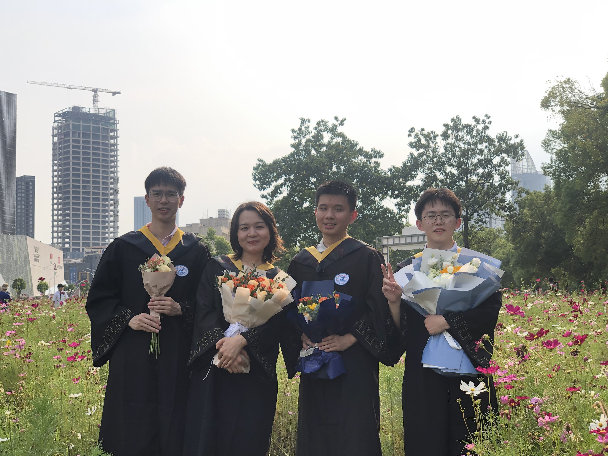
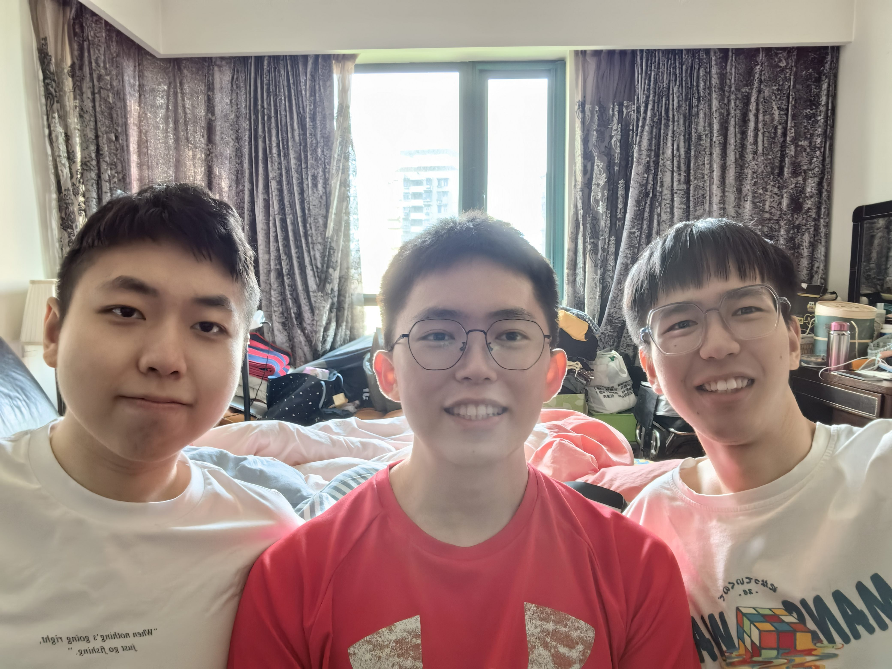
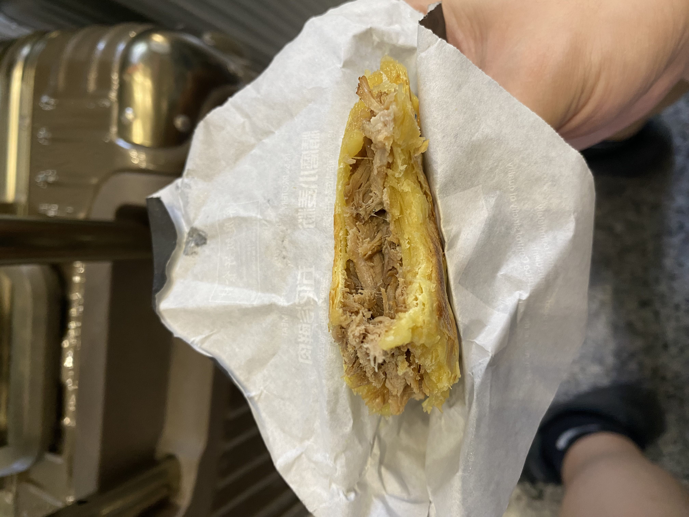
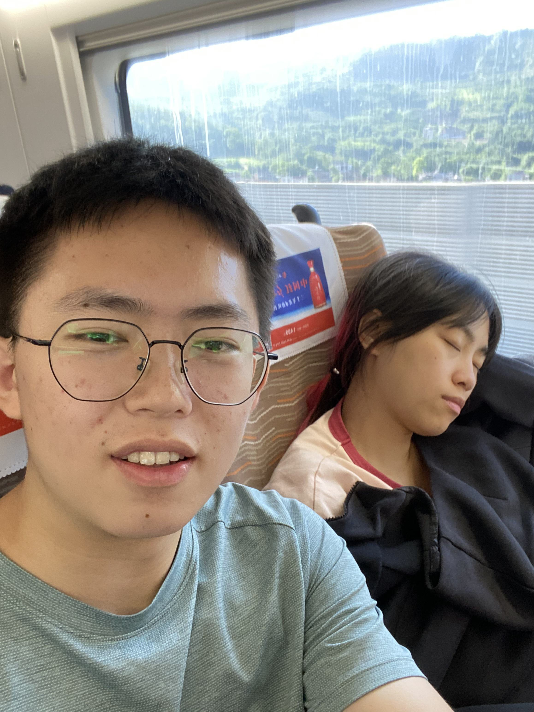
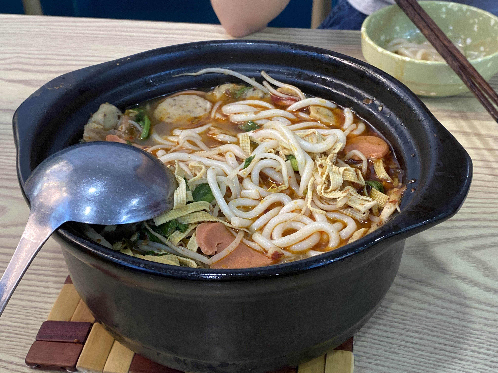

#### 23/7/24

今天是我即将回学校的最后一天晚上。也即是我大四即将结束的暑假的最后一天。

是的，不知不觉，我已经大学毕业了。
这一个多月以来，我经历了**毕业旅行去青岛——毕设答辩——全班一起拍毕业照——1908班和1914班一起吃饭——毕业典礼——毕业典礼后大家一起拍照——三五好友一起吃饭——送别同学离校——看望许亚亨——毕业旅行去青海——回到家**。这些经历如今看来似乎就是梦中往事一样，但当我经历这其中的每一件事情的时候，我都很清楚且明确地知道：当下我所经历的正是我此后无数年将无数次所缅怀的美好。但哪怕我知道，却也无法将时光变慢一点，果不其然，我如今便已经在缅怀了。

毕业有许多朋友发了朋友圈来庆祝毕业，我其实也一直想发，但是又总感觉差点什么，感觉似乎时光在推着我走，我不能安静地坐下，来整理总结我的内心所想；或许也是因为这时光过得太快了，而我在以后也必将无数次缅怀如今这宝贵的时光，所以我不想坐下来总结，我想继续感受这段最后的日子。```心如催了我好多次，说我为什么不也发一个朋友圈，我感觉他就是自己也想发，但是不知道发的合不合适，所以就想让我先发一下....```
而如今，似乎确实也是时候进行一次总结了。。

1. **青岛之旅**。我和萌萌、姜明望、陈天宇一起去了青岛旅游，嘿嘿，这是我第一次坐飞机。飞机原来没有我想象的那么大，感觉是一个小教室的宽度，在起飞和落地时耳朵都会不舒服，这些都是我之前所不知道的；而不出所料的是，飞机上的窗外真的好美。在青岛的那几天，我也第一次看到了海，但是海上有雾，并且其实在游艇上才能真正感受到海的辽阔，仅从海岸线上看的时候，其实某些大湖所呈现的景象也是同样的。但是那依然还是海！
   - 第一次踩了沙滩，赤着脚和他们一起在沙滩上追逐玩耍，6月的青岛十分凉爽，海水尤其冰凉，脚浸泡在水里便是一种透心的冰爽。幸好当时没去厦门，我们刚开始其实准备去厦门，```我真的想去见见书鸿哥，大学要毕业了，我也应该为我曾经的事情而道歉了。```但是出发前不久，姜明望又非要去青岛，于是我们最后又选了青岛。6月份的厦门正是30多度的大热天，比青岛高了10几度。
   - 青岛的老城区非常有特色，它曾经是德国租界，所以现在的很多建筑也沿用了当时的建筑风格，屋顶多是红色的。街区的道路也非常窄，像德国小镇一样。
   - 青岛的特色饮食好像以海鲜为主，但是我却吃不惯，感觉很不好吃，```是因为吃不习惯海鲜，而不是青岛不好吃```，相比之下，我还是喜欢吃一些主要的肉类。
   - 而发现的一个非常有趣的现象就是，青岛遍地都是卖啤酒的，奶茶店反而稀少，可以看到许多人去啤酒店，会直接给一个塑料袋，直接喝袋装的啤酒。而青岛的人同样相比于武汉要少得多，道路上要更加稀疏，地铁或者步行街上，人流量均不是很大。
   - 一个非常意外的惊喜就是倒数第二天去的景点旁边竟然是解放军海军博物馆，于是最后一天他们去赶海，而我则独自去海军博物馆看了一上午，真爽！
   - 待在青岛的几天非常惬意，但是最后由于时间问题，```因为我周日要继续上家教，当时我们是周二出发，所以最后一商量，周五就回去了```，我们最终待在青岛的时间也没有太久。这期间，我们住的都是民宿，我、萌萌一个屋子，姜明望、陈天宇一个屋子。最初订房间的时候我尤其为难，因为萌萌对屋子尤其是厕所的卫生条件非常在意，但是酒店的价格较高，我们资金有限，因此很难找；甚至她还一度闹情绪不去了，当时把我气的头都晕了```真的头晕```，但最后还是顺利订下了一个两居室的很不错的屋子。晚上几个人在一起的感觉非常爽，原来和朋友几个人一起去玩是这么愉快的感觉，而这同样也是我第一次体会到。在出去的这几天里，其实我们之间还是闹了一点矛盾的，比如我感觉路线规划一直是陈天宇和姜明望在讨论决定，一点没有我参与的空间，因此我就一点建议也不提了；回来之后萌萌一直跟我讲以后再也不跟男的一群朋友出去玩了，因为她感觉这几天太特种兵了，让她过的很不舒服；最后陈天宇和姜明望两人间还闹出了一点矛盾。但是如今再回想起来，我只后悔这段旅行实在太短了。。。
   
2. **毕业答辩**。毕业答辩的时候，其实我一直心有遗憾或者一点不平，就是我老师都没有跟我讲关于优秀毕业设计的事情，最后我以为他根本不知道，结果他就是光集成学部这边的评委老师。（皱眉）
   - 答辩的时候我努力模仿看到过的心如答辩的那种气势和感觉，最后感觉答辩的效果还可以，几个答辩老师都针对我的ppt里的图片提了点问题，有的还指出了我的仿真可能存在的问题，```但我之后问学长，好像不是老师说的那个问题。```
3. **全班一起拍毕业照**。一起去拍毕业照，我们穿的是外面租的衬衫还有学士服，当时真的热死咯。萌萌化了化妆，然后穿着她的小皮鞋，贼漂亮。当时我们先去校门拍了一下，然后去图书馆，又去青年园。拍了一些照片，真怀念那一天哦。
   
4. **1908班吃饭并且还有一些1914班的人**。1908班的人一起吃饭，但是同样也叫上了1914班的一些人，于是我们1914班的全都坐在了一桌：我、萌萌、游璐瑶、大个、唐心如、周锦杨、汪世鑫、姜明望、陈天宇、吉吉、哲哥、非非。讲实话，那一桌饭菜是真的不错，每一道菜都蛮好吃，最后一听价格，原来一桌就几千了，难怪哦。其实本来这次吃饭我以为心如都不会来了，但是没想到就要出发了，他找我，问我去了没，我也那时候才知道他也要去。这四年，心如变了太多了。好吧，或者说，每一个人都变了。
   许多人都去了不同的城市，以后可能可以去不同的城市找他们玩，但是像这样一群人再聚在一起的日子不知道何时才能再次找到啊。。。高中毕业的时候，我满心都是对大学美好时光的向往，从未担心朋友、同学之后的分开，可大学毕业却令我辗转悱恻，如今的我对曾经的高中同学已经基本没有印象了，但是曾经刚毕业时候的我难道也对他们没有感情吗？，，我不明白。
   
5. **毕业典礼**。终于讲到了毕业典礼。
   - 典礼当天，我记得很清楚，需要很早就到体育馆里面，我又是骑电动车去找萌萌，但是她又是像往常一样动作很慢，过了好久才下来，而她却说她是她们宿舍第一个下来的。而最后由于我的路痴，我们到我们班指定位置的时候却是最后一个。。。
   - 典礼上发生的一切都还历历在目。萌萌坐在我的右边，我的前面是吉吉，右前面是姜明望，左边是潘亚淞，右边的右边是娜迪拉。典礼上有唱歌的环节，```但是没有山东大学的好看```，之后宣读各种说明文件，讲到了荣誉学士就是给本科生的最高荣誉，```心如就是```，当时萌萌跟我讲，她也想这么厉害，跟那些人一对比感觉自己怎么这么菜，说她要拿荣誉硕士，我：！。在讲完各种东西之后，体育馆中间就开始清理，摆放上了许多个台子以供拨穗，这个时候我也羡慕荣誉学士了，因为他们是校长进行拨穗的，而普通的本科生就是指定给不同的校领导拨穗，而我们要上的拨穗台子上的老师，我就不认识。。。```但是对我也相当热情。```。拨穗之后我找到了谢宗澳、唐心如，我们仨一起去外面拍了个合照，丁俊文的迷弟们终于顺利来到了最后，一个不少的。其实当时想找蛮多人一起拍照的，但是感觉不好意思，就匆匆地就离开了。我想找魏宇弘，也想找姚琦云，但是都没找。。。
   - 典礼后我们俩就去门外的卤肉饭吃饭去了，然后下午跟姜明望约了要一起去学校里面的各处地方好好拍一下。本来萌萌跟我们一起的，但是她中午睡觉一下子睡过了，于是下午我、姜明望、胡浩钧我们三个在学校的各个地方拍了好多。姜明望提前跟我讲他想拍```学死流```，就是各种趴在地上啊，或者趴在栏杆上啊，仿佛学的太用力，学死了一样。。。我们先去了醉晚亭，又去了图书馆，又去了梧桐雨，又去了西十二以及外面的花园，最后返回了光电大楼，因为那时候萌萌跟她舍友们一起去了光电大楼拍照，于是最后我们汇合了。我、游璐瑶、姜明望、娜迪拉、萌萌、胡浩钧，六个人于是在光电大楼旁边又拍了拍。而拍的过程中又碰巧遇到了来拍照的非非七人组```指非非、吉吉、蒙浩辉、哲哥、任子、大个、吉吉```和陈天宇，于是我们又一起拍了拍照。
   - 最后全部拍完之后，我们准备一起去吃饭，因为夏雨已经从美国回来了，所以就想叫上夏雨一起，但是没想到夏雨光速联系了崴子，因为之前崴子喜欢萌萌，跟萌萌之间的一些事情，我就感觉可能晚上吃饭如果我、萌萌、崴子三个都在，就会气氛非常尴尬，然后就让姜明望跟夏雨讲，能不能不带崴子，（但是又感觉心里非常不舒服，因为孤立了崴子似的），崴子于是同意不来了。但是之后问了问萌萌，她竟然说她感觉没什么，于是那我也感觉没什么了，但是先拒绝了崴子，现在又跟他讲可以去，这样就非常不好，于是我没跟崴子讲。晚上要去的时候，萌萌她们一直在忙什么事情，就一直在等她们，然后最终决定我们男生先去，于是上楼去找夏雨的时候，崴子直接就下来了竟然，然后问我到底他能不能去，于是顺利加入了崴子。晚上吃饭时候，刚开始我就坐立不安的，因为我不知道该怎么处事，不知道怎么跟萌萌讲话，又怎么跟崴子讲话，但是没想到他们两个非常自然，彼此之间讲话也很轻松，于是最后我也放松下来了。交谈中我才知道原来夏雨去香港大学也是搞光集成的，并且跟萌萌搞的东西很类似，也是耦合器，于是我们竟然可以在一起讨论一些相同的学术话题！这里面懵圈的只有姜明望了，因为他甚至还不知道之后去浙大要搞什么emmmm。但是吃完饭之后，非常遗憾的一点就是竟然忘记了拍照。。。唉。。。
   - 那一天真的是快乐哦~
   
   
   
6. **送别**。其实在这之前我一直都是蛮开心，蛮激动的，感觉毕业时节做了好多平时没有做的事情，长见识了，也体验生活了。但是等毕业典礼过去，一些隐藏在这盛大表象下的东西开始出现了，最明显的感触即是送别。
   - 姜明望和陈天宇就是典礼后没几天就走。姜明望要搬东西回家，之后就等着去浙大了，而陈天宇则是准备二战考研，之后可能不再考华科了。。。也就是说，那也是他们在华科最后的一点时间了，之后，下一次见面，也不知道会是什么时候了。晚上我准备去找萌萌吃饭了，才看到他们宿舍开着，里面他们两个人都在收拾东西，那一刹那，我就愣住了，我进去问了问，才知道一会儿两个人就都走了，我的内心仿佛什么东西刺了一下，我觉得我得做点什么，于是说我们抱一抱吧，平时感觉男人抱一抱就很娘，但是那时候我却感觉拥抱就是可以表达我的语言。等和萌萌吃饭回来，他们还在收拾，于是我就去帮他收拾收拾，掂着东西到楼下他哥车上。我和姜明望、夏雨回到宿舍，本来以为他已经坐车上走了，结果看到他梨花带雨地上来，要跟我们几个拥抱，抱完又跑附近几个宿舍去抱了抱，最后才又下楼。而我们几个自然追了上去，站在宿舍门口，一直望着他们离开。。。如今我仍无法描述当时我的内心，那是一种翻滚的起伏的感觉，是不舍以及难以相信。
   - 在送别陈天宇之后便是送别姜明望了，姜明望一点也不难受，他满脸是笑，似乎非常开心，于是我一边讽刺他，一边帮他收拾，最后也没有下楼目视他离开。。有点难过，因为他竟然不难过。。。但是也好，其实这个暑假他都还在武汉，随时可以再去找他。或许等他真正要开学了，要离开了，我真的要再去找一下他。
   - 大个也要走了。大早上，我还在床上，模模糊糊听到吉吉起床，说陪大个去南大门，然后我猛地就醒了，我当时满脑子就是一个想法，我一定要见大个离开的最后一面。当时外面下着大雨，但是我没在怕的，因为担心跟不上他们，于是我穿好衣服就出门了，碰到了非非，说他们去吃饭了，一会儿再走，于是我就坐在电动车上，打着伞等他们吃完饭，结果等了好久也没出来。非非陪我一起等，他终于联系上了大个，原来因为雨太大，所以他要坐校车去南大门，就不用我们陪着了。当时雨很大，我、非非、吉吉站在校车旁边，我努力扭过头去，希望自己流下的泪珠不让他们看到。我不知道下次再能看到大个是什么时候，站在那里，我一直在回忆着过去与大个相处的各种片段，这一别，再见是何年。但之后回来后，我问了问吉吉之后大个要考哪里，他讲大概率是华科，那大个回来就是我学弟咯。嘿嘿
   - 最后我们也要搬宿舍了，世鑫和仲子那时候已经不在宿舍了，只剩我和吉吉。第二天我们就要搬东西，我要搬到楼下的临时宿舍，而他要直接搬去他的新宿舍南二舍，以后就再也不在一个宿舍了。我看了看吉吉，四年了，从2019年开始，我便和吉吉住在了一起，相邻了四年的床位。每一次宿舍里面都可以跟吉吉讲很多东西，听他吐槽，听他讲各种我不知道的东西，噢，前面一直没讲，吉吉也谈恋爱了，于是这一学期每晚在宿舍还可以看到他跟他女朋友视频。有一段时间我跟吉吉是关系最好的搭档，那段时间我们天天一起吃饭，一起上下学，一起干各种事情，直到我跟萌萌谈起了恋爱```讲实话我也感觉蛮对不起吉吉，因为之后他就只能再找一个人天天陪他干各种事情，是我见色忘友了（泪）```。吉吉有点像我宿舍的家人，他总能听我的各种东西，而我却无法想象之后宿舍里面再也没有吉吉的情况，我曾经一个人在宿舍待过一段时间，但是他们很快也就会回来，但是这之后的五年，我将再无像家一样的宿舍了。那晚，我1点和吉吉一起出去吃烧烤了。离别的前夕总是无法入眠，那晚我甚至不想睡觉了。我们一起去一家叫老兵烧烤的地方，一边吃，一边大聊特聊，那一晚我明明感觉我们有非常多非常多可以聊的东西，但是话到嘴前，却只余一声叹息，因此一切想法都被愁思给冲淡了。我已经忘记了我们聊了点什么了，但我记得我们回去之后，在床上睡觉，我又讲了很多东西，但是讲着讲着就听到了他的呼噜声，他直接睡着了。。。
   .jpeg)
7. **又见许亚亨**。在上述一切之后，我开始在学校的临时宿舍中生活。噢，似乎忘讲了一件事情：本来我以为我会有一个完整的暑假，但是突然有一天收到课题组科研助理的电话，通知我可以提前来上班了，并且告诉我课题组的暑假就是两周，七月底、八月初放。我当时一脸懵逼，但是也就是听了他们的安排。在学校的这段时间，萌萌给我办了一张健身卡，因此我开始了规律的健身，一周去四次，都是趁晚上，和非非一起去。感觉效果非常显著，并且每天还都会背单词，每天都过的很充实。于是有一天，许亚亨跟我和姜明望讲，他从上海回来了，说可以聚一聚，因此时隔这么久，我们终于又见到了许亚亨。这小子感觉跟大一的时候没啥变化，噢，脸变得更圆了，相当圆。每一次我们去了之后，他妈妈都会给我们点奶茶，搞得三个人一起喝奶茶，公主下午茶似的hhhhh；and，每一次都会话题缺失，不知道该讲什么，于是我只能催着姜明望赶紧想话题。问了许亚亨之后，才知道他在上海那边一直在做康复训练，就是如何绑着一个假腿走路，起初我以为是网上看到过的那种小腿变成义肢，但是看了才发现是一个相当笨重的装置：是一个完整的腿加上辅助固定在腰部的装置。那时候我才想起来当时他是整条腿都不得已了。突然发现这种义肢真的很有必要去发展。。。很多人的心智成熟，却受限于身体四肢的问题而无法正常地生活，尤其是在中国。我曾看过一篇报道，称中国的残疾人数量在千万级别，但是平时四周却很少看到残疾人出没，很多很多残疾人想来都是待在了家中，由于各种各样的原因而被禁锢在那狭小的空间中。。。。我的心很沉重也很窒息。
   - 一晃这么多年竟然过来了。还记得最开始大一时候跟许亚亨一起军训，军训的休息时间一起去吃饭，见识了学校的各种食堂；和他一起学微积分，有好多题都是问他的，发现他好聪明；还看到过他体测，明明平时看着虚虚的，结果一千米跑的贼拼命；还记得我住的是323，他就住我隔壁，床位还刚好就跟我挨着，我们之间就隔了一堵墙，去他宿舍找他，看到他床上是一个大蚊帐，隔绝成了一个小空间，床上还有他喜欢的小鲨鱼玩偶；他那时候的手机就是苹果xr了，用到了现在竟然还没换，而我则从华为mate20变成了现在的苹果11；也不记得是什么时候我、姜明望、许亚亨我们三个走到一起了，他们俩说是做那个c语言的课程设计，在那之前有一个实践大作业，我们也是在一起搞的，于是之后c语言课程设计就组成了一个小组，建了一个群，后来群就变成了现在我们的那个群，说到这个c语言课程设计我就想起来了，当时是要做一个学生成绩管理系统，我们仨其实都不太会，但是都相当卖力，搞了好久到最后却还是没搞定，于是最后许亚亨从网上找了一个，用那个验收成功了。。。
   - 其实说到过去，我就总想起来云，还记得大学刚开始，我跟麦哥军训的一个中午一起去吃饭，是在中操的一个食堂，我跟麦哥刚进食堂，就看到了一个又白长的又好看的女生，我当时就看呆了，这个女生长的好像外国人噢，而且还贼白，于是我就对麦哥说，你信不信我以后肯定会认识她？麦哥当时啥反应我忘了，但是这个我却一直埋在了心底，可之后的生活中却再也没有见到过她，而我也发现大学生活认识陌生女生可太难了，于是我都快忘记了。可就在大二的一个公选课，那个公选课叫心理学与生活，我当时迟到了一点，裴玉战还非要跟着我去，于是我们俩从后面偷偷进入，刚好就坐在了最后一排。我看到了左边有一个女生长的那么似曾相识，于是我又假装不经意地看了几眼，然后瞳孔大震，那竟然就是之前的那个女生！！然后这个女生还老喜欢讲话，直接自来熟地就跟我讲起了话，于是我也就讲着，我的心里还在震惊，这个公选课的老师却开始了一系列的安排，说需要分组以完成之后的任务，神乎其神地，我们就分在了一个组里面，并且更神乎其神的，因为要进行小组活动，因此我们建了一个qq群，各个人之间都加了qq！！神得离谱啊。之后就很神奇地，我跟这个女生聊了越来越多，后来便显而易见，她就是姚琦云，名字就很美。后来我发现她跟我非常相像，我曾经有一段时间以为她就像女版的我一样，当然现在我又感觉我们不那么一样了，她太喜欢艺术了，喜欢一些抽象的东西，而我却没那么喜欢文学。以后希望我可以多多跟她联系吧，但是总担心萌萌会介意。。。。
   
8. **青海之旅**。本来我跟萌萌计划的是7月底8月初放假一起去旅行，但是萌萌的假期突然前移了，因此我向老师请了假，将我的那两周前移，换到了与萌萌假期一样的时间，但就在出发前两天，我们都不知道要去哪里旅游。下学期开始，我们就说要去泰国，于是兴冲冲地办了护照，准备报个团去泰国，但是后来跟姜明望、陈天宇一起去青岛后，她又不想去泰国了，说海边看够了，不想看海，说想去新疆。但是问题在于我们两周的假期如果要去新疆还要回家待一周的话就根本不够，因为去新疆实在太远了。。。。最后经过一轮思考，我们决定去青海，在携程上报了个旅游团，青海甘肃，青甘大环线，旅游团里面就几个人，是一辆小车带着我们去那边的各种景点，省心省力。我们确定的票的出发时间是下午6点，先坐卧铺到西安，再换乘高铁去西宁，但直到出发的前一天深夜12点，我们才抢到卧铺的票。一天多的时间里我们收拾了各种要去那边带的东西，然后在出发前的那个下午，我突然想到我这个临时宿舍会不会在我不在的这两周里面要装修啊。。。然后一问才发现真的有可能，于是还又把行李给打包了一下，如果之后真装修了就委托几个学校的同学帮我搬一下。终于在4点，我们准时坐上地铁，又与6点上了绿皮车，前往西安！！
   - 在车上我就预定了第二天早上5点多的出租车，到时候要转车去西安的高铁站。预定完就和萌萌在一起看提前下好在ipad上的电影《偷东西的小人》，好看的噢。卧铺11点关灯，于是我们吃了点提前买好的零食就各自上床了，刚好她的床就在最上面，我感觉蛮安全的，而我的床就在下铺。但晚上我一直睡不着，不知道为什么，可能是激动以及对于即将到来的旅行中各种事情的忐忑不安，于是我就一直在看小说看到了好晚好晚。第二天一早列车员来叫我们下车，于是我们来到了西安，上出租车之后我跟师傅讲想吃一下这里的肉夹馍，于是他带我们到了一个肉夹馍店旁边，可是那馍要现烤，竟然要15分钟，我就在那边等待，因为怕师傅等太久就买了三个，一个肉夹馍15块。。结果最后还是把他搞急了，他好像送我们之后还有别的乘客要接，于是一直在催我，最后我上车之后他就一改之前接到我后的和颜悦色，脸色很硬，我就说了点场面话，要把一个肉夹馍给他作为延迟他时间的赔礼，但他却一直不接，最后下车我还是放在了他前排座位上（当时我觉得做的问心无愧，但是后来过了几天，滴滴app通知我还有一笔钱没付我才直到，出租车超时是要收钱的，又扣了我12块钱，我那时才知道我有多傻呗。。。）。但，西安的肉夹馍是真好吃，纯瘦肉夹馍可真香！坐了高铁之后我们终于顺利到达了西安，旅行社给我们安排了接车，于是又顺利地来到了酒店，酒店相当不错噢！这个团我们报的8天7晚，不带来回车票是4300一个人，因为我和萌萌有学生票，之后还可以退一部分钱，感觉这个里面的钱全都是值在这个酒店上了，当晚我们住的酒店在携程上一晚要6、700！里面有冰箱、保险柜，各种设施都很棒！但是很奇怪的在于他的空调相当差劲，热死咯，于是当天晚上我们投诉，又换了一个房间，但是还是很热，可没办法，第二天很早就要出发了。当天是旅游团的第一天，但是其实我们就是到了西宁，然后自由活动，第二天才是真正的旅程出发。当天我们吃了一下过桥米线。
   
   
   
